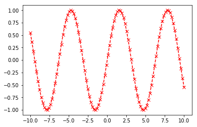
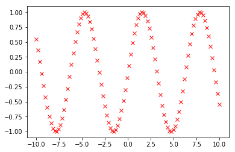
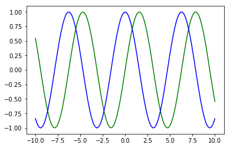
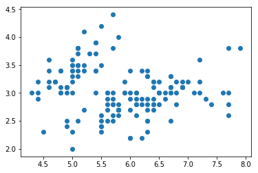
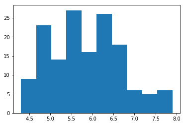

# 파이썬 머신러닝

파이썬 라이브러리를 활용해 머신러닝을 논의합니다.

## 진행

1. 환경설정과 파이썬 리뷰
1. 필수 라이브러리
1. 지도학습
1. 비지도학습


```python
print('안녕하세요!')
print('셀 실행은 shift+Enter')
```

    안녕하세요!
    셀 실행은 shift+Enter
    


```python
x = 1
```


```python
print(x)
```

    1
    

## 파이썬 리뷰


```python
x = 1
x = 3.14
```


```python
type(x)
```


    float


```python
nums = list(range(10))
nums
```


    [0, 1, 2, 3, 4, 5, 6, 7, 8, 9]


```python
type(nums)
```


    list


```python
nums.append(10)
```


```python
nums
```


    [0, 1, 2, 3, 4, 5, 6, 7, 8, 9, 10]


```python
print(nums)
```

    [0, 1, 2, 3, 4, 5, 6, 7, 8, 9, 10]
    


```python
제목 = '파이썬 머신러닝\n(이성주)'
```

객체 표현 for 프로그래머


```python
제목
```


    '파이썬 머신러닝\n(이성주)'


문자열 표현 for 사용자


```python
print(제목)
```

    파이썬 머신러닝
    (이성주)
    


```python
nums.pop()
```


    10


```python
nums
```


    [0, 1, 2, 3, 4, 5, 6, 7, 8, 9]


```python
nums.pop?
```


```python
프로필 = {'이름': '이성주', '여자':False}
```


```python
type(프로필)
```


    dict


```python
프로필['이름']
```


    '이성주'


```python
'이메일' in 프로필
```


    False


### 제어


```python
results = []

for n in range(10):
    results.append(n+1)
    
results
```


    [1, 2, 3, 4, 5, 6, 7, 8, 9, 10]


내장 리스트


```python
results = [n**2 for n in results]
results
```


    [1, 4, 9, 16, 25, 36, 49, 64, 81, 100]


```python
results = [n**2 for n in results if n%2 == 0]
results
```


    [16, 256, 1296, 4096, 10000]


```python
def f(x, y=0):
    return x+1, y+1 
```


```python
f(0)
```


    (1, 1)


```python
결과 = f(0)
```


```python
x, y = f(0)
```


```python
def 집계(방법, 데이터):
    결과 = 방법(데이터)
    return 결과
```


```python
def 제곱합(데이터):
    return sum(n**2 for n in 데이터)
```


```python
data = list(range(1, 11))
```


```python
집계(sum, data)
```


    55


```python
집계(제곱합, data)
```


    385


### 입출력


```python
경로 = 'data/iris.data'
```

윈도우의 경로는 원시(raw) 문자열 사용 고려


```python
print(r'C:\Users\name')
```

    C:\Users\name
    


```python
with open(경로) as 파일:
    data = []
    for 줄 in 파일:
        *수치, 라벨 = 줄.strip().split(',')
        수치 = [float(n) for n in 수치]
        data.append((라벨, 수치))
```


```python
data[0]
```


    ('Iris-setosa', [5.1, 3.5, 1.4, 0.2])


#### 연습

iris.data 파일에서, 라벨의 개수와 각 라벨별 샘플수를 구해봅시다.

# 필수 라이브러리

## NumPy


```python
data = [[1,2,3],[4,5,6],[7,8,9]]
```


```python
[n*2 for n in data]
```


    [[1, 2, 3, 1, 2, 3], [4, 5, 6, 4, 5, 6], [7, 8, 9, 7, 8, 9]]


```python
import numpy as np
```


```python
arr = np.array(data)
arr
```


    array([[1, 2, 3],
           [4, 5, 6],
           [7, 8, 9]])


```python
type(arr)
```


    numpy.ndarray


```python
arr * 2
```


    array([[ 2,  4,  6],
           [ 8, 10, 12],
           [14, 16, 18]])


#### 연습

1...16까지의 정수를 ndarray 벡터, 4x4 형상의 행렬로 구성해 봅시다.


```python
data = list(range(1, 17))
data
```


    [1, 2, 3, 4, 5, 6, 7, 8, 9, 10, 11, 12, 13, 14, 15, 16]


```python
arr = np.array(data)
arr
```


    array([ 1,  2,  3,  4,  5,  6,  7,  8,  9, 10, 11, 12, 13, 14, 15, 16])


```python
arr * 2
```


    array([ 2,  4,  6,  8, 10, 12, 14, 16, 18, 20, 22, 24, 26, 28, 30, 32])


```python
arr.shape
```


    (16,)


```python
arr.reshape(1, 16).shape
```


    (1, 16)


```python
type(data)
```


    list


```python
type(arr)
```


    numpy.ndarray


```python
arr.dtype
```


    dtype('int32')


```python
not_good = [1, 2.3, '3.14']
```


```python
np.array(not_good)
```


    array(['1', '2.3', '3.14'],
          dtype='<U32')


```python
np.array([1, 2.3]).dtype
```


    dtype('float64')


```python
arr = np.arange(1e7)
```


```python
len(arr)
```


    10000000


```python
nums = arr.tolist()
```


```python
%timeit arr * 1.1
```

    30.2 ms ± 1.42 ms per loop (mean ± std. dev. of 7 runs, 10 loops each)
    


```python
%timeit [n*1.1 for n in nums]
```

    721 ms ± 7.28 ms per loop (mean ± std. dev. of 7 runs, 1 loop each)
    

#### 연습

1...9의 정수를 3x3 형상의 행렬로 구성하고 다음을 수행합니다.

1. 두 번째 행 선택
1. (1,2) 원소 선택
1. 두 번째 열 선택


```python
arr = np.arange(1, 10).reshape(3,3)
arr
```


    array([[1, 2, 3],
           [4, 5, 6],
           [7, 8, 9]])


```python
arr[1]
```


    array([4, 5, 6])


```python
arr[1,2]
```


    6


```python
arr[:, 1]
```


    array([2, 5, 8])


```python
arr[0:2]
```


    array([[1, 2, 3],
           [4, 5, 6]])


```python
arr[:, 1:]
```


    array([[2, 3],
           [5, 6],
           [8, 9]])


팬시색인


```python
arr[[0, 2]]
```


    array([[1, 2, 3],
           [7, 8, 9]])


```python
arr[[2, 0]]
```


    array([[7, 8, 9],
           [1, 2, 3]])


#### 연습

주어진 행렬 배열에 대해 다음을 수행합니다.

1. 첫 번째와 마지막 열 선택
1. 두 번째와 마지막 열을 역순으로 선택


```python
arr[:, [0, -1]]
```


    array([[1, 3],
           [4, 6],
           [7, 9]])


```python
arr[:, [-1, 1]]
```


    array([[3, 2],
           [6, 5],
           [9, 8]])


```python
arr
```


    array([[1, 2, 3],
           [4, 5, 6],
           [7, 8, 9]])


```python
arr < 6
```


    array([[ True,  True,  True],
           [ True,  True, False],
           [False, False, False]], dtype=bool)


불리언 색인


```python
arr[arr < 7].reshape(2, 3)
```


    array([[1, 2, 3],
           [4, 5, 6]])


원소별 NOT


```python
~(arr < 7)
```


    array([[False, False, False],
           [False, False, False],
           [ True,  True,  True]], dtype=bool)


원소별 AND


```python
(arr > 2) & (arr < 7)
```


    array([[False, False,  True],
           [ True,  True,  True],
           [False, False, False]], dtype=bool)


원소별 OR


```python
(arr < 2) | (arr > 7)
```


    array([[ True, False, False],
           [False, False, False],
           [False,  True,  True]], dtype=bool)


#### 연습

data/iris.data의 데이터에서 수치값은 변수 X, 라벨값은 변수 y로 적절한 자료구조로 표현합니다.

1. 전체 자료를 균일하게 1/3씩 나누어 각각 X1 ... X3, y1...y3에 할당합니다.

1. X1, X2, X3의 각 그룹에서 첫 번째와 세 번째 열을 선택합니다.

1. 첫 번째 열의 값이 4.7 이상인 것들의 라벨 선택

1. X1, X2, X3의 각 열별 평균 산출

*생각해 볼 점*

왜 전체 데이터를 한번에 ndarray로 만들지 않고, 나누어서 수행하고자 할까요?


```python
with open('data/iris.data') as 파일:
    data, labels = [], []    
    for 줄 in 파일:
        *수치, 라벨 = 줄.strip().split(',')
        수치 = [float(n) for n in 수치]
        data.append(수치)
        labels.append(라벨)
```


```python
X = np.array(data)
```


```python
y = labels
```


```python
len(X)
```


    150


```python
X.shape
```


    (150, 4)


```python
X1 = X[:50]
X2 = X[50:100]
X3 = X[100:]
```


```python
len(X1) == len(X2) == len(X3)
```


    True


```python
X1.mean(0)
```


    array([ 5.006,  3.418,  1.464,  0.244])


```python
X2.mean(0)
```


    array([ 5.936,  2.77 ,  4.26 ,  1.326])


```python
X3.mean(0)
```


    array([ 6.588,  2.974,  5.552,  2.026])


```python
np.array(y)[X[:, 0] >= 4.7]
```


    array(['Iris-setosa', 'Iris-setosa', 'Iris-setosa', 'Iris-setosa',
           'Iris-setosa', 'Iris-setosa', 'Iris-setosa', 'Iris-setosa',
           'Iris-setosa', 'Iris-setosa', 'Iris-setosa', 'Iris-setosa',
           'Iris-setosa', 'Iris-setosa', 'Iris-setosa', 'Iris-setosa',
           'Iris-setosa', 'Iris-setosa', 'Iris-setosa', 'Iris-setosa',
           'Iris-setosa', 'Iris-setosa', 'Iris-setosa', 'Iris-setosa',
           'Iris-setosa', 'Iris-setosa', 'Iris-setosa', 'Iris-setosa',
           'Iris-setosa', 'Iris-setosa', 'Iris-setosa', 'Iris-setosa',
           'Iris-setosa', 'Iris-setosa', 'Iris-setosa', 'Iris-setosa',
           'Iris-setosa', 'Iris-setosa', 'Iris-setosa', 'Iris-setosa',
           'Iris-setosa', 'Iris-versicolor', 'Iris-versicolor',
           'Iris-versicolor', 'Iris-versicolor', 'Iris-versicolor',
           'Iris-versicolor', 'Iris-versicolor', 'Iris-versicolor',
           'Iris-versicolor', 'Iris-versicolor', 'Iris-versicolor',
           'Iris-versicolor', 'Iris-versicolor', 'Iris-versicolor',
           'Iris-versicolor', 'Iris-versicolor', 'Iris-versicolor',
           'Iris-versicolor', 'Iris-versicolor', 'Iris-versicolor',
           'Iris-versicolor', 'Iris-versicolor', 'Iris-versicolor',
           'Iris-versicolor', 'Iris-versicolor', 'Iris-versicolor',
           'Iris-versicolor', 'Iris-versicolor', 'Iris-versicolor',
           'Iris-versicolor', 'Iris-versicolor', 'Iris-versicolor',
           'Iris-versicolor', 'Iris-versicolor', 'Iris-versicolor',
           'Iris-versicolor', 'Iris-versicolor', 'Iris-versicolor',
           'Iris-versicolor', 'Iris-versicolor', 'Iris-versicolor',
           'Iris-versicolor', 'Iris-versicolor', 'Iris-versicolor',
           'Iris-versicolor', 'Iris-versicolor', 'Iris-versicolor',
           'Iris-versicolor', 'Iris-versicolor', 'Iris-versicolor',
           'Iris-virginica', 'Iris-virginica', 'Iris-virginica',
           'Iris-virginica', 'Iris-virginica', 'Iris-virginica',
           'Iris-virginica', 'Iris-virginica', 'Iris-virginica',
           'Iris-virginica', 'Iris-virginica', 'Iris-virginica',
           'Iris-virginica', 'Iris-virginica', 'Iris-virginica',
           'Iris-virginica', 'Iris-virginica', 'Iris-virginica',
           'Iris-virginica', 'Iris-virginica', 'Iris-virginica',
           'Iris-virginica', 'Iris-virginica', 'Iris-virginica',
           'Iris-virginica', 'Iris-virginica', 'Iris-virginica',
           'Iris-virginica', 'Iris-virginica', 'Iris-virginica',
           'Iris-virginica', 'Iris-virginica', 'Iris-virginica',
           'Iris-virginica', 'Iris-virginica', 'Iris-virginica',
           'Iris-virginica', 'Iris-virginica', 'Iris-virginica',
           'Iris-virginica', 'Iris-virginica', 'Iris-virginica',
           'Iris-virginica', 'Iris-virginica', 'Iris-virginica',
           'Iris-virginica', 'Iris-virginica', 'Iris-virginica',
           'Iris-virginica', 'Iris-virginica'],
          dtype='<U15')


```python
arr = np.random.randn(3, 2)
arr
```


    array([[-0.13028112, -0.47446258],
           [ 1.74282093,  0.81937062],
           [-0.09297519,  0.99644386]])


```python
arr.mean()
```


    0.47681941983923243


```python
arr.mean(axis=0)
```


    array([ 0.50652154,  0.4471173 ])


```python
arr.mean(axis=1)
```


    array([-0.30237185,  1.28109577,  0.45173434])


```python
arr = np.array([1,2] * 3)
arr
```


    array([1, 2, 1, 2, 1, 2])


```python
np.unique(arr)
```


    array([1, 2])


#### 연습

iris.data의 라벨의 유형?


```python
np.unique(y)
```


    array(['Iris-setosa', 'Iris-versicolor', 'Iris-virginica'],
          dtype='<U15')


#### 연습

라벨 값을 활용해 각 라벨별로 X1, X2, X3를 선택합니다.


```python
라벨유형 = np.unique(y)

Xs = []
for 라벨 in 라벨유형:
    Xs.append(X[라벨 == np.array(y)])
    
X1, X2, X3 = Xs
```


```python
X1[:3]
```


    array([[ 5.1,  3.5,  1.4,  0.2],
           [ 4.9,  3. ,  1.4,  0.2],
           [ 4.7,  3.2,  1.3,  0.2]])


### 선형대수


```python
A = np.array([
    [3, 6, -5], 
    [1, -3, 2], 
    [5, -1, 4]])
```


```python
b = np.array([12, -2, 10])
```


```python
invA = np.linalg.inv(A)
```


```python
x = np.dot(invA,  b)
```


```python
x
```


    array([ 1.75,  1.75,  0.75])


```python
import random
```


```python
[random.randint(0, 10) for _ in range(10)]
```


    [1, 2, 10, 6, 1, 5, 9, 7, 1, 0]


```python
np.random.randint(0, 11, size=10)
```


    array([ 4, 10,  0,  5,  9,  9,  1,  3,  0,  7])


```python
np.random.randint(0, 11, size=(5, 2))
```


    array([[ 2,  0],
           [ 7, 10],
           [ 3,  4],
           [ 2,  3],
           [ 6,  0]])


```python
np.random.uniform(low=0, high=1, size=(3,2))
```


    array([[ 0.03626466,  0.95112727],
           [ 0.173044  ,  0.51584104],
           [ 0.48157146,  0.16820697]])


```python
np.random.rand(3, 2)
```


    array([[ 0.47284469,  0.55702242],
           [ 0.15684874,  0.098745  ],
           [ 0.68388045,  0.40733141]])


```python
np.random.normal(loc=170, scale=1.0, size=(3,2))
```


    array([[ 170.65616097,  170.43384113],
           [ 172.48045835,  171.3500466 ],
           [ 171.23959279,  169.94497083]])


```python
np.random.randn(3, 2)
```


    array([[ 0.81600876, -0.63730501],
           [-0.33070871,  0.66650766],
           [ 1.57827282,  2.66350767]])


### 개발자 Vs. 데이터 과학자


```python
%%timeit

for _ in range(5000):
    위치 = 0
    위치변화 = [위치]

    for _ in range(1000):
        승 = random.randint(0, 1)
        걸음 = 1 if 승 else -1
        위치 += 걸음
        위치변화.append(위치)
```

    6.54 s ± 10.4 ms per loop (mean ± std. dev. of 7 runs, 1 loop each)
    

데이터 과학자라면 ...?


```python
%%timeit

승 = np.random.randint(0, 2, size=(5000, 1000))
걸음 = np.where(승, 1, -1)
위치변화 = 걸음.cumsum(axis=1)
```

    71.3 ms ± 1.68 ms per loop (mean ± std. dev. of 7 runs, 10 loops each)
    

# 시각화


```python
%matplotlib inline
```


```python
import matplotlib.pyplot as plt
```


```python
x = np.linspace(-10, 10, 100)
```


```python
len(x)
```


    100


```python
x[:3]
```


    array([-10.       ,  -9.7979798,  -9.5959596])


```python
y = np.sin(x)
```


```python
plt.plot(x, y, 
         color='r', marker='x', linestyle='--')
```


    [<matplotlib.lines.Line2D at 0x8568898>]





```python
plt.plot(x, y, 'rx')
```


    [<matplotlib.lines.Line2D at 0x8390828>]





```python
y2 = np.cos(x)
```


```python
plt.plot(x, y, 'g')
plt.plot(x, y2, 'b')
```


    [<matplotlib.lines.Line2D at 0xa17f160>]





```python
plt.scatter(x=X[:, 0], y=X[:, 1])
```


    <matplotlib.collections.PathCollection at 0xa3bdc50>





```python
plt.hist(X[:, 0])
```


    (array([  9.,  23.,  14.,  27.,  16.,  26.,  18.,   6.,   5.,   6.]),
     array([ 4.3 ,  4.66,  5.02,  5.38,  5.74,  6.1 ,  6.46,  6.82,  7.18,
             7.54,  7.9 ]),
     <a list of 10 Patch objects>)





```python
import pandas as pd
```


```python
frame = pd.read_csv('data/iris.data', header=None)
```


```python
type(frame)
```


    pandas.core.frame.DataFrame


```python
frame[:5]
```


<div>
<style>
    .dataframe thead tr:only-child th {
        text-align: right;
    }

    .dataframe thead th {
        text-align: left;
    }

    .dataframe tbody tr th {
        vertical-align: top;
    }
</style>
<table border="1" class="dataframe">
  <thead>
    <tr style="text-align: right;">
      <th></th>
      <th>0</th>
      <th>1</th>
      <th>2</th>
      <th>3</th>
      <th>4</th>
    </tr>
  </thead>
  <tbody>
    <tr>
      <th>0</th>
      <td>5.1</td>
      <td>3.5</td>
      <td>1.4</td>
      <td>0.2</td>
      <td>Iris-setosa</td>
    </tr>
    <tr>
      <th>1</th>
      <td>4.9</td>
      <td>3.0</td>
      <td>1.4</td>
      <td>0.2</td>
      <td>Iris-setosa</td>
    </tr>
    <tr>
      <th>2</th>
      <td>4.7</td>
      <td>3.2</td>
      <td>1.3</td>
      <td>0.2</td>
      <td>Iris-setosa</td>
    </tr>
    <tr>
      <th>3</th>
      <td>4.6</td>
      <td>3.1</td>
      <td>1.5</td>
      <td>0.2</td>
      <td>Iris-setosa</td>
    </tr>
    <tr>
      <th>4</th>
      <td>5.0</td>
      <td>3.6</td>
      <td>1.4</td>
      <td>0.2</td>
      <td>Iris-setosa</td>
    </tr>
  </tbody>
</table>
</div>


```python
X = frame.values[:, 0:4]
y = frame.values[:, -1]
```


```python
X[:5]
```


    array([[5.1, 3.5, 1.4, 0.2],
           [4.9, 3.0, 1.4, 0.2],
           [4.7, 3.2, 1.3, 0.2],
           [4.6, 3.1, 1.5, 0.2],
           [5.0, 3.6, 1.4, 0.2]], dtype=object)


```python
업종 = pd.read_clipboard()
```


```python
업종['현재가'].str.replace(',', '').astype('float')
```


    0      80900.0
    1      25000.0
    2     196000.0
    3      14700.0
    4       3595.0
    5      18200.0
    6      13150.0
    7       6080.0
    8       2740.0
    9       9290.0
    10      2270.0
    11     32900.0
    12     15650.0
    13    172500.0
    14      9810.0
    15     32200.0
    16      5190.0
    17     34650.0
    18      5810.0
    19      9890.0
    20     18000.0
    21     14500.0
    22     74500.0
    23      6930.0
    24      2150.0
    25    169000.0
    26      5680.0
    27      9400.0
    28      9410.0
    29    355500.0
    30     19200.0
    31      7270.0
    32      3790.0
    33      8450.0
    34     14300.0
    35     44900.0
    36      2800.0
    37     29650.0
    38     14700.0
    39     12650.0
    40      6880.0
    41     33350.0
    42      5730.0
    43      2195.0
    44     11350.0
    45      1315.0
    Name: 현재가, dtype: float64


