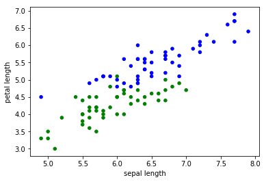

```python
import numpy as np
import matplotlib.pyplot as plt
import pandas as pd

%matplotlib inline
```

#### 연습

data/iris.data를 읽어와서 특징값은 변수 X로, 라벨값은 변수 y에 할당합니다. 적재된 데이터를 활용해 다음을 수행합니다.

1. 라벨 클래스 집합
1. 각 특징들의 평균값


```python
iris = pd.read_csv('data/iris.data', header=None)
```


```python
iris.columns = [
    'sepal length', 'sepal width',
    'petal length', 'petal width',
    'label'
]
```


```python
iris[:5]
```


<div>
<style>
    .dataframe thead tr:only-child th {
        text-align: right;
    }

    .dataframe thead th {
        text-align: left;
    }

    .dataframe tbody tr th {
        vertical-align: top;
    }
</style>
<table border="1" class="dataframe">
  <thead>
    <tr style="text-align: right;">
      <th></th>
      <th>sepal length</th>
      <th>sepal width</th>
      <th>petal length</th>
      <th>petal width</th>
      <th>label</th>
    </tr>
  </thead>
  <tbody>
    <tr>
      <th>0</th>
      <td>5.1</td>
      <td>3.5</td>
      <td>1.4</td>
      <td>0.2</td>
      <td>Iris-setosa</td>
    </tr>
    <tr>
      <th>1</th>
      <td>4.9</td>
      <td>3.0</td>
      <td>1.4</td>
      <td>0.2</td>
      <td>Iris-setosa</td>
    </tr>
    <tr>
      <th>2</th>
      <td>4.7</td>
      <td>3.2</td>
      <td>1.3</td>
      <td>0.2</td>
      <td>Iris-setosa</td>
    </tr>
    <tr>
      <th>3</th>
      <td>4.6</td>
      <td>3.1</td>
      <td>1.5</td>
      <td>0.2</td>
      <td>Iris-setosa</td>
    </tr>
    <tr>
      <th>4</th>
      <td>5.0</td>
      <td>3.6</td>
      <td>1.4</td>
      <td>0.2</td>
      <td>Iris-setosa</td>
    </tr>
  </tbody>
</table>
</div>


```python
iris.shape
```


    (150, 5)


```python
X = iris.values[:, 0:4].astype('float32')
y = iris.values[:, 4]
```


```python
X[:5]
```


    array([[ 5.0999999 ,  3.5       ,  1.39999998,  0.2       ],
           [ 4.9000001 ,  3.        ,  1.39999998,  0.2       ],
           [ 4.69999981,  3.20000005,  1.29999995,  0.2       ],
           [ 4.5999999 ,  3.0999999 ,  1.5       ,  0.2       ],
           [ 5.        ,  3.5999999 ,  1.39999998,  0.2       ]], dtype=float32)


```python
X.dtype
```


    dtype('float32')


```python
np.unique(y)
```


    array(['Iris-setosa', 'Iris-versicolor', 'Iris-virginica'], dtype=object)


```python
X.mean(0)
```


    array([ 5.84333324,  3.05400014,  3.75866699,  1.19866669], dtype=float32)


```python
pd.Series(y).replace(np.unique(y), [0, 1, 2])
```


    0      0
    1      0
    2      0
    3      0
    4      0
    5      0
    6      0
    7      0
    8      0
    9      0
    10     0
    11     0
    12     0
    13     0
    14     0
    15     0
    16     0
    17     0
    18     0
    19     0
    20     0
    21     0
    22     0
    23     0
    24     0
    25     0
    26     0
    27     0
    28     0
    29     0
          ..
    120    2
    121    2
    122    2
    123    2
    124    2
    125    2
    126    2
    127    2
    128    2
    129    2
    130    2
    131    2
    132    2
    133    2
    134    2
    135    2
    136    2
    137    2
    138    2
    139    2
    140    2
    141    2
    142    2
    143    2
    144    2
    145    2
    146    2
    147    2
    148    2
    149    2
    Length: 150, dtype: int64


```python
colormap = pd.Series(y).replace(
    np.unique(y), ['r', 'g', 'b'])
plt.scatter(x=X[:, 0], y=X[:, 2], c=colormap)
```


    <matplotlib.collections.PathCollection at 0xbacbac8>


```python
axes = pd.plotting.scatter_matrix(
    iris, c=colormap,
    figsize=(15, 15), # 그림틀 크기 설정
    s=60, alpha=0.8, # 점 스타일 설정
)
```


훈련/테스트 분리


```python
from sklearn.model_selection import train_test_split
```


```python
X[shuffled_index]
```


    array([[ 5.5999999 ,  2.70000005,  4.19999981,  1.29999995],
           [ 5.69999981,  4.4000001 ,  1.5       ,  0.40000001],
           [ 6.30000019,  2.5       ,  4.9000001 ,  1.5       ],
           [ 7.4000001 ,  2.79999995,  6.0999999 ,  1.89999998],
           [ 5.5       ,  4.19999981,  1.39999998,  0.2       ],
           [ 5.9000001 ,  3.20000005,  4.80000019,  1.79999995],
           [ 4.80000019,  3.        ,  1.39999998,  0.1       ],
           [ 6.30000019,  3.29999995,  4.69999981,  1.60000002],
           [ 5.4000001 ,  3.9000001 ,  1.70000005,  0.40000001],
           [ 6.19999981,  2.20000005,  4.5       ,  1.5       ],
           [ 5.9000001 ,  3.        ,  4.19999981,  1.5       ],
           [ 4.9000001 ,  3.        ,  1.39999998,  0.2       ],
           [ 5.5999999 ,  2.5       ,  3.9000001 ,  1.10000002],
           [ 4.4000001 ,  3.20000005,  1.29999995,  0.2       ],
           [ 6.30000019,  3.29999995,  6.        ,  2.5       ],
           [ 5.0999999 ,  3.29999995,  1.70000005,  0.5       ],
           [ 6.5       ,  3.20000005,  5.0999999 ,  2.        ],
           [ 5.5       ,  2.5999999 ,  4.4000001 ,  1.20000005],
           [ 5.0999999 ,  3.79999995,  1.89999998,  0.40000001],
           [ 5.        ,  3.5       ,  1.29999995,  0.30000001],
           [ 5.69999981,  2.9000001 ,  4.19999981,  1.29999995],
           [ 5.69999981,  2.79999995,  4.5       ,  1.29999995],
           [ 4.9000001 ,  3.0999999 ,  1.5       ,  0.1       ],
           [ 5.        ,  3.4000001 ,  1.60000002,  0.40000001],
           [ 6.0999999 ,  2.79999995,  4.        ,  1.29999995],
           [ 6.        ,  3.        ,  4.80000019,  1.79999995],
           [ 5.69999981,  2.5       ,  5.        ,  2.        ],
           [ 6.        ,  3.4000001 ,  4.5       ,  1.60000002],
           [ 4.69999981,  3.20000005,  1.29999995,  0.2       ],
           [ 6.5999999 ,  2.9000001 ,  4.5999999 ,  1.29999995],
           [ 5.5       ,  2.4000001 ,  3.70000005,  1.        ],
           [ 5.        ,  2.        ,  3.5       ,  1.        ],
           [ 5.0999999 ,  3.5       ,  1.39999998,  0.30000001],
           [ 5.5       ,  3.5       ,  1.29999995,  0.2       ],
           [ 5.69999981,  3.        ,  4.19999981,  1.20000005],
           [ 7.        ,  3.20000005,  4.69999981,  1.39999998],
           [ 7.69999981,  3.79999995,  6.69999981,  2.20000005],
           [ 5.0999999 ,  3.4000001 ,  1.5       ,  0.2       ],
           [ 5.5       ,  2.5       ,  4.        ,  1.29999995],
           [ 5.69999981,  2.79999995,  4.0999999 ,  1.29999995],
           [ 6.4000001 ,  3.0999999 ,  5.5       ,  1.79999995],
           [ 4.80000019,  3.4000001 ,  1.60000002,  0.2       ],
           [ 5.        ,  3.5999999 ,  1.39999998,  0.2       ],
           [ 6.5       ,  2.79999995,  4.5999999 ,  1.5       ],
           [ 6.        ,  2.20000005,  5.        ,  1.5       ],
           [ 6.9000001 ,  3.20000005,  5.69999981,  2.29999995],
           [ 5.4000001 ,  3.4000001 ,  1.70000005,  0.2       ],
           [ 6.9000001 ,  3.0999999 ,  5.0999999 ,  2.29999995],
           [ 5.5999999 ,  3.        ,  4.5       ,  1.5       ],
           [ 7.0999999 ,  3.        ,  5.9000001 ,  2.0999999 ],
           [ 6.9000001 ,  3.0999999 ,  4.9000001 ,  1.5       ],
           [ 6.19999981,  2.9000001 ,  4.30000019,  1.29999995],
           [ 6.4000001 ,  2.79999995,  5.5999999 ,  2.0999999 ],
           [ 6.69999981,  3.0999999 ,  5.5999999 ,  2.4000001 ],
           [ 6.5       ,  3.        ,  5.5       ,  1.79999995],
           [ 6.69999981,  3.        ,  5.19999981,  2.29999995],
           [ 5.5       ,  2.4000001 ,  3.79999995,  1.10000002],
           [ 6.9000001 ,  3.0999999 ,  5.4000001 ,  2.0999999 ],
           [ 5.69999981,  3.79999995,  1.70000005,  0.30000001],
           [ 5.19999981,  2.70000005,  3.9000001 ,  1.39999998],
           [ 7.69999981,  3.        ,  6.0999999 ,  2.29999995],
           [ 6.0999999 ,  2.9000001 ,  4.69999981,  1.39999998],
           [ 6.        ,  2.20000005,  4.        ,  1.        ],
           [ 5.        ,  2.29999995,  3.29999995,  1.        ],
           [ 4.9000001 ,  2.4000001 ,  3.29999995,  1.        ],
           [ 6.80000019,  3.20000005,  5.9000001 ,  2.29999995],
           [ 4.30000019,  3.        ,  1.10000002,  0.1       ],
           [ 7.19999981,  3.20000005,  6.        ,  1.79999995],
           [ 5.5999999 ,  3.        ,  4.0999999 ,  1.29999995],
           [ 6.4000001 ,  2.70000005,  5.30000019,  1.89999998],
           [ 6.4000001 ,  3.20000005,  4.5       ,  1.5       ],
           [ 5.80000019,  2.79999995,  5.0999999 ,  2.4000001 ],
           [ 5.80000019,  2.70000005,  5.0999999 ,  1.89999998],
           [ 5.30000019,  3.70000005,  1.5       ,  0.2       ],
           [ 6.30000019,  2.5       ,  5.        ,  1.89999998],
           [ 4.5999999 ,  3.20000005,  1.39999998,  0.2       ],
           [ 5.5999999 ,  2.79999995,  4.9000001 ,  2.        ],
           [ 6.4000001 ,  2.9000001 ,  4.30000019,  1.29999995],
           [ 4.80000019,  3.0999999 ,  1.60000002,  0.2       ],
           [ 5.5       ,  2.29999995,  4.        ,  1.29999995],
           [ 6.0999999 ,  2.79999995,  4.69999981,  1.20000005],
           [ 6.69999981,  3.29999995,  5.69999981,  2.0999999 ],
           [ 5.4000001 ,  3.4000001 ,  1.5       ,  0.40000001],
           [ 5.80000019,  2.70000005,  3.9000001 ,  1.20000005],
           [ 6.69999981,  3.0999999 ,  4.69999981,  1.5       ],
           [ 6.        ,  2.70000005,  5.0999999 ,  1.60000002],
           [ 6.5999999 ,  3.        ,  4.4000001 ,  1.39999998],
           [ 6.0999999 ,  3.        ,  4.9000001 ,  1.79999995],
           [ 4.9000001 ,  3.0999999 ,  1.5       ,  0.1       ],
           [ 5.4000001 ,  3.9000001 ,  1.29999995,  0.40000001],
           [ 4.5999999 ,  3.4000001 ,  1.39999998,  0.30000001],
           [ 4.80000019,  3.4000001 ,  1.89999998,  0.2       ],
           [ 4.9000001 ,  3.0999999 ,  1.5       ,  0.1       ],
           [ 7.69999981,  2.79999995,  6.69999981,  2.        ],
           [ 6.19999981,  2.79999995,  4.80000019,  1.79999995],
           [ 6.80000019,  2.79999995,  4.80000019,  1.39999998],
           [ 6.        ,  2.9000001 ,  4.5       ,  1.5       ],
           [ 5.19999981,  3.4000001 ,  1.39999998,  0.2       ],
           [ 4.5999999 ,  3.0999999 ,  1.5       ,  0.2       ],
           [ 6.0999999 ,  2.5999999 ,  5.5999999 ,  1.39999998],
           [ 5.        ,  3.5       ,  1.60000002,  0.60000002],
           [ 6.69999981,  2.5       ,  5.80000019,  1.79999995],
           [ 5.        ,  3.29999995,  1.39999998,  0.2       ],
           [ 5.0999999 ,  3.79999995,  1.5       ,  0.30000001],
           [ 6.30000019,  2.70000005,  4.9000001 ,  1.79999995],
           [ 7.19999981,  3.5999999 ,  6.0999999 ,  2.5       ],
           [ 6.69999981,  3.        ,  5.        ,  1.70000005],
           [ 6.5       ,  3.        ,  5.19999981,  2.        ],
           [ 5.        ,  3.4000001 ,  1.5       ,  0.2       ],
           [ 5.80000019,  4.        ,  1.20000005,  0.2       ],
           [ 5.80000019,  2.5999999 ,  4.        ,  1.20000005],
           [ 6.19999981,  3.4000001 ,  5.4000001 ,  2.29999995],
           [ 5.69999981,  2.5999999 ,  3.5       ,  1.        ],
           [ 4.4000001 ,  3.        ,  1.29999995,  0.2       ],
           [ 5.4000001 ,  3.70000005,  1.5       ,  0.2       ],
           [ 5.9000001 ,  3.        ,  5.0999999 ,  1.79999995],
           [ 4.69999981,  3.20000005,  1.60000002,  0.2       ],
           [ 5.19999981,  4.0999999 ,  1.5       ,  0.1       ],
           [ 6.30000019,  2.9000001 ,  5.5999999 ,  1.79999995],
           [ 6.30000019,  3.4000001 ,  5.5999999 ,  2.4000001 ],
           [ 6.69999981,  3.0999999 ,  4.4000001 ,  1.39999998],
           [ 4.5999999 ,  3.5999999 ,  1.        ,  0.2       ],
           [ 7.19999981,  3.        ,  5.80000019,  1.60000002],
           [ 6.5       ,  3.        ,  5.80000019,  2.20000005],
           [ 6.80000019,  3.        ,  5.5       ,  2.0999999 ],
           [ 5.5999999 ,  2.9000001 ,  3.5999999 ,  1.29999995],
           [ 5.0999999 ,  3.70000005,  1.5       ,  0.40000001],
           [ 5.0999999 ,  2.5       ,  3.        ,  1.10000002],
           [ 5.        ,  3.20000005,  1.20000005,  0.2       ],
           [ 5.19999981,  3.5       ,  1.5       ,  0.2       ],
           [ 4.80000019,  3.        ,  1.39999998,  0.30000001],
           [ 5.        ,  3.        ,  1.60000002,  0.2       ],
           [ 7.30000019,  2.9000001 ,  6.30000019,  1.79999995],
           [ 7.5999999 ,  3.        ,  6.5999999 ,  2.0999999 ],
           [ 4.9000001 ,  2.5       ,  4.5       ,  1.70000005],
           [ 6.4000001 ,  3.20000005,  5.30000019,  2.29999995],
           [ 6.30000019,  2.79999995,  5.0999999 ,  1.5       ],
           [ 6.69999981,  3.29999995,  5.69999981,  2.5       ],
           [ 5.80000019,  2.70000005,  4.0999999 ,  1.        ],
           [ 5.0999999 ,  3.79999995,  1.60000002,  0.2       ],
           [ 6.0999999 ,  3.        ,  4.5999999 ,  1.39999998],
           [ 5.0999999 ,  3.5       ,  1.39999998,  0.2       ],
           [ 6.30000019,  2.29999995,  4.4000001 ,  1.29999995],
           [ 4.5       ,  2.29999995,  1.29999995,  0.30000001],
           [ 7.9000001 ,  3.79999995,  6.4000001 ,  2.        ],
           [ 5.4000001 ,  3.        ,  4.5       ,  1.5       ],
           [ 7.69999981,  2.5999999 ,  6.9000001 ,  2.29999995],
           [ 5.80000019,  2.70000005,  5.0999999 ,  1.89999998],
           [ 4.4000001 ,  2.9000001 ,  1.39999998,  0.2       ],
           [ 6.4000001 ,  2.79999995,  5.5999999 ,  2.20000005]], dtype=float32)


```python
X_train, X_test, y_train, y_test = train_test_split(
    X, y)
```


```python
len(X_train)
```


    112


```python
len(X_test)
```


    38


```python
from sklearn.neighbors import KNeighborsClassifier
```


```python
model = KNeighborsClassifier(n_neighbors=1)
```


```python
model.fit(X_train, y_train)
```


    KNeighborsClassifier(algorithm='auto', leaf_size=30, metric='minkowski',
               metric_params=None, n_jobs=1, n_neighbors=1, p=2,
               weights='uniform')


```python
X_new = np.array([[5, 2.9, 1, 0.2]])
```


```python
X_new.shape
```


    (1, 4)


```python
model.predict(X_new)
```


    array(['Iris-setosa'], dtype=object)


```python
y_pred = model.predict(X_test)
```


```python
np.mean(y_pred == y_test)
```


    0.92105263157894735


#### 연습

data/wine.data를 읽어들여 기계학습을 훈련할 수 있는 형태로 준비합니다. 가능하다면, KNeighborsClassifier 모델로 훈련하고, 결과를 평가해 봅니다.

*생각해 볼 점*

1. X, y를 무엇으로 설정해야 할까요?
1. 각 클래스의 샘플의 개수는?


```python
wine = pd.read_csv('data/wine.data')
```


```python
X = wine.values[:, 1:].astype('float32')
y = wine.values[:, 0]
```


```python
X.shape
```


    (178, 13)


```python
np.unique(y)
```


    array([ 1.,  2.,  3.])


```python
pd.Series(y).value_counts()
```


    2.0    71
    1.0    59
    3.0    48
    dtype: int64


```python
X_train, X_test, y_train, y_test = train_test_split(
    X, y, test_size=0.3)
```

#### 연습

훈련/테스트 분리 후, y_train, y_test 클래스의 분포 확인


```python
pd.Series(y_train).value_counts()
```


    2.0    49
    1.0    39
    3.0    36
    dtype: int64


```python
pd.Series(y_test).value_counts()
```


    2.0    22
    1.0    20
    3.0    12
    dtype: int64


## 1943 MCP 뉴런


```python
x = np.array([0.5, 0.5])
```


```python
w = np.array([0.1, 0.2])
```


```python
z = np.sum(x*w)
z
```


    0.15000000000000002


```python
b = 0.3
y = 1 if z > b else -1
```


```python
y
```


    -1


MCP 뉴런을 활용한 논리 게이트


```python
def test(logic):
    for x1, x2 in [(0, 0), (0, 1), (1, 0), (1, 1)]:
        y = logic(x1, x2)
        print(x1, x2, '|', y)
```


```python
def AND(x1, x2):
    x = np.array([x1, x2])
    w = np.array([0.5, 0.5])
    z = np.dot(x, w)
    b = 0.7    
    y = 1 if z > b else 0
    return y
```


```python
def NAND(x1, x2):
    x = np.array([x1, x2])
    w = np.array([-0.5, -0.5])
    z = np.dot(x, w)
    b = -0.7    
    y = 1 if z > b else 0
    return y
```


```python
def OR(x1, x2):
    x = np.array([x1, x2])
    w = np.array([0.5, 0.5])
    z = np.dot(x, w)
    b = 0.2
    y = 1 if z > b else 0
    return y
```


```python
test(AND)
```

    0 0 | 0
    0 1 | 0
    1 0 | 0
    1 1 | 1
    


```python
test(NAND)
```

    0 0 | 1
    0 1 | 1
    1 0 | 1
    1 1 | 0
    


```python
test(OR)
```

    0 0 | 0
    0 1 | 1
    1 0 | 1
    1 1 | 1
    

## 1958 퍼셉트론


```python
data = iris[:100]
```


```python
data['label'].value_counts()
```


    Iris-versicolor    50
    Iris-setosa        50
    Name: label, dtype: int64


```python
X = data.values[:, 0:4].astype('float32')
```


```python
X.shape
```


    (100, 4)


```python
y = data['label']
y = y.replace(np.unique(y), [1, -1])
```


```python
y.value_counts()
```


     1    50
    -1    50
    Name: label, dtype: int64


```python
X_train, X_test, y_train, y_test = train_test_split(
    X, y)
```


```python
from perceptron import 퍼셉트론
```


```python
model = 퍼셉트론()
error_history = model.fit(X_train, y_train)
```


```python
error_history
```


    [36, 0, 0, 0, 0, 0, 0, 0, 0, 0]


```python
model.w
```


    array([ 0.44      ,  0.95999989, -1.75999996, -0.67999996])


```python
model.b
```


    0.20000000000000001


```python
y_pred = model.predict(X_test)
```


```python
y_pred[:5]
```


    array([-1,  1, -1,  1, -1])


```python
np.mean(y_pred == y_test)
```


    1.0


#### 연습

붓꽃 데이터의 다른 두 개의 클래스에 대해 퍼셉트론을 훈련하고 평가해 봅시다.


```python
data = iris[50:]
```


```python
len(data)
```


    100


```python
X = data.values[:, 0:4].astype('float32')
```


```python
X.shape
```


    (100, 4)


```python
y = data['label']
y = y.replace(np.unique(y), [1, -1])
```


```python
y.value_counts()
```


     1    50
    -1    50
    Name: label, dtype: int64


```python
X_train, X_test, y_train, y_test = train_test_split(
    X, y)
```


```python
model = 퍼셉트론()
error_history = model.fit(
    X_train, y_train, 학습횟수=100)
```


```python
plt.plot(error_history, 'o--')
```


    [<matplotlib.lines.Line2D at 0xfa58eb8>]


"왜 잘 되거나, 잘 되지 않을까?"


```python
data1 = iris[:100]
```


```python
y = data1['label']
colormap = y.replace(np.unique(y), ['r', 'g'])
data1.plot(
    kind='scatter', 
    x='sepal length', y='petal length',
    c=colormap
)
```


    <matplotlib.axes._subplots.AxesSubplot at 0xf5f7048>


```python
data2 = iris[50:]
```


```python
y = data2['label']
colormap = y.replace(np.unique(y), ['g', 'b'])
data2.plot(
    kind='scatter', 
    x='sepal length', y='petal length',
    c=colormap
)
```


    <matplotlib.axes._subplots.AxesSubplot at 0xfbb57b8>





## K-NN


```python
from sklearn.neighbors import KNeighborsClassifier
```

#### 연습

data/wdbc.data를 지도학습를 할 수 있는 형태로 준비합니다.

1. 샘플과 특징의 개수?
1. 클래스의 개수?


```python
cancer = pd.read_csv('data/wdbc.data') 
```


```python
y = cancer['class']
X = cancer.values[:, 1:].astype('float32')
```


```python
X.shape
```


    (569, 30)


```python
X_train, X_test, y_train, y_test = train_test_split(
    X, y, stratify=y)
```


```python
y.value_counts() / y.value_counts().sum()
```


    benign       0.627417
    malignant    0.372583
    Name: class, dtype: float64


```python
y_train.value_counts() / y_train.value_counts().sum()
```


    benign       0.626761
    malignant    0.373239
    Name: class, dtype: float64


```python
scores = []
for 이웃수 in range(1, 11):
    model = KNeighborsClassifier(
        n_neighbors=이웃수)
    model.fit(X_train, y_train)
    train_score = model.score(X_train, y_train)
    test_score = model.score(X_test, y_test)
    scores.append([train_score, test_score])
```


```python
pd.DataFrame(scores, columns=['train', 'test']).plot(
    ylim=(0.7, 1.05), style='o--')
```


    <matplotlib.axes._subplots.AxesSubplot at 0xf548780>


```python
boston = pd.read_csv('data/boston.csv')
```


```python
y = boston['Price']
X = boston.values[:, 1:]
```


```python
X.shape
```


    (506, 13)


```python
from sklearn.neighbors import KNeighborsRegressor
```


```python
X_train, X_test, y_train, y_test = train_test_split(
    X, y)
```


```python
model = KNeighborsRegressor(n_neighbors=1)
```


```python
model.fit(X_train, y_train)
```


    KNeighborsRegressor(algorithm='auto', leaf_size=30, metric='minkowski',
              metric_params=None, n_jobs=1, n_neighbors=1, p=2,
              weights='uniform')


```python
model.score(X_train, y_train)
```


    1.0


```python
model.score(X_test, y_test)
```


    0.5009454761360137


#### 연습

상위 파라메터 n_neighbors 값에 따른 훈련/테스트 점수의 양상 비교
