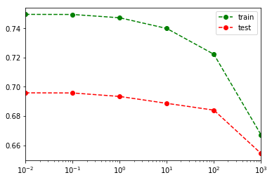

```python
import numpy as np
import pandas as pd
import matplotlib.pyplot as plt

from sklearn.model_selection import train_test_split

%matplotlib inline
```

data/boston.csv 파일을 지도학습용으로 준비합니다.


```python
boston = pd.read_csv('data/boston.csv')
```


```python
boston[:5]
```


<div>
<style>
    .dataframe thead tr:only-child th {
        text-align: right;
    }

    .dataframe thead th {
        text-align: left;
    }

    .dataframe tbody tr th {
        vertical-align: top;
    }
</style>
<table border="1" class="dataframe">
  <thead>
    <tr style="text-align: right;">
      <th></th>
      <th>Price</th>
      <th>CRIM</th>
      <th>ZN</th>
      <th>INDUS</th>
      <th>CHAS</th>
      <th>NOX</th>
      <th>RM</th>
      <th>AGE</th>
      <th>DIS</th>
      <th>RAD</th>
      <th>TAX</th>
      <th>PTRATIO</th>
      <th>B</th>
      <th>LSTAT</th>
    </tr>
  </thead>
  <tbody>
    <tr>
      <th>0</th>
      <td>24.0</td>
      <td>0.00632</td>
      <td>18.0</td>
      <td>2.31</td>
      <td>0.0</td>
      <td>0.538</td>
      <td>6.575</td>
      <td>65.2</td>
      <td>4.0900</td>
      <td>1.0</td>
      <td>296.0</td>
      <td>15.3</td>
      <td>396.90</td>
      <td>4.98</td>
    </tr>
    <tr>
      <th>1</th>
      <td>21.6</td>
      <td>0.02731</td>
      <td>0.0</td>
      <td>7.07</td>
      <td>0.0</td>
      <td>0.469</td>
      <td>6.421</td>
      <td>78.9</td>
      <td>4.9671</td>
      <td>2.0</td>
      <td>242.0</td>
      <td>17.8</td>
      <td>396.90</td>
      <td>9.14</td>
    </tr>
    <tr>
      <th>2</th>
      <td>34.7</td>
      <td>0.02729</td>
      <td>0.0</td>
      <td>7.07</td>
      <td>0.0</td>
      <td>0.469</td>
      <td>7.185</td>
      <td>61.1</td>
      <td>4.9671</td>
      <td>2.0</td>
      <td>242.0</td>
      <td>17.8</td>
      <td>392.83</td>
      <td>4.03</td>
    </tr>
    <tr>
      <th>3</th>
      <td>33.4</td>
      <td>0.03237</td>
      <td>0.0</td>
      <td>2.18</td>
      <td>0.0</td>
      <td>0.458</td>
      <td>6.998</td>
      <td>45.8</td>
      <td>6.0622</td>
      <td>3.0</td>
      <td>222.0</td>
      <td>18.7</td>
      <td>394.63</td>
      <td>2.94</td>
    </tr>
    <tr>
      <th>4</th>
      <td>36.2</td>
      <td>0.06905</td>
      <td>0.0</td>
      <td>2.18</td>
      <td>0.0</td>
      <td>0.458</td>
      <td>7.147</td>
      <td>54.2</td>
      <td>6.0622</td>
      <td>3.0</td>
      <td>222.0</td>
      <td>18.7</td>
      <td>396.90</td>
      <td>5.33</td>
    </tr>
  </tbody>
</table>
</div>


```python
y = boston['Price']
X = boston.values[:, 1:]
```


```python
X.shape
```


    (506, 13)


```python
X_train, X_test, y_train, y_test = train_test_split(X, y)
```


```python
from sklearn.neighbors import KNeighborsRegressor
from sklearn.linear_model import LinearRegression
```


```python
knn_reg = KNeighborsRegressor()
knn_reg
```


    KNeighborsRegressor(algorithm='auto', leaf_size=30, metric='minkowski',
              metric_params=None, n_jobs=1, n_neighbors=5, p=2,
              weights='uniform')


```python
lin_reg = LinearRegression()
lin_reg
```


    LinearRegression(copy_X=True, fit_intercept=True, n_jobs=1, normalize=False)


#### 연습

boston 데이터에 대해 두 모델을 훈련하고 평가합니다.


```python
knn_reg.fit(X_train, y_train)
```


    KNeighborsRegressor(algorithm='auto', leaf_size=30, metric='minkowski',
              metric_params=None, n_jobs=1, n_neighbors=5, p=2,
              weights='uniform')


```python
lin_reg.fit(X_train, y_train)
```


    LinearRegression(copy_X=True, fit_intercept=True, n_jobs=1, normalize=False)


```python
knn_reg.score(X_train, y_train)
```


    0.66882387028003576


```python
knn_reg.score(X_test, y_test)
```


    0.57440025399153138


```python
lin_reg.score(X_train, y_train)
```


    0.70173657643201737


```python
lin_reg.score(X_test, y_test)
```


    0.80947357108980755


## 릿지 회귀


```python
from sklearn.linear_model import Ridge
```


```python
ridge = Ridge(alpha=1.0).fit(X_train, y_train)
```


```python
w = ridge.coef_
b = ridge.intercept_
```


```python
ridge.score(X_train, y_train)
```


    0.69946769693519983


```python
ridge.score(X_test, y_test)
```


    0.80489965010688491


#### 연습

Ridge의 alpha 값을 0.1, 1., 10으로 바꿔가면서 평가합니다.


```python
X_train, X_test, y_train, y_test = train_test_split(X, y)
```


```python
scores = []
weights = []
alpha_range = [0.01, 0.1, 1., 10., 100., 1000.]
for alpha in alpha_range:
    ridge = Ridge(alpha=alpha).fit(
        X_train, y_train)    
    weights.append(ridge.coef_)
    train_score = ridge.score(X_train, y_train)
    test_score = ridge.score(X_test, y_test)
    scores.append((train_score, test_score))
```


```python
훈련평가 = pd.DataFrame(
    scores, 
    index=alpha_range, 
    columns=['train', 'test'])
```


```python
훈련평가.plot(
    logx=True, ylim=(0.3, 1.0),
    style=['go--', 'ro--'])
```


    <matplotlib.axes._subplots.AxesSubplot at 0x10ad3b70>


```python
weights = pd.DataFrame(
    weights, index=alpha_range)
```


```python
(weights ** 2).sum(axis=1)
```


    0.01       405.993574
    0.10       354.672626
    1.00       140.507629
    10.00       26.972567
    100.00       8.436325
    1000.00      1.695395
    dtype: float64


#### 연습

boston_x.csv 데이터에 대해 Ridge 회귀 모델을 훈련하고 평가합니다. 이전의 boston.csv 데이터와 훈련/테스트 점수의 양상을 비교해 봅시다.

*생각해 볼 점*

1. 특징(차원)의 증가로 인해 어디에 많은 영향을 미쳤나요?
1. alpha값은 얼마로 하는 것이 적절할까요?


```python
boston_x = pd.read_csv('data/boston_x.csv')
```


```python
y = boston_x['y']
X = boston.values[:, 1:].astype('float32')
```


```python
X_train, X_test, y_train, y_test = train_test_split(X, y)
```


```python
scores = []
for alpha in alpha_range:
    ridge = Ridge(alpha).fit(X_train, y_train)
    train_score = ridge.score(X_train, y_train)
    test_score = ridge.score(X_test, y_test)
    scores.append((train_score, test_score))
```


```python
pd.DataFrame(
    scores, index=alpha_range,
    columns=['train', 'test']
).plot(logx=True, style=['go--', 'ro--'])
```


    <matplotlib.axes._subplots.AxesSubplot at 0x10f1c080>





#### 연습

주어진 모델은 선형 분류 모델입니다. 이 모델의 중요한 하이퍼 파라메터는 C입니다. 주어진 데이터에 대해 하이퍼 파라메터 튜닝을 통해 모델을 평가하고, 적절한 C값을 설정합니다.


```python
from sklearn.linear_model import (
    LogisticRegression)
```


```python
cancer = pd.read_csv('data/wdbc.data')
cancer[:5]
```


<div>
<style>
    .dataframe thead tr:only-child th {
        text-align: right;
    }

    .dataframe thead th {
        text-align: left;
    }

    .dataframe tbody tr th {
        vertical-align: top;
    }
</style>
<table border="1" class="dataframe">
  <thead>
    <tr style="text-align: right;">
      <th></th>
      <th>class</th>
      <th>mean radius</th>
      <th>mean texture</th>
      <th>mean perimeter</th>
      <th>mean area</th>
      <th>mean smoothness</th>
      <th>mean compactness</th>
      <th>mean concavity</th>
      <th>mean concave points</th>
      <th>mean symmetry</th>
      <th>...</th>
      <th>worst radius</th>
      <th>worst texture</th>
      <th>worst perimeter</th>
      <th>worst area</th>
      <th>worst smoothness</th>
      <th>worst compactness</th>
      <th>worst concavity</th>
      <th>worst concave points</th>
      <th>worst symmetry</th>
      <th>worst fractal dimension</th>
    </tr>
  </thead>
  <tbody>
    <tr>
      <th>0</th>
      <td>malignant</td>
      <td>17.99</td>
      <td>10.38</td>
      <td>122.80</td>
      <td>1001.0</td>
      <td>0.11840</td>
      <td>0.27760</td>
      <td>0.3001</td>
      <td>0.14710</td>
      <td>0.2419</td>
      <td>...</td>
      <td>25.38</td>
      <td>17.33</td>
      <td>184.60</td>
      <td>2019.0</td>
      <td>0.1622</td>
      <td>0.6656</td>
      <td>0.7119</td>
      <td>0.2654</td>
      <td>0.4601</td>
      <td>0.11890</td>
    </tr>
    <tr>
      <th>1</th>
      <td>malignant</td>
      <td>20.57</td>
      <td>17.77</td>
      <td>132.90</td>
      <td>1326.0</td>
      <td>0.08474</td>
      <td>0.07864</td>
      <td>0.0869</td>
      <td>0.07017</td>
      <td>0.1812</td>
      <td>...</td>
      <td>24.99</td>
      <td>23.41</td>
      <td>158.80</td>
      <td>1956.0</td>
      <td>0.1238</td>
      <td>0.1866</td>
      <td>0.2416</td>
      <td>0.1860</td>
      <td>0.2750</td>
      <td>0.08902</td>
    </tr>
    <tr>
      <th>2</th>
      <td>malignant</td>
      <td>19.69</td>
      <td>21.25</td>
      <td>130.00</td>
      <td>1203.0</td>
      <td>0.10960</td>
      <td>0.15990</td>
      <td>0.1974</td>
      <td>0.12790</td>
      <td>0.2069</td>
      <td>...</td>
      <td>23.57</td>
      <td>25.53</td>
      <td>152.50</td>
      <td>1709.0</td>
      <td>0.1444</td>
      <td>0.4245</td>
      <td>0.4504</td>
      <td>0.2430</td>
      <td>0.3613</td>
      <td>0.08758</td>
    </tr>
    <tr>
      <th>3</th>
      <td>malignant</td>
      <td>11.42</td>
      <td>20.38</td>
      <td>77.58</td>
      <td>386.1</td>
      <td>0.14250</td>
      <td>0.28390</td>
      <td>0.2414</td>
      <td>0.10520</td>
      <td>0.2597</td>
      <td>...</td>
      <td>14.91</td>
      <td>26.50</td>
      <td>98.87</td>
      <td>567.7</td>
      <td>0.2098</td>
      <td>0.8663</td>
      <td>0.6869</td>
      <td>0.2575</td>
      <td>0.6638</td>
      <td>0.17300</td>
    </tr>
    <tr>
      <th>4</th>
      <td>malignant</td>
      <td>20.29</td>
      <td>14.34</td>
      <td>135.10</td>
      <td>1297.0</td>
      <td>0.10030</td>
      <td>0.13280</td>
      <td>0.1980</td>
      <td>0.10430</td>
      <td>0.1809</td>
      <td>...</td>
      <td>22.54</td>
      <td>16.67</td>
      <td>152.20</td>
      <td>1575.0</td>
      <td>0.1374</td>
      <td>0.2050</td>
      <td>0.4000</td>
      <td>0.1625</td>
      <td>0.2364</td>
      <td>0.07678</td>
    </tr>
  </tbody>
</table>
<p>5 rows × 31 columns</p>
</div>


```python
y = cancer['class']
X = cancer.values[:, 1:].astype('float32')
```


```python
X_train, X_test, y_train, y_test = train_test_split(
    X, y, stratify=y)
```


```python
logreg = LogisticRegression().fit(
    X_train, y_train)
```


```python
logreg.score(X_train, y_train)
```


    0.960093896713615


```python
logreg.score(X_test, y_test)
```


    0.965034965034965


```python
C_range = [0.01, 0.1, 1., 10., 100., 1000.]

scores = []
weights = []
for C in C_range:
    logreg = LogisticRegression(C=C)    
    logreg.fit(X_train, y_train)
    # TODO: 가중치 수집
    weights.append(logreg.coef_.flatten())
    train_score = logreg.score(X_train, y_train)
    test_score = logreg.score(X_test, y_test)
    scores.append((train_score, test_score))
```


```python
train_results = pd.DataFrame(
    scores, 
    index=C_range, 
    columns=['train', 'test'])
```


```python
train_results.plot(
    logx=True, ylim=(0.7, 1.05),
    style=['go--', 'ro--'])
```


    <matplotlib.axes._subplots.AxesSubplot at 0x11540390>


```python
(pd.DataFrame(weights, index=C_range) ** 2).sum(1)
```


    0.01         0.122867
    0.10         1.124122
    1.00        12.224522
    10.00       60.608969
    100.00     127.143582
    1000.00    111.467261
    dtype: float64


```python
plt.plot(weights[0], 'o', label='C=0.01')
plt.plot(weights[-1], 'x', label='C=1000')
plt.hlines(0, 0, len(weights[0]))
```


    <matplotlib.collections.LineCollection at 0x12a67940>


```python
logreg
```


    LogisticRegression(C=1000.0, class_weight=None, dual=False,
              fit_intercept=True, intercept_scaling=1, max_iter=100,
              multi_class='ovr', n_jobs=1, penalty='l2', random_state=None,
              solver='liblinear', tol=0.0001, verbose=0, warm_start=False)


```python
pd.DataFrame(logreg.predict_proba(X_test))
```


<div>
<style>
    .dataframe thead tr:only-child th {
        text-align: right;
    }

    .dataframe thead th {
        text-align: left;
    }

    .dataframe tbody tr th {
        vertical-align: top;
    }
</style>
<table border="1" class="dataframe">
  <thead>
    <tr style="text-align: right;">
      <th></th>
      <th>0</th>
      <th>1</th>
    </tr>
  </thead>
  <tbody>
    <tr>
      <th>0</th>
      <td>5.252537e-01</td>
      <td>0.474746</td>
    </tr>
    <tr>
      <th>1</th>
      <td>9.973136e-01</td>
      <td>0.002686</td>
    </tr>
    <tr>
      <th>2</th>
      <td>2.072585e-07</td>
      <td>1.000000</td>
    </tr>
    <tr>
      <th>3</th>
      <td>7.739009e-08</td>
      <td>1.000000</td>
    </tr>
    <tr>
      <th>4</th>
      <td>9.157650e-01</td>
      <td>0.084235</td>
    </tr>
    <tr>
      <th>5</th>
      <td>1.823338e-02</td>
      <td>0.981767</td>
    </tr>
    <tr>
      <th>6</th>
      <td>9.997161e-01</td>
      <td>0.000284</td>
    </tr>
    <tr>
      <th>7</th>
      <td>9.853372e-01</td>
      <td>0.014663</td>
    </tr>
    <tr>
      <th>8</th>
      <td>1.849432e-11</td>
      <td>1.000000</td>
    </tr>
    <tr>
      <th>9</th>
      <td>3.299029e-05</td>
      <td>0.999967</td>
    </tr>
    <tr>
      <th>10</th>
      <td>2.032494e-01</td>
      <td>0.796751</td>
    </tr>
    <tr>
      <th>11</th>
      <td>9.878192e-01</td>
      <td>0.012181</td>
    </tr>
    <tr>
      <th>12</th>
      <td>2.220446e-16</td>
      <td>1.000000</td>
    </tr>
    <tr>
      <th>13</th>
      <td>5.993143e-07</td>
      <td>0.999999</td>
    </tr>
    <tr>
      <th>14</th>
      <td>9.995436e-01</td>
      <td>0.000456</td>
    </tr>
    <tr>
      <th>15</th>
      <td>1.998401e-15</td>
      <td>1.000000</td>
    </tr>
    <tr>
      <th>16</th>
      <td>9.999684e-01</td>
      <td>0.000032</td>
    </tr>
    <tr>
      <th>17</th>
      <td>9.998616e-01</td>
      <td>0.000138</td>
    </tr>
    <tr>
      <th>18</th>
      <td>9.999971e-01</td>
      <td>0.000003</td>
    </tr>
    <tr>
      <th>19</th>
      <td>4.096997e-05</td>
      <td>0.999959</td>
    </tr>
    <tr>
      <th>20</th>
      <td>3.232854e-06</td>
      <td>0.999997</td>
    </tr>
    <tr>
      <th>21</th>
      <td>9.999495e-01</td>
      <td>0.000050</td>
    </tr>
    <tr>
      <th>22</th>
      <td>4.206145e-05</td>
      <td>0.999958</td>
    </tr>
    <tr>
      <th>23</th>
      <td>9.996824e-01</td>
      <td>0.000318</td>
    </tr>
    <tr>
      <th>24</th>
      <td>9.910677e-01</td>
      <td>0.008932</td>
    </tr>
    <tr>
      <th>25</th>
      <td>1.123435e-10</td>
      <td>1.000000</td>
    </tr>
    <tr>
      <th>26</th>
      <td>9.999809e-01</td>
      <td>0.000019</td>
    </tr>
    <tr>
      <th>27</th>
      <td>9.771015e-01</td>
      <td>0.022899</td>
    </tr>
    <tr>
      <th>28</th>
      <td>9.998340e-01</td>
      <td>0.000166</td>
    </tr>
    <tr>
      <th>29</th>
      <td>3.809922e-02</td>
      <td>0.961901</td>
    </tr>
    <tr>
      <th>...</th>
      <td>...</td>
      <td>...</td>
    </tr>
    <tr>
      <th>113</th>
      <td>9.999643e-01</td>
      <td>0.000036</td>
    </tr>
    <tr>
      <th>114</th>
      <td>2.090717e-04</td>
      <td>0.999791</td>
    </tr>
    <tr>
      <th>115</th>
      <td>9.964612e-01</td>
      <td>0.003539</td>
    </tr>
    <tr>
      <th>116</th>
      <td>9.998456e-01</td>
      <td>0.000154</td>
    </tr>
    <tr>
      <th>117</th>
      <td>9.977406e-01</td>
      <td>0.002259</td>
    </tr>
    <tr>
      <th>118</th>
      <td>9.908883e-01</td>
      <td>0.009112</td>
    </tr>
    <tr>
      <th>119</th>
      <td>9.991618e-01</td>
      <td>0.000838</td>
    </tr>
    <tr>
      <th>120</th>
      <td>1.867282e-08</td>
      <td>1.000000</td>
    </tr>
    <tr>
      <th>121</th>
      <td>7.022492e-04</td>
      <td>0.999298</td>
    </tr>
    <tr>
      <th>122</th>
      <td>9.999438e-01</td>
      <td>0.000056</td>
    </tr>
    <tr>
      <th>123</th>
      <td>9.996825e-01</td>
      <td>0.000318</td>
    </tr>
    <tr>
      <th>124</th>
      <td>5.573697e-11</td>
      <td>1.000000</td>
    </tr>
    <tr>
      <th>125</th>
      <td>7.909288e-07</td>
      <td>0.999999</td>
    </tr>
    <tr>
      <th>126</th>
      <td>9.867307e-01</td>
      <td>0.013269</td>
    </tr>
    <tr>
      <th>127</th>
      <td>9.923909e-01</td>
      <td>0.007609</td>
    </tr>
    <tr>
      <th>128</th>
      <td>9.998919e-01</td>
      <td>0.000108</td>
    </tr>
    <tr>
      <th>129</th>
      <td>3.239701e-09</td>
      <td>1.000000</td>
    </tr>
    <tr>
      <th>130</th>
      <td>3.750962e-03</td>
      <td>0.996249</td>
    </tr>
    <tr>
      <th>131</th>
      <td>5.651492e-01</td>
      <td>0.434851</td>
    </tr>
    <tr>
      <th>132</th>
      <td>9.868734e-01</td>
      <td>0.013127</td>
    </tr>
    <tr>
      <th>133</th>
      <td>3.283493e-04</td>
      <td>0.999672</td>
    </tr>
    <tr>
      <th>134</th>
      <td>9.736546e-01</td>
      <td>0.026345</td>
    </tr>
    <tr>
      <th>135</th>
      <td>9.999935e-01</td>
      <td>0.000006</td>
    </tr>
    <tr>
      <th>136</th>
      <td>9.949644e-01</td>
      <td>0.005036</td>
    </tr>
    <tr>
      <th>137</th>
      <td>9.998482e-01</td>
      <td>0.000152</td>
    </tr>
    <tr>
      <th>138</th>
      <td>9.999904e-01</td>
      <td>0.000010</td>
    </tr>
    <tr>
      <th>139</th>
      <td>9.997622e-01</td>
      <td>0.000238</td>
    </tr>
    <tr>
      <th>140</th>
      <td>9.990694e-01</td>
      <td>0.000931</td>
    </tr>
    <tr>
      <th>141</th>
      <td>9.999605e-01</td>
      <td>0.000040</td>
    </tr>
    <tr>
      <th>142</th>
      <td>9.999592e-01</td>
      <td>0.000041</td>
    </tr>
  </tbody>
</table>
<p>143 rows × 2 columns</p>
</div>


```python
X.shape
```


    (569, 30)


```python
logreg.coef_.shape
```


    (1, 30)


#### 연습

data/wine.data를 Logistic Regression 모델로 훈련하고, 평가합니다. 클래스는 몇 개인가요? 훈련된 모델의 가중치의 형상은?


```python
wine = pd.read_csv('data/wine.data')
```


```python
y = wine['Class label']
X = wine.values[:, 1:]
```


```python
X.shape
```


    (178, 13)


```python
X_train, X_test, y_train, y_test = train_test_split(
    X, y)
```


```python
logreg = LogisticRegression().fit(
    X_train, y_train)
```


```python
logreg.score(X_test, y_test)
```


    0.91111111111111109


```python
len(np.unique(y))
```


    3


```python
logreg.coef_.shape
```


    (3, 13)


# 결정 트리


```python
from sklearn.tree import DecisionTreeClassifier
```


```python
tree = DecisionTreeClassifier()
```


```python
tree.fit(X_train, y_train)
```


    DecisionTreeClassifier(class_weight=None, criterion='gini', max_depth=None,
                max_features=None, max_leaf_nodes=None,
                min_impurity_decrease=0.0, min_impurity_split=None,
                min_samples_leaf=1, min_samples_split=2,
                min_weight_fraction_leaf=0.0, presort=False, random_state=None,
                splitter='best')


```python
tree.score(X_test, y_test)
```


    0.93333333333333335


```python
tree.score(X_train, y_train)
```


    1.0


```python
tree = DecisionTreeClassifier(max_depth=5)
```


```python
tree.fit(X_train, y_train)
```


    DecisionTreeClassifier(class_weight=None, criterion='gini', max_depth=5,
                max_features=None, max_leaf_nodes=None,
                min_impurity_decrease=0.0, min_impurity_split=None,
                min_samples_leaf=1, min_samples_split=2,
                min_weight_fraction_leaf=0.0, presort=False, random_state=None,
                splitter='best')


```python
tree.score(X_train, y_train)
```


    1.0


```python
tree.score(X_test, y_test)
```


    0.9555555555555556


#### 연습

boston.data에 결정 트리를 적용하고, 하이퍼 파라메터 튜링을 수행합니다.


```python
from sklearn.tree import DecisionTreeRegressor
```


```python
y = boston['Price']
X = boston.values[:, 1:].astype('float32')
```


```python
X.shape
```


    (506, 13)


```python
tree_reg = DecisionTreeRegressor()
```


```python
tree_reg.fit(X_train, y_train)
```


    DecisionTreeRegressor(criterion='mse', max_depth=None, max_features=None,
               max_leaf_nodes=None, min_impurity_decrease=0.0,
               min_impurity_split=None, min_samples_leaf=1,
               min_samples_split=2, min_weight_fraction_leaf=0.0,
               presort=False, random_state=None, splitter='best')


```python
tree_reg.score(X_train, y_train)
```


    1.0


```python
tree_reg.score(X_test, y_test)
```


    0.95817843866171004


```python
특성중요도 = tree_reg.feature_importances_
```


```python
특성중요도 = pd.Series(
    특성중요도, index=boston.columns[1:])
```


```python
특성중요도.sort_values().plot(kind='barh')
```


    <matplotlib.axes._subplots.AxesSubplot at 0x116590f0>


"비올까?"

다음 날 비가 올지 예측하는 기계학습 모델을 훈련하고 평가합니다.


```python
weather = pd.read_excel('data/weather.xlsx')
```


```python
weather[:5]
```


<div>
<style>
    .dataframe thead tr:only-child th {
        text-align: right;
    }

    .dataframe thead th {
        text-align: left;
    }

    .dataframe tbody tr th {
        vertical-align: top;
    }
</style>
<table border="1" class="dataframe">
  <thead>
    <tr style="text-align: right;">
      <th></th>
      <th>location</th>
      <th>date</th>
      <th>weekDay</th>
      <th>avgTemp</th>
      <th>highestTemp</th>
      <th>lowestTemp</th>
      <th>precipitation</th>
      <th>snow</th>
      <th>windSpeed</th>
      <th>humidity</th>
      <th>cloud</th>
      <th>dayTime</th>
      <th>weather</th>
    </tr>
  </thead>
  <tbody>
    <tr>
      <th>0</th>
      <td>seoul</td>
      <td>2013-08-01</td>
      <td>thur</td>
      <td>28.0</td>
      <td>32.1</td>
      <td>24.5</td>
      <td>-</td>
      <td>-</td>
      <td>1.8</td>
      <td>66</td>
      <td>7.1</td>
      <td>6.0</td>
      <td>구름많음</td>
    </tr>
    <tr>
      <th>1</th>
      <td>seoul</td>
      <td>2013-08-02</td>
      <td>fri</td>
      <td>27.4</td>
      <td>29.3</td>
      <td>25.2</td>
      <td>7.5</td>
      <td>-</td>
      <td>2.1</td>
      <td>79</td>
      <td>9.1</td>
      <td>0.9</td>
      <td>흐림/안개/비</td>
    </tr>
    <tr>
      <th>2</th>
      <td>seoul</td>
      <td>2013-08-03</td>
      <td>sat</td>
      <td>28.9</td>
      <td>32.6</td>
      <td>26.7</td>
      <td>0.1</td>
      <td>-</td>
      <td>3.6</td>
      <td>72</td>
      <td>8.1</td>
      <td>8.9</td>
      <td>흐림/소나기</td>
    </tr>
    <tr>
      <th>3</th>
      <td>seoul</td>
      <td>2013-08-04</td>
      <td>sun</td>
      <td>28.3</td>
      <td>31.3</td>
      <td>26.4</td>
      <td>4.5</td>
      <td>-</td>
      <td>2.5</td>
      <td>76</td>
      <td>8.0</td>
      <td>4.7</td>
      <td>흐림/소나기/안개</td>
    </tr>
    <tr>
      <th>4</th>
      <td>seoul</td>
      <td>2013-08-05</td>
      <td>mon</td>
      <td>27.7</td>
      <td>30.1</td>
      <td>26.4</td>
      <td>7</td>
      <td>-</td>
      <td>3.3</td>
      <td>78</td>
      <td>7.0</td>
      <td>4.5</td>
      <td>구름많음/안개/천둥번개/비</td>
    </tr>
  </tbody>
</table>
</div>


```python
y = weather['weather'].str.contains(
    '비|눈|소나기')
y = y.replace([True, False], [1, 0])
```


```python
X = weather.drop(
    ['location', 'date', 'weekDay', 'weather'],\
    axis=1)
```


```python
X = X.replace('-', 0.0)
```


```python
y = y.shift(-1)
```


```python
X.shape
```


    (1460, 9)


```python
len(y)
```


    1460


```python
y[-2:]
```


    1458    0.0
    1459    NaN
    Name: weather, dtype: float64


```python
X = X[:-1]
y = y[:-1]
```


```python
X_train, X_test, y_train, y_test = train_test_split(X, y)
```


```python
logreg = LogisticRegression().fit(X_train, y_train)
```


```python
logreg.score(X_train, y_train)
```


    0.73217550274223031


```python
logreg.score(X_test, y_test)
```


    0.76164383561643834


```python
tree = DecisionTreeClassifier(max_depth=8)
```


```python
tree.fit(X_train, y_train)
```


    DecisionTreeClassifier(class_weight=None, criterion='gini', max_depth=8,
                max_features=None, max_leaf_nodes=None,
                min_impurity_decrease=0.0, min_impurity_split=None,
                min_samples_leaf=1, min_samples_split=2,
                min_weight_fraction_leaf=0.0, presort=False, random_state=None,
                splitter='best')


```python
tree.score(X_train, y_train)
```


    0.86288848263254114


```python
tree.score(X_test, y_test)
```


    0.70684931506849313


