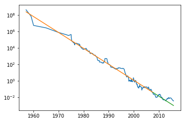

```python
import numpy as np
import pandas as pd
from pandas import Series, DataFrame
import matplotlib.pyplot as plt

from sklearn.model_selection import train_test_split

%matplotlib inline
```

#### 연습

data/wdbc.data를 결정 트리로 훈련하고, 결과를 평가합니다. 결정 트리의 하이퍼 파라메터의 튜닝으로 성능을 최대한 끌어냅니다.

1. 특성 중요도를 추출해 중요한 세 가지 특징을 중요도 순서로 추출합니다.
1. LogisticRegression으로 훈련한 다음, 가중치의 절대값이 큰 특징들 세 개는 무엇인지 살펴봅니다.


```python
cancer = pd.read_csv('data/wdbc.data')
```


```python
y = cancer['class']
X = cancer.values[:, 1:].astype('float32')
```


```python
X.shape
```


    (569, 30)


```python
X_train, X_test, y_train, y_test = train_test_split(
    X, y, stratify=y)
```


```python
from sklearn.tree import DecisionTreeClassifier
```


```python
scores = []
max_depth_range = list(range(1, 11))
for max_depth in max_depth_range:
    tree = DecisionTreeClassifier(
        max_depth=max_depth)
    tree.fit(X_train, y_train)
    train_score = tree.score(X_train, y_train)
    test_score = tree.score(X_test, y_test)
    scores.append((train_score, test_score))
```


```python
train_results = DataFrame(
    scores, index=max_depth_range, 
    columns=['train', 'test'])
```


```python
train_results.plot(
    ylim=(0.7, 1.01), style=['go--', 'ro--'])
```


    <matplotlib.axes._subplots.AxesSubplot at 0xbf7ea20>


```python
tree = DecisionTreeClassifier(max_depth=1)
tree.fit(X_train, y_train)
특성중요도 = tree.feature_importances_
특성중요도 = Series(
    특성중요도, index=cancer.columns[1:])
```


```python
특성중요도.sort_values(ascending=False)[:3]
```


    worst area                 1.0
    worst fractal dimension    0.0
    area error                 0.0
    dtype: float64


```python
from sklearn.linear_model import LogisticRegression
```


```python
logreg = LogisticRegression()
```


```python
logreg.fit(X_train, y_train)
```


    LogisticRegression(C=1.0, class_weight=None, dual=False, fit_intercept=True,
              intercept_scaling=1, max_iter=100, multi_class='ovr', n_jobs=1,
              penalty='l2', random_state=None, solver='liblinear', tol=0.0001,
              verbose=0, warm_start=False)


```python
logreg.score(X_train, y_train)
```


    0.95539906103286387


```python
logreg.score(X_test, y_test)
```


    0.965034965034965


```python
w = logreg.coef_
```


```python
weights = Series(w.reshape(30), 
       index=cancer.columns[1:])
```


```python
weights.abs().sort_values(ascending=False)
```


    mean radius                1.762857
    worst radius               1.393452
    worst concavity            1.358153
    texture error              1.141301
    worst compactness          0.985621
    mean concavity             0.513301
    worst concave points       0.504893
    worst symmetry             0.411384
    mean compactness           0.331754
    worst texture              0.325752
    mean concave points        0.249428
    worst perimeter            0.221422
    worst smoothness           0.207193
    mean symmetry              0.145547
    perimeter error            0.106879
    mean smoothness            0.105641
    area error                 0.098804
    worst fractal dimension    0.096695
    mean texture               0.083026
    mean perimeter             0.074239
    concavity error            0.073172
    radius error               0.039637
    concave points error       0.033337
    compactness error          0.030873
    symmetry error             0.019945
    mean fractal dimension     0.018739
    worst area                 0.017598
    smoothness error           0.012166
    mean area                  0.011032
    fractal dimension error    0.000464
    dtype: float64


```python
ram_price = pd.read_csv('data/ram_price.csv')
```


```python
ram_price.set_index('date').plot(logy=True)
```


    <matplotlib.axes._subplots.AxesSubplot at 0xd88b0f0>


#### 연습

ram_price를 선형회귀와 결정 트리로 훈련하고, 평가합니다.

*생각해 볼 점*

train_test_split을 시계열 형태의 데이터에 적용해도 될까요? 만약 안 된다면, 어떤 문제 때문인가요?


```python
y = ram_price['price']
X = ram_price['date'].values.astype('float32')
```


```python
X = X.reshape(333, 1)
X.shape
```


    (333, 1)


```python
train_size = int(len(X) * 0.8)
```


```python
X_train = X[:train_size]
X_test = X[train_size:]
```


```python
len(X_train), len(X_test)
```


    (266, 67)


```python
y_train = y[:train_size]
y_test = y[train_size:]
```


```python
from sklearn.tree import DecisionTreeRegressor
```


```python
from sklearn.linear_model import LinearRegression
```


```python
tree_reg = DecisionTreeRegressor()
```


```python
linreg = LinearRegression()
```


```python
tree_reg.fit(X_train, y_train)
linreg.fit(X_train, y_train)
```


    LinearRegression(copy_X=True, fit_intercept=True, n_jobs=1, normalize=False)


```python
y_pred_train = tree_reg.predict(X_train)
y_pred_test = tree_reg.predict(X_test)
```


```python
plt.semilogy(X.flatten(), y)
plt.semilogy(X_train.flatten(), y_pred_train)
plt.semilogy(X_test.flatten(), y_pred_test)
plt.semilogy(
    X_train.flatten(), linreg.predict(X_train))
```


    [<matplotlib.lines.Line2D at 0xe4357b8>]


#### 연습

로그 스케일로 변환된 y에 대해 선형회귀 모델을 훈련하고 평가합니다.


```python
log_y = np.log(y)
log_y_train = log_y[:train_size]
log_y_test = log_y[train_size:]
```


```python
linreg = LinearRegression().fit(
    X_train, log_y_train)
```


```python
plt.semilogy(X.flatten(), y)
plt.semilogy(
    X_train.flatten(), 
    np.exp(linreg.predict(X_train)))
plt.semilogy(
    X_test.flatten(),
    np.exp(linreg.predict(X_test))
)
```


    [<matplotlib.lines.Line2D at 0xdbf4f60>]





## Random Forest


```python
from sklearn.ensemble import RandomForestClassifier
```

#### 연습

cancer 데이터를 랜덤 포레스트 모델로 훈련하고, 평가합니다.


```python
y = cancer['class']
X = cancer.values[:, 1:].astype('float32')
```


```python
X_train, X_test, y_train, y_test = train_test_split(
    X, y, stratify=y)
```


```python
forest = RandomForestClassifier(n_estimators=1000)
```


```python
forest.fit(X_train, y_train)
```


    RandomForestClassifier(bootstrap=True, class_weight=None, criterion='gini',
                max_depth=None, max_features='auto', max_leaf_nodes=None,
                min_impurity_decrease=0.0, min_impurity_split=None,
                min_samples_leaf=1, min_samples_split=2,
                min_weight_fraction_leaf=0.0, n_estimators=1000, n_jobs=1,
                oob_score=False, random_state=None, verbose=0,
                warm_start=False)


```python
forest.score(X_train, y_train)
```


    1.0


```python
forest.score(X_test, y_test)
```


    0.95804195804195802


```python
특성중요도 = forest.feature_importances_
```


```python
특성중요도 = Series(
    특성중요도, index=cancer.columns[1:])
```


```python
특성중요도.sort_values().plot(kind='barh')
```


    <matplotlib.axes._subplots.AxesSubplot at 0xf3ca278>


```python
from sklearn.ensemble import GradientBoostingClassifier
```


```python
gbrt = GradientBoostingClassifier(
    n_estimators=100, max_depth=1)

gbrt.fit(X_train, y_train)
```


    GradientBoostingClassifier(criterion='friedman_mse', init=None,
                  learning_rate=0.1, loss='deviance', max_depth=1,
                  max_features=None, max_leaf_nodes=None,
                  min_impurity_decrease=0.0, min_impurity_split=None,
                  min_samples_leaf=1, min_samples_split=2,
                  min_weight_fraction_leaf=0.0, n_estimators=100,
                  presort='auto', random_state=None, subsample=1.0, verbose=0,
                  warm_start=False)


```python
gbrt.score(X_train, y_train)
```


    0.99061032863849763


```python
gbrt.score(X_test, y_test)
```


    0.965034965034965


```python
특성중요도 = Series(
    gbrt.feature_importances_,
    index=cancer.columns[1:])
```


```python
특성중요도.sort_values().plot(kind='barh')
```


    <matplotlib.axes._subplots.AxesSubplot at 0x104c27f0>


```python
제외특성목록 = 특성중요도.sort_values(
    ascending=False)['compactness error':]
제외특성목록 = list(제외특성목록.index)
```


```python
cancer2 = cancer.drop(제외특성목록, axis=1)
```


```python
X = cancer.values[:, 1:].astype('float32')
```


```python
X2 = cancer2.values[:, 1:].astype('float32')
```


```python
X.shape
```


    (569, 30)


```python
X2.shape
```


    (569, 17)


```python
X_train, X_test, X2_train, X2_test, y_train, y_test = train_test_split(
    X, X2, y, stratify=y)
```


```python
forest = RandomForestClassifier(n_estimators=100)
gbrt = GradientBoostingClassifier(
    n_estimators=100, max_depth=1)
```


```python
scores = []
for Xtr, Xte in [
    (X_train, X_test), (X2_train, X2_test)]:
    forest.fit(Xtr, y_train)
    train_score = forest.score(Xtr, y_train)
    test_score = forest.score(Xte, y_test)
    scores.append((train_score, test_score))
    gbrt.fit(Xtr, y_train)
    train_score = gbrt.score(Xtr, y_train)
    test_score = gbrt.score(Xte, y_test)
    scores.append((train_score, test_score))
```


```python
DataFrame(
    scores, columns=['train', 'test'],
    index=['X RF', 'X GBRT', 'X2 RF', 'X2 GBRT']
)
```


<div>
<style>
    .dataframe thead tr:only-child th {
        text-align: right;
    }

    .dataframe thead th {
        text-align: left;
    }

    .dataframe tbody tr th {
        vertical-align: top;
    }
</style>
<table border="1" class="dataframe">
  <thead>
    <tr style="text-align: right;">
      <th></th>
      <th>train</th>
      <th>test</th>
    </tr>
  </thead>
  <tbody>
    <tr>
      <th>X RF</th>
      <td>1.000000</td>
      <td>0.965035</td>
    </tr>
    <tr>
      <th>X GBRT</th>
      <td>0.992958</td>
      <td>0.958042</td>
    </tr>
    <tr>
      <th>X2 RF</th>
      <td>1.000000</td>
      <td>0.965035</td>
    </tr>
    <tr>
      <th>X2 GBRT</th>
      <td>0.992958</td>
      <td>0.958042</td>
    </tr>
  </tbody>
</table>
</div>


# SVM


```python
from sklearn.svm import SVC
```


```python
svc = SVC().fit(X_train, y_train)
```


```python
svc.score(X_train, y_train)
```


    1.0


```python
svc.score(X_test, y_test)
```


    0.62937062937062938


```python
cancer[:5]
```


<div>
<style>
    .dataframe thead tr:only-child th {
        text-align: right;
    }

    .dataframe thead th {
        text-align: left;
    }

    .dataframe tbody tr th {
        vertical-align: top;
    }
</style>
<table border="1" class="dataframe">
  <thead>
    <tr style="text-align: right;">
      <th></th>
      <th>class</th>
      <th>mean radius</th>
      <th>mean texture</th>
      <th>mean perimeter</th>
      <th>mean area</th>
      <th>mean smoothness</th>
      <th>mean compactness</th>
      <th>mean concavity</th>
      <th>mean concave points</th>
      <th>mean symmetry</th>
      <th>...</th>
      <th>worst radius</th>
      <th>worst texture</th>
      <th>worst perimeter</th>
      <th>worst area</th>
      <th>worst smoothness</th>
      <th>worst compactness</th>
      <th>worst concavity</th>
      <th>worst concave points</th>
      <th>worst symmetry</th>
      <th>worst fractal dimension</th>
    </tr>
  </thead>
  <tbody>
    <tr>
      <th>0</th>
      <td>malignant</td>
      <td>17.99</td>
      <td>10.38</td>
      <td>122.80</td>
      <td>1001.0</td>
      <td>0.11840</td>
      <td>0.27760</td>
      <td>0.3001</td>
      <td>0.14710</td>
      <td>0.2419</td>
      <td>...</td>
      <td>25.38</td>
      <td>17.33</td>
      <td>184.60</td>
      <td>2019.0</td>
      <td>0.1622</td>
      <td>0.6656</td>
      <td>0.7119</td>
      <td>0.2654</td>
      <td>0.4601</td>
      <td>0.11890</td>
    </tr>
    <tr>
      <th>1</th>
      <td>malignant</td>
      <td>20.57</td>
      <td>17.77</td>
      <td>132.90</td>
      <td>1326.0</td>
      <td>0.08474</td>
      <td>0.07864</td>
      <td>0.0869</td>
      <td>0.07017</td>
      <td>0.1812</td>
      <td>...</td>
      <td>24.99</td>
      <td>23.41</td>
      <td>158.80</td>
      <td>1956.0</td>
      <td>0.1238</td>
      <td>0.1866</td>
      <td>0.2416</td>
      <td>0.1860</td>
      <td>0.2750</td>
      <td>0.08902</td>
    </tr>
    <tr>
      <th>2</th>
      <td>malignant</td>
      <td>19.69</td>
      <td>21.25</td>
      <td>130.00</td>
      <td>1203.0</td>
      <td>0.10960</td>
      <td>0.15990</td>
      <td>0.1974</td>
      <td>0.12790</td>
      <td>0.2069</td>
      <td>...</td>
      <td>23.57</td>
      <td>25.53</td>
      <td>152.50</td>
      <td>1709.0</td>
      <td>0.1444</td>
      <td>0.4245</td>
      <td>0.4504</td>
      <td>0.2430</td>
      <td>0.3613</td>
      <td>0.08758</td>
    </tr>
    <tr>
      <th>3</th>
      <td>malignant</td>
      <td>11.42</td>
      <td>20.38</td>
      <td>77.58</td>
      <td>386.1</td>
      <td>0.14250</td>
      <td>0.28390</td>
      <td>0.2414</td>
      <td>0.10520</td>
      <td>0.2597</td>
      <td>...</td>
      <td>14.91</td>
      <td>26.50</td>
      <td>98.87</td>
      <td>567.7</td>
      <td>0.2098</td>
      <td>0.8663</td>
      <td>0.6869</td>
      <td>0.2575</td>
      <td>0.6638</td>
      <td>0.17300</td>
    </tr>
    <tr>
      <th>4</th>
      <td>malignant</td>
      <td>20.29</td>
      <td>14.34</td>
      <td>135.10</td>
      <td>1297.0</td>
      <td>0.10030</td>
      <td>0.13280</td>
      <td>0.1980</td>
      <td>0.10430</td>
      <td>0.1809</td>
      <td>...</td>
      <td>22.54</td>
      <td>16.67</td>
      <td>152.20</td>
      <td>1575.0</td>
      <td>0.1374</td>
      <td>0.2050</td>
      <td>0.4000</td>
      <td>0.1625</td>
      <td>0.2364</td>
      <td>0.07678</td>
    </tr>
  </tbody>
</table>
<p>5 rows × 31 columns</p>
</div>


```python
from sklearn.preprocessing import MinMaxScaler
```


```python
scaler = MinMaxScaler()
```


```python
Xmm = scaler.fit_transform(X)
```


```python
DataFrame(Xmm)
```


<div>
<style>
    .dataframe thead tr:only-child th {
        text-align: right;
    }

    .dataframe thead th {
        text-align: left;
    }

    .dataframe tbody tr th {
        vertical-align: top;
    }
</style>
<table border="1" class="dataframe">
  <thead>
    <tr style="text-align: right;">
      <th></th>
      <th>0</th>
      <th>1</th>
      <th>2</th>
      <th>3</th>
      <th>4</th>
      <th>5</th>
      <th>6</th>
      <th>7</th>
      <th>8</th>
      <th>9</th>
      <th>...</th>
      <th>20</th>
      <th>21</th>
      <th>22</th>
      <th>23</th>
      <th>24</th>
      <th>25</th>
      <th>26</th>
      <th>27</th>
      <th>28</th>
      <th>29</th>
    </tr>
  </thead>
  <tbody>
    <tr>
      <th>0</th>
      <td>0.521037</td>
      <td>0.022658</td>
      <td>0.545989</td>
      <td>0.363733</td>
      <td>0.593753</td>
      <td>0.792037</td>
      <td>0.703140</td>
      <td>0.731113</td>
      <td>0.686364</td>
      <td>0.605518</td>
      <td>...</td>
      <td>0.620775</td>
      <td>0.141524</td>
      <td>0.668310</td>
      <td>0.450698</td>
      <td>0.601136</td>
      <td>0.619292</td>
      <td>0.568610</td>
      <td>0.912027</td>
      <td>0.598462</td>
      <td>0.418864</td>
    </tr>
    <tr>
      <th>1</th>
      <td>0.643144</td>
      <td>0.272574</td>
      <td>0.615783</td>
      <td>0.501591</td>
      <td>0.289880</td>
      <td>0.181768</td>
      <td>0.203608</td>
      <td>0.348757</td>
      <td>0.379798</td>
      <td>0.141323</td>
      <td>...</td>
      <td>0.606902</td>
      <td>0.303571</td>
      <td>0.539818</td>
      <td>0.435214</td>
      <td>0.347553</td>
      <td>0.154563</td>
      <td>0.192971</td>
      <td>0.639175</td>
      <td>0.233590</td>
      <td>0.222878</td>
    </tr>
    <tr>
      <th>2</th>
      <td>0.601496</td>
      <td>0.390260</td>
      <td>0.595743</td>
      <td>0.449417</td>
      <td>0.514309</td>
      <td>0.431017</td>
      <td>0.462512</td>
      <td>0.635686</td>
      <td>0.509596</td>
      <td>0.211247</td>
      <td>...</td>
      <td>0.556386</td>
      <td>0.360075</td>
      <td>0.508442</td>
      <td>0.374508</td>
      <td>0.483590</td>
      <td>0.385375</td>
      <td>0.359744</td>
      <td>0.835051</td>
      <td>0.403706</td>
      <td>0.213433</td>
    </tr>
    <tr>
      <th>3</th>
      <td>0.210090</td>
      <td>0.360839</td>
      <td>0.233502</td>
      <td>0.102906</td>
      <td>0.811321</td>
      <td>0.811361</td>
      <td>0.565605</td>
      <td>0.522863</td>
      <td>0.776263</td>
      <td>1.000000</td>
      <td>...</td>
      <td>0.248310</td>
      <td>0.385927</td>
      <td>0.241347</td>
      <td>0.094008</td>
      <td>0.915473</td>
      <td>0.814012</td>
      <td>0.548642</td>
      <td>0.884880</td>
      <td>1.000000</td>
      <td>0.773711</td>
    </tr>
    <tr>
      <th>4</th>
      <td>0.629893</td>
      <td>0.156578</td>
      <td>0.630986</td>
      <td>0.489289</td>
      <td>0.430351</td>
      <td>0.347893</td>
      <td>0.463918</td>
      <td>0.518390</td>
      <td>0.378283</td>
      <td>0.186816</td>
      <td>...</td>
      <td>0.519744</td>
      <td>0.123934</td>
      <td>0.506948</td>
      <td>0.341575</td>
      <td>0.437364</td>
      <td>0.172415</td>
      <td>0.319489</td>
      <td>0.558419</td>
      <td>0.157500</td>
      <td>0.142595</td>
    </tr>
    <tr>
      <th>5</th>
      <td>0.258839</td>
      <td>0.202570</td>
      <td>0.267984</td>
      <td>0.141506</td>
      <td>0.678613</td>
      <td>0.461996</td>
      <td>0.369728</td>
      <td>0.402038</td>
      <td>0.518687</td>
      <td>0.551180</td>
      <td>...</td>
      <td>0.268232</td>
      <td>0.312633</td>
      <td>0.263908</td>
      <td>0.136748</td>
      <td>0.712739</td>
      <td>0.482784</td>
      <td>0.427716</td>
      <td>0.598282</td>
      <td>0.477035</td>
      <td>0.454939</td>
    </tr>
    <tr>
      <th>6</th>
      <td>0.533343</td>
      <td>0.347311</td>
      <td>0.523875</td>
      <td>0.380276</td>
      <td>0.379164</td>
      <td>0.274891</td>
      <td>0.264058</td>
      <td>0.367793</td>
      <td>0.370707</td>
      <td>0.157119</td>
      <td>...</td>
      <td>0.531839</td>
      <td>0.416844</td>
      <td>0.511928</td>
      <td>0.349194</td>
      <td>0.482269</td>
      <td>0.223448</td>
      <td>0.302236</td>
      <td>0.663918</td>
      <td>0.295289</td>
      <td>0.187853</td>
    </tr>
    <tr>
      <th>7</th>
      <td>0.318472</td>
      <td>0.376057</td>
      <td>0.320710</td>
      <td>0.184263</td>
      <td>0.598267</td>
      <td>0.445126</td>
      <td>0.219447</td>
      <td>0.297465</td>
      <td>0.573737</td>
      <td>0.517060</td>
      <td>...</td>
      <td>0.324795</td>
      <td>0.429638</td>
      <td>0.299766</td>
      <td>0.174941</td>
      <td>0.622268</td>
      <td>0.330753</td>
      <td>0.213898</td>
      <td>0.534708</td>
      <td>0.321506</td>
      <td>0.393939</td>
    </tr>
    <tr>
      <th>8</th>
      <td>0.284869</td>
      <td>0.409537</td>
      <td>0.302052</td>
      <td>0.159618</td>
      <td>0.674099</td>
      <td>0.533158</td>
      <td>0.435567</td>
      <td>0.464861</td>
      <td>0.651515</td>
      <td>0.504002</td>
      <td>...</td>
      <td>0.268943</td>
      <td>0.498667</td>
      <td>0.277852</td>
      <td>0.136183</td>
      <td>0.654626</td>
      <td>0.497531</td>
      <td>0.430511</td>
      <td>0.707904</td>
      <td>0.554504</td>
      <td>0.342123</td>
    </tr>
    <tr>
      <th>9</th>
      <td>0.259312</td>
      <td>0.484613</td>
      <td>0.277659</td>
      <td>0.140997</td>
      <td>0.595558</td>
      <td>0.675480</td>
      <td>0.532568</td>
      <td>0.424602</td>
      <td>0.489899</td>
      <td>0.683867</td>
      <td>...</td>
      <td>0.254714</td>
      <td>0.763859</td>
      <td>0.235271</td>
      <td>0.129326</td>
      <td>0.753682</td>
      <td>1.000000</td>
      <td>0.882588</td>
      <td>0.759450</td>
      <td>0.552139</td>
      <td>1.000000</td>
    </tr>
    <tr>
      <th>10</th>
      <td>0.427801</td>
      <td>0.457558</td>
      <td>0.407090</td>
      <td>0.277540</td>
      <td>0.265686</td>
      <td>0.145114</td>
      <td>0.077296</td>
      <td>0.165159</td>
      <td>0.236364</td>
      <td>0.147641</td>
      <td>...</td>
      <td>0.400569</td>
      <td>0.582623</td>
      <td>0.365506</td>
      <td>0.237122</td>
      <td>0.309912</td>
      <td>0.124002</td>
      <td>0.116534</td>
      <td>0.342783</td>
      <td>0.272620</td>
      <td>0.193362</td>
    </tr>
    <tr>
      <th>11</th>
      <td>0.416442</td>
      <td>0.276632</td>
      <td>0.413309</td>
      <td>0.270414</td>
      <td>0.401462</td>
      <td>0.336850</td>
      <td>0.233224</td>
      <td>0.328330</td>
      <td>0.394950</td>
      <td>0.228728</td>
      <td>...</td>
      <td>0.444326</td>
      <td>0.406716</td>
      <td>0.428756</td>
      <td>0.273742</td>
      <td>0.451892</td>
      <td>0.517711</td>
      <td>0.316693</td>
      <td>0.621993</td>
      <td>0.438991</td>
      <td>0.326381</td>
    </tr>
    <tr>
      <th>12</th>
      <td>0.576885</td>
      <td>0.510314</td>
      <td>0.612328</td>
      <td>0.415482</td>
      <td>0.404171</td>
      <td>0.694497</td>
      <td>0.483833</td>
      <td>0.555666</td>
      <td>0.675253</td>
      <td>0.590565</td>
      <td>...</td>
      <td>0.463536</td>
      <td>0.477612</td>
      <td>0.504457</td>
      <td>0.281852</td>
      <td>0.214819</td>
      <td>0.352194</td>
      <td>0.290655</td>
      <td>0.607216</td>
      <td>0.317564</td>
      <td>0.309983</td>
    </tr>
    <tr>
      <th>13</th>
      <td>0.419755</td>
      <td>0.481569</td>
      <td>0.414000</td>
      <td>0.271135</td>
      <td>0.283290</td>
      <td>0.247899</td>
      <td>0.232849</td>
      <td>0.266600</td>
      <td>0.397475</td>
      <td>0.072030</td>
      <td>...</td>
      <td>0.316969</td>
      <td>0.416844</td>
      <td>0.306738</td>
      <td>0.169903</td>
      <td>0.276894</td>
      <td>0.160191</td>
      <td>0.185463</td>
      <td>0.384536</td>
      <td>0.245220</td>
      <td>0.051358</td>
    </tr>
    <tr>
      <th>14</th>
      <td>0.319419</td>
      <td>0.436253</td>
      <td>0.344206</td>
      <td>0.184433</td>
      <td>0.545906</td>
      <td>0.643887</td>
      <td>0.498594</td>
      <td>0.398857</td>
      <td>0.509596</td>
      <td>0.565712</td>
      <td>...</td>
      <td>0.252579</td>
      <td>0.532782</td>
      <td>0.290801</td>
      <td>0.125959</td>
      <td>0.620287</td>
      <td>0.723006</td>
      <td>0.554553</td>
      <td>0.758763</td>
      <td>0.400355</td>
      <td>0.577594</td>
    </tr>
    <tr>
      <th>15</th>
      <td>0.357755</td>
      <td>0.602976</td>
      <td>0.365835</td>
      <td>0.218579</td>
      <td>0.553128</td>
      <td>0.429790</td>
      <td>0.384021</td>
      <td>0.366004</td>
      <td>0.627778</td>
      <td>0.438290</td>
      <td>...</td>
      <td>0.339025</td>
      <td>0.669243</td>
      <td>0.367000</td>
      <td>0.186296</td>
      <td>0.638117</td>
      <td>0.611627</td>
      <td>0.561182</td>
      <td>0.588316</td>
      <td>0.522965</td>
      <td>0.518562</td>
    </tr>
    <tr>
      <th>16</th>
      <td>0.364381</td>
      <td>0.352384</td>
      <td>0.352083</td>
      <td>0.229480</td>
      <td>0.415636</td>
      <td>0.161401</td>
      <td>0.173266</td>
      <td>0.261382</td>
      <td>0.265657</td>
      <td>0.195030</td>
      <td>...</td>
      <td>0.396300</td>
      <td>0.502665</td>
      <td>0.363514</td>
      <td>0.234172</td>
      <td>0.496797</td>
      <td>0.155048</td>
      <td>0.232748</td>
      <td>0.552921</td>
      <td>0.288587</td>
      <td>0.177883</td>
    </tr>
    <tr>
      <th>17</th>
      <td>0.433007</td>
      <td>0.370984</td>
      <td>0.444406</td>
      <td>0.277964</td>
      <td>0.581114</td>
      <td>0.560763</td>
      <td>0.403468</td>
      <td>0.510934</td>
      <td>0.557576</td>
      <td>0.497051</td>
      <td>...</td>
      <td>0.463536</td>
      <td>0.518657</td>
      <td>0.430251</td>
      <td>0.277674</td>
      <td>0.711418</td>
      <td>0.384211</td>
      <td>0.382109</td>
      <td>0.712371</td>
      <td>0.422038</td>
      <td>0.388036</td>
    </tr>
    <tr>
      <th>18</th>
      <td>0.607175</td>
      <td>0.420697</td>
      <td>0.595743</td>
      <td>0.473595</td>
      <td>0.412386</td>
      <td>0.255567</td>
      <td>0.346532</td>
      <td>0.472068</td>
      <td>0.263636</td>
      <td>0.084036</td>
      <td>...</td>
      <td>0.689790</td>
      <td>0.502665</td>
      <td>0.679267</td>
      <td>0.543846</td>
      <td>0.528495</td>
      <td>0.279138</td>
      <td>0.429073</td>
      <td>0.820619</td>
      <td>0.237138</td>
      <td>0.138463</td>
    </tr>
    <tr>
      <th>19</th>
      <td>0.310426</td>
      <td>0.157254</td>
      <td>0.301776</td>
      <td>0.179343</td>
      <td>0.407692</td>
      <td>0.189896</td>
      <td>0.156139</td>
      <td>0.237624</td>
      <td>0.416667</td>
      <td>0.162174</td>
      <td>...</td>
      <td>0.255425</td>
      <td>0.192964</td>
      <td>0.245480</td>
      <td>0.129276</td>
      <td>0.480948</td>
      <td>0.145540</td>
      <td>0.190895</td>
      <td>0.442612</td>
      <td>0.278336</td>
      <td>0.115112</td>
    </tr>
    <tr>
      <th>20</th>
      <td>0.288655</td>
      <td>0.202908</td>
      <td>0.289130</td>
      <td>0.159703</td>
      <td>0.495351</td>
      <td>0.330102</td>
      <td>0.107029</td>
      <td>0.154573</td>
      <td>0.458081</td>
      <td>0.382266</td>
      <td>...</td>
      <td>0.233725</td>
      <td>0.225746</td>
      <td>0.227501</td>
      <td>0.109443</td>
      <td>0.396421</td>
      <td>0.242852</td>
      <td>0.150958</td>
      <td>0.250275</td>
      <td>0.319141</td>
      <td>0.175718</td>
    </tr>
    <tr>
      <th>21</th>
      <td>0.119409</td>
      <td>0.092323</td>
      <td>0.114367</td>
      <td>0.055313</td>
      <td>0.449309</td>
      <td>0.139685</td>
      <td>0.069260</td>
      <td>0.103181</td>
      <td>0.381313</td>
      <td>0.402064</td>
      <td>...</td>
      <td>0.081821</td>
      <td>0.097015</td>
      <td>0.073310</td>
      <td>0.031877</td>
      <td>0.404345</td>
      <td>0.084903</td>
      <td>0.070823</td>
      <td>0.213986</td>
      <td>0.174453</td>
      <td>0.148826</td>
    </tr>
    <tr>
      <th>22</th>
      <td>0.395617</td>
      <td>0.153872</td>
      <td>0.405708</td>
      <td>0.237922</td>
      <td>0.493545</td>
      <td>0.595424</td>
      <td>0.486645</td>
      <td>0.484891</td>
      <td>0.737879</td>
      <td>0.428812</td>
      <td>...</td>
      <td>0.360726</td>
      <td>0.188166</td>
      <td>0.371981</td>
      <td>0.195561</td>
      <td>0.447930</td>
      <td>0.551183</td>
      <td>0.503594</td>
      <td>0.822337</td>
      <td>0.611472</td>
      <td>0.291355</td>
    </tr>
    <tr>
      <th>23</th>
      <td>0.671068</td>
      <td>0.450795</td>
      <td>0.645498</td>
      <td>0.534677</td>
      <td>0.376004</td>
      <td>0.254034</td>
      <td>0.257029</td>
      <td>0.429026</td>
      <td>0.358081</td>
      <td>0.059394</td>
      <td>...</td>
      <td>0.755603</td>
      <td>0.628198</td>
      <td>0.685243</td>
      <td>0.597179</td>
      <td>0.455194</td>
      <td>0.225776</td>
      <td>0.251997</td>
      <td>0.690378</td>
      <td>0.247782</td>
      <td>0.132625</td>
    </tr>
    <tr>
      <th>24</th>
      <td>0.457617</td>
      <td>0.394657</td>
      <td>0.457536</td>
      <td>0.322842</td>
      <td>0.536878</td>
      <td>0.387461</td>
      <td>0.357310</td>
      <td>0.455765</td>
      <td>0.472222</td>
      <td>0.280960</td>
      <td>...</td>
      <td>0.659196</td>
      <td>0.520789</td>
      <td>0.630460</td>
      <td>0.498869</td>
      <td>0.721984</td>
      <td>0.320662</td>
      <td>0.375000</td>
      <td>0.719931</td>
      <td>0.403706</td>
      <td>0.266299</td>
    </tr>
    <tr>
      <th>25</th>
      <td>0.480808</td>
      <td>0.226243</td>
      <td>0.498998</td>
      <td>0.326278</td>
      <td>0.595558</td>
      <td>0.638672</td>
      <td>0.522259</td>
      <td>0.696322</td>
      <td>1.000000</td>
      <td>0.509056</td>
      <td>...</td>
      <td>0.509427</td>
      <td>0.250000</td>
      <td>0.507944</td>
      <td>0.313557</td>
      <td>0.550287</td>
      <td>0.356657</td>
      <td>0.307748</td>
      <td>0.876289</td>
      <td>0.493002</td>
      <td>0.333596</td>
    </tr>
    <tr>
      <th>26</th>
      <td>0.359648</td>
      <td>0.399729</td>
      <td>0.370534</td>
      <td>0.212641</td>
      <td>0.476393</td>
      <td>0.513527</td>
      <td>0.333880</td>
      <td>0.436531</td>
      <td>0.602020</td>
      <td>0.406066</td>
      <td>...</td>
      <td>0.344717</td>
      <td>0.564765</td>
      <td>0.358534</td>
      <td>0.174916</td>
      <td>0.537080</td>
      <td>0.618030</td>
      <td>0.442412</td>
      <td>0.928179</td>
      <td>0.532032</td>
      <td>0.475272</td>
    </tr>
    <tr>
      <th>27</th>
      <td>0.550381</td>
      <td>0.356442</td>
      <td>0.541151</td>
      <td>0.403181</td>
      <td>0.377088</td>
      <td>0.267530</td>
      <td>0.349110</td>
      <td>0.384245</td>
      <td>0.321717</td>
      <td>0.148062</td>
      <td>...</td>
      <td>0.475987</td>
      <td>0.406183</td>
      <td>0.445689</td>
      <td>0.299302</td>
      <td>0.413590</td>
      <td>0.178916</td>
      <td>0.275240</td>
      <td>0.512028</td>
      <td>0.152967</td>
      <td>0.125738</td>
    </tr>
    <tr>
      <th>28</th>
      <td>0.393724</td>
      <td>0.526209</td>
      <td>0.405017</td>
      <td>0.249799</td>
      <td>0.501670</td>
      <td>0.461076</td>
      <td>0.394330</td>
      <td>0.434940</td>
      <td>0.437374</td>
      <td>0.325190</td>
      <td>...</td>
      <td>0.438990</td>
      <td>0.658049</td>
      <td>0.492505</td>
      <td>0.266368</td>
      <td>0.613683</td>
      <td>0.566318</td>
      <td>0.505990</td>
      <td>0.695533</td>
      <td>0.485314</td>
      <td>0.286764</td>
    </tr>
    <tr>
      <th>29</th>
      <td>0.501159</td>
      <td>0.180588</td>
      <td>0.492088</td>
      <td>0.344263</td>
      <td>0.413830</td>
      <td>0.295442</td>
      <td>0.231373</td>
      <td>0.395278</td>
      <td>0.342929</td>
      <td>0.242839</td>
      <td>...</td>
      <td>0.429740</td>
      <td>0.199893</td>
      <td>0.420788</td>
      <td>0.256046</td>
      <td>0.358780</td>
      <td>0.246345</td>
      <td>0.198802</td>
      <td>0.500344</td>
      <td>0.234772</td>
      <td>0.158402</td>
    </tr>
    <tr>
      <th>...</th>
      <td>...</td>
      <td>...</td>
      <td>...</td>
      <td>...</td>
      <td>...</td>
      <td>...</td>
      <td>...</td>
      <td>...</td>
      <td>...</td>
      <td>...</td>
      <td>...</td>
      <td>...</td>
      <td>...</td>
      <td>...</td>
      <td>...</td>
      <td>...</td>
      <td>...</td>
      <td>...</td>
      <td>...</td>
      <td>...</td>
      <td>...</td>
    </tr>
    <tr>
      <th>539</th>
      <td>0.033603</td>
      <td>0.531958</td>
      <td>0.031442</td>
      <td>0.011410</td>
      <td>0.307394</td>
      <td>0.308325</td>
      <td>0.216776</td>
      <td>0.067793</td>
      <td>0.493434</td>
      <td>0.580244</td>
      <td>...</td>
      <td>0.026610</td>
      <td>0.529584</td>
      <td>0.020320</td>
      <td>0.009438</td>
      <td>0.583966</td>
      <td>0.270794</td>
      <td>0.271006</td>
      <td>0.171821</td>
      <td>0.241475</td>
      <td>0.338187</td>
    </tr>
    <tr>
      <th>540</th>
      <td>0.215770</td>
      <td>0.159959</td>
      <td>0.213254</td>
      <td>0.110032</td>
      <td>0.426198</td>
      <td>0.284093</td>
      <td>0.157849</td>
      <td>0.128926</td>
      <td>0.382828</td>
      <td>0.376158</td>
      <td>...</td>
      <td>0.154038</td>
      <td>0.204158</td>
      <td>0.141292</td>
      <td>0.066998</td>
      <td>0.418213</td>
      <td>0.179013</td>
      <td>0.143530</td>
      <td>0.237732</td>
      <td>0.150601</td>
      <td>0.172504</td>
    </tr>
    <tr>
      <th>541</th>
      <td>0.354442</td>
      <td>0.516740</td>
      <td>0.359478</td>
      <td>0.217561</td>
      <td>0.322651</td>
      <td>0.317833</td>
      <td>0.236410</td>
      <td>0.193340</td>
      <td>0.410101</td>
      <td>0.283277</td>
      <td>...</td>
      <td>0.294913</td>
      <td>0.525320</td>
      <td>0.314209</td>
      <td>0.153288</td>
      <td>0.414911</td>
      <td>0.381203</td>
      <td>0.322684</td>
      <td>0.414089</td>
      <td>0.319732</td>
      <td>0.309983</td>
    </tr>
    <tr>
      <th>542</th>
      <td>0.367220</td>
      <td>0.531282</td>
      <td>0.351807</td>
      <td>0.222736</td>
      <td>0.271915</td>
      <td>0.161831</td>
      <td>0.096181</td>
      <td>0.150447</td>
      <td>0.393939</td>
      <td>0.144061</td>
      <td>...</td>
      <td>0.305229</td>
      <td>0.540245</td>
      <td>0.283829</td>
      <td>0.157589</td>
      <td>0.230007</td>
      <td>0.107023</td>
      <td>0.128674</td>
      <td>0.376289</td>
      <td>0.228070</td>
      <td>0.095238</td>
    </tr>
    <tr>
      <th>543</th>
      <td>0.294808</td>
      <td>0.620561</td>
      <td>0.283947</td>
      <td>0.167508</td>
      <td>0.307665</td>
      <td>0.151494</td>
      <td>0.069986</td>
      <td>0.162773</td>
      <td>0.286869</td>
      <td>0.165333</td>
      <td>...</td>
      <td>0.229100</td>
      <td>0.670309</td>
      <td>0.209522</td>
      <td>0.109221</td>
      <td>0.237932</td>
      <td>0.107508</td>
      <td>0.084824</td>
      <td>0.273471</td>
      <td>0.178987</td>
      <td>0.061590</td>
    </tr>
    <tr>
      <th>544</th>
      <td>0.326045</td>
      <td>0.371661</td>
      <td>0.317739</td>
      <td>0.187190</td>
      <td>0.389546</td>
      <td>0.252807</td>
      <td>0.086411</td>
      <td>0.117744</td>
      <td>0.282828</td>
      <td>0.356361</td>
      <td>...</td>
      <td>0.253291</td>
      <td>0.339286</td>
      <td>0.242841</td>
      <td>0.123722</td>
      <td>0.364723</td>
      <td>0.171154</td>
      <td>0.109984</td>
      <td>0.235223</td>
      <td>0.134831</td>
      <td>0.195986</td>
    </tr>
    <tr>
      <th>545</th>
      <td>0.314213</td>
      <td>0.457220</td>
      <td>0.299910</td>
      <td>0.182269</td>
      <td>0.359574</td>
      <td>0.147506</td>
      <td>0.069681</td>
      <td>0.121421</td>
      <td>0.305051</td>
      <td>0.169545</td>
      <td>...</td>
      <td>0.263963</td>
      <td>0.454957</td>
      <td>0.234922</td>
      <td>0.133848</td>
      <td>0.333025</td>
      <td>0.120703</td>
      <td>0.083786</td>
      <td>0.246529</td>
      <td>0.212300</td>
      <td>0.095041</td>
    </tr>
    <tr>
      <th>546</th>
      <td>0.158029</td>
      <td>0.224552</td>
      <td>0.148711</td>
      <td>0.076946</td>
      <td>0.376546</td>
      <td>0.093737</td>
      <td>0.023711</td>
      <td>0.027311</td>
      <td>0.416667</td>
      <td>0.253791</td>
      <td>...</td>
      <td>0.118107</td>
      <td>0.259861</td>
      <td>0.103143</td>
      <td>0.049081</td>
      <td>0.378591</td>
      <td>0.059309</td>
      <td>0.035016</td>
      <td>0.081821</td>
      <td>0.219988</td>
      <td>0.124295</td>
    </tr>
    <tr>
      <th>547</th>
      <td>0.155190</td>
      <td>0.232330</td>
      <td>0.152443</td>
      <td>0.075207</td>
      <td>0.326262</td>
      <td>0.187964</td>
      <td>0.102109</td>
      <td>0.121173</td>
      <td>0.307576</td>
      <td>0.361837</td>
      <td>...</td>
      <td>0.103166</td>
      <td>0.267058</td>
      <td>0.102943</td>
      <td>0.042322</td>
      <td>0.494816</td>
      <td>0.191431</td>
      <td>0.142412</td>
      <td>0.286357</td>
      <td>0.221959</td>
      <td>0.260724</td>
    </tr>
    <tr>
      <th>548</th>
      <td>0.127881</td>
      <td>0.325668</td>
      <td>0.119273</td>
      <td>0.060318</td>
      <td>0.291415</td>
      <td>0.094841</td>
      <td>0.054756</td>
      <td>0.047788</td>
      <td>0.262626</td>
      <td>0.260952</td>
      <td>...</td>
      <td>0.106724</td>
      <td>0.361674</td>
      <td>0.093082</td>
      <td>0.043993</td>
      <td>0.321799</td>
      <td>0.066139</td>
      <td>0.074681</td>
      <td>0.132165</td>
      <td>0.194559</td>
      <td>0.158468</td>
    </tr>
    <tr>
      <th>549</th>
      <td>0.181693</td>
      <td>0.490362</td>
      <td>0.173450</td>
      <td>0.092513</td>
      <td>0.264422</td>
      <td>0.143059</td>
      <td>0.036270</td>
      <td>0.040557</td>
      <td>0.462626</td>
      <td>0.280539</td>
      <td>...</td>
      <td>0.181430</td>
      <td>0.517857</td>
      <td>0.166791</td>
      <td>0.078746</td>
      <td>0.325101</td>
      <td>0.131958</td>
      <td>0.049473</td>
      <td>0.112165</td>
      <td>0.294500</td>
      <td>0.139184</td>
    </tr>
    <tr>
      <th>550</th>
      <td>0.183587</td>
      <td>0.398039</td>
      <td>0.170824</td>
      <td>0.092047</td>
      <td>0.195721</td>
      <td>0.070210</td>
      <td>0.000000</td>
      <td>0.000000</td>
      <td>0.303535</td>
      <td>0.200506</td>
      <td>...</td>
      <td>0.132693</td>
      <td>0.339819</td>
      <td>0.117884</td>
      <td>0.055815</td>
      <td>0.191045</td>
      <td>0.044814</td>
      <td>0.000000</td>
      <td>0.000000</td>
      <td>0.176030</td>
      <td>0.071363</td>
    </tr>
    <tr>
      <th>551</th>
      <td>0.196365</td>
      <td>0.430504</td>
      <td>0.191417</td>
      <td>0.099639</td>
      <td>0.388463</td>
      <td>0.191890</td>
      <td>0.113027</td>
      <td>0.112177</td>
      <td>0.489899</td>
      <td>0.327717</td>
      <td>...</td>
      <td>0.145500</td>
      <td>0.432836</td>
      <td>0.136411</td>
      <td>0.061787</td>
      <td>0.247837</td>
      <td>0.146414</td>
      <td>0.124920</td>
      <td>0.220378</td>
      <td>0.316184</td>
      <td>0.165814</td>
    </tr>
    <tr>
      <th>552</th>
      <td>0.273984</td>
      <td>0.666892</td>
      <td>0.259554</td>
      <td>0.154571</td>
      <td>0.272005</td>
      <td>0.070425</td>
      <td>0.046790</td>
      <td>0.074503</td>
      <td>0.241919</td>
      <td>0.135004</td>
      <td>...</td>
      <td>0.211313</td>
      <td>0.639126</td>
      <td>0.187709</td>
      <td>0.100644</td>
      <td>0.344912</td>
      <td>0.076753</td>
      <td>0.069113</td>
      <td>0.223299</td>
      <td>0.165977</td>
      <td>0.064279</td>
    </tr>
    <tr>
      <th>553</th>
      <td>0.111316</td>
      <td>0.413595</td>
      <td>0.105176</td>
      <td>0.051113</td>
      <td>0.359032</td>
      <td>0.112478</td>
      <td>0.093627</td>
      <td>0.063718</td>
      <td>0.319192</td>
      <td>0.332772</td>
      <td>...</td>
      <td>0.068125</td>
      <td>0.347281</td>
      <td>0.062005</td>
      <td>0.027182</td>
      <td>0.258403</td>
      <td>0.054031</td>
      <td>0.063842</td>
      <td>0.088110</td>
      <td>0.171496</td>
      <td>0.123901</td>
    </tr>
    <tr>
      <th>554</th>
      <td>0.279190</td>
      <td>0.649645</td>
      <td>0.267501</td>
      <td>0.157285</td>
      <td>0.258193</td>
      <td>0.119195</td>
      <td>0.145150</td>
      <td>0.116451</td>
      <td>0.255556</td>
      <td>0.149958</td>
      <td>...</td>
      <td>0.212024</td>
      <td>0.632196</td>
      <td>0.191394</td>
      <td>0.100890</td>
      <td>0.340289</td>
      <td>0.130696</td>
      <td>0.194808</td>
      <td>0.223127</td>
      <td>0.159077</td>
      <td>0.113997</td>
    </tr>
    <tr>
      <th>555</th>
      <td>0.156609</td>
      <td>0.605343</td>
      <td>0.151199</td>
      <td>0.075461</td>
      <td>0.340074</td>
      <td>0.175449</td>
      <td>0.140558</td>
      <td>0.136084</td>
      <td>0.269192</td>
      <td>0.238206</td>
      <td>...</td>
      <td>0.103522</td>
      <td>0.610075</td>
      <td>0.095423</td>
      <td>0.042371</td>
      <td>0.443968</td>
      <td>0.139428</td>
      <td>0.159744</td>
      <td>0.313643</td>
      <td>0.130298</td>
      <td>0.182277</td>
    </tr>
    <tr>
      <th>556</th>
      <td>0.150457</td>
      <td>0.334122</td>
      <td>0.144703</td>
      <td>0.071347</td>
      <td>0.430351</td>
      <td>0.170726</td>
      <td>0.011774</td>
      <td>0.055467</td>
      <td>0.369192</td>
      <td>0.281171</td>
      <td>...</td>
      <td>0.096763</td>
      <td>0.289446</td>
      <td>0.087006</td>
      <td>0.039840</td>
      <td>0.365383</td>
      <td>0.089948</td>
      <td>0.008027</td>
      <td>0.076701</td>
      <td>0.137394</td>
      <td>0.081202</td>
    </tr>
    <tr>
      <th>557</th>
      <td>0.115576</td>
      <td>0.614474</td>
      <td>0.106903</td>
      <td>0.054210</td>
      <td>0.258193</td>
      <td>0.093031</td>
      <td>0.000000</td>
      <td>0.000000</td>
      <td>0.344444</td>
      <td>0.223884</td>
      <td>...</td>
      <td>0.091071</td>
      <td>0.592218</td>
      <td>0.080133</td>
      <td>0.035735</td>
      <td>0.238592</td>
      <td>0.042970</td>
      <td>0.000000</td>
      <td>0.000000</td>
      <td>0.179381</td>
      <td>0.096091</td>
    </tr>
    <tr>
      <th>558</th>
      <td>0.360121</td>
      <td>0.438620</td>
      <td>0.363486</td>
      <td>0.217858</td>
      <td>0.289790</td>
      <td>0.348506</td>
      <td>0.241097</td>
      <td>0.185686</td>
      <td>0.198990</td>
      <td>0.242418</td>
      <td>...</td>
      <td>0.268588</td>
      <td>0.406450</td>
      <td>0.276358</td>
      <td>0.134757</td>
      <td>0.207555</td>
      <td>0.281175</td>
      <td>0.292492</td>
      <td>0.379725</td>
      <td>0.136606</td>
      <td>0.163977</td>
    </tr>
    <tr>
      <th>559</th>
      <td>0.214350</td>
      <td>0.480893</td>
      <td>0.212356</td>
      <td>0.110286</td>
      <td>0.360928</td>
      <td>0.253727</td>
      <td>0.260544</td>
      <td>0.204026</td>
      <td>0.165657</td>
      <td>0.331508</td>
      <td>...</td>
      <td>0.161864</td>
      <td>0.670043</td>
      <td>0.158723</td>
      <td>0.071028</td>
      <td>0.387176</td>
      <td>0.217724</td>
      <td>0.289936</td>
      <td>0.331718</td>
      <td>0.107826</td>
      <td>0.211728</td>
    </tr>
    <tr>
      <th>560</th>
      <td>0.334564</td>
      <td>0.589787</td>
      <td>0.328865</td>
      <td>0.193807</td>
      <td>0.421233</td>
      <td>0.285933</td>
      <td>0.104545</td>
      <td>0.213917</td>
      <td>0.240909</td>
      <td>0.247473</td>
      <td>...</td>
      <td>0.262184</td>
      <td>0.563699</td>
      <td>0.247971</td>
      <td>0.128170</td>
      <td>0.349534</td>
      <td>0.193178</td>
      <td>0.105911</td>
      <td>0.360137</td>
      <td>0.135029</td>
      <td>0.184770</td>
    </tr>
    <tr>
      <th>561</th>
      <td>0.199678</td>
      <td>0.664863</td>
      <td>0.185751</td>
      <td>0.102863</td>
      <td>0.197346</td>
      <td>0.049690</td>
      <td>0.000000</td>
      <td>0.000000</td>
      <td>0.000000</td>
      <td>0.106571</td>
      <td>...</td>
      <td>0.141942</td>
      <td>0.700426</td>
      <td>0.123413</td>
      <td>0.062525</td>
      <td>0.141980</td>
      <td>0.026826</td>
      <td>0.000000</td>
      <td>0.000000</td>
      <td>0.000197</td>
      <td>0.026302</td>
    </tr>
    <tr>
      <th>562</th>
      <td>0.389938</td>
      <td>0.707136</td>
      <td>0.411927</td>
      <td>0.243224</td>
      <td>0.470976</td>
      <td>0.580701</td>
      <td>0.597470</td>
      <td>0.468638</td>
      <td>0.539394</td>
      <td>0.454086</td>
      <td>...</td>
      <td>0.341160</td>
      <td>0.820096</td>
      <td>0.389910</td>
      <td>0.179365</td>
      <td>0.465760</td>
      <td>0.741634</td>
      <td>0.934505</td>
      <td>0.809622</td>
      <td>0.497536</td>
      <td>0.563164</td>
    </tr>
    <tr>
      <th>563</th>
      <td>0.659709</td>
      <td>0.520122</td>
      <td>0.685578</td>
      <td>0.510498</td>
      <td>0.517017</td>
      <td>0.626403</td>
      <td>0.743674</td>
      <td>0.732604</td>
      <td>0.550000</td>
      <td>0.396588</td>
      <td>...</td>
      <td>0.581999</td>
      <td>0.463486</td>
      <td>0.640918</td>
      <td>0.401543</td>
      <td>0.459156</td>
      <td>0.379651</td>
      <td>0.527077</td>
      <td>0.873540</td>
      <td>0.268874</td>
      <td>0.286567</td>
    </tr>
    <tr>
      <th>564</th>
      <td>0.689999</td>
      <td>0.428813</td>
      <td>0.678668</td>
      <td>0.566490</td>
      <td>0.526948</td>
      <td>0.296055</td>
      <td>0.571462</td>
      <td>0.690358</td>
      <td>0.336364</td>
      <td>0.132056</td>
      <td>...</td>
      <td>0.623266</td>
      <td>0.383262</td>
      <td>0.576174</td>
      <td>0.452664</td>
      <td>0.461137</td>
      <td>0.178527</td>
      <td>0.328035</td>
      <td>0.761512</td>
      <td>0.097575</td>
      <td>0.105667</td>
    </tr>
    <tr>
      <th>565</th>
      <td>0.622320</td>
      <td>0.626987</td>
      <td>0.604036</td>
      <td>0.474019</td>
      <td>0.407782</td>
      <td>0.257714</td>
      <td>0.337395</td>
      <td>0.486630</td>
      <td>0.349495</td>
      <td>0.113100</td>
      <td>...</td>
      <td>0.560655</td>
      <td>0.699094</td>
      <td>0.520893</td>
      <td>0.379915</td>
      <td>0.300007</td>
      <td>0.159997</td>
      <td>0.256789</td>
      <td>0.559450</td>
      <td>0.198502</td>
      <td>0.074315</td>
    </tr>
    <tr>
      <th>566</th>
      <td>0.455251</td>
      <td>0.621238</td>
      <td>0.445788</td>
      <td>0.303118</td>
      <td>0.288165</td>
      <td>0.254340</td>
      <td>0.216753</td>
      <td>0.263519</td>
      <td>0.267677</td>
      <td>0.137321</td>
      <td>...</td>
      <td>0.393099</td>
      <td>0.589019</td>
      <td>0.379949</td>
      <td>0.230731</td>
      <td>0.282177</td>
      <td>0.273705</td>
      <td>0.271805</td>
      <td>0.487285</td>
      <td>0.128721</td>
      <td>0.151909</td>
    </tr>
    <tr>
      <th>567</th>
      <td>0.644564</td>
      <td>0.663510</td>
      <td>0.665538</td>
      <td>0.475716</td>
      <td>0.588336</td>
      <td>0.790197</td>
      <td>0.823336</td>
      <td>0.755467</td>
      <td>0.675253</td>
      <td>0.425442</td>
      <td>...</td>
      <td>0.633582</td>
      <td>0.730277</td>
      <td>0.668310</td>
      <td>0.402035</td>
      <td>0.619626</td>
      <td>0.815758</td>
      <td>0.749760</td>
      <td>0.910653</td>
      <td>0.497142</td>
      <td>0.452315</td>
    </tr>
    <tr>
      <th>568</th>
      <td>0.036869</td>
      <td>0.501522</td>
      <td>0.028540</td>
      <td>0.015907</td>
      <td>0.000000</td>
      <td>0.074351</td>
      <td>0.000000</td>
      <td>0.000000</td>
      <td>0.266162</td>
      <td>0.187026</td>
      <td>...</td>
      <td>0.054287</td>
      <td>0.489072</td>
      <td>0.043578</td>
      <td>0.020497</td>
      <td>0.124084</td>
      <td>0.036043</td>
      <td>0.000000</td>
      <td>0.000000</td>
      <td>0.257441</td>
      <td>0.100682</td>
    </tr>
  </tbody>
</table>
<p>569 rows × 30 columns</p>
</div>


```python
Xmm_train, Xmm_test, y_train, y_test = train_test_split(
    Xmm, y, stratify=y)
```


```python
svc = SVC(C=1000).fit(Xmm_train, y_train)
```


```python
svc.score(Xmm_train, y_train)
```


    0.99530516431924887


```python
svc.score(Xmm_test, y_test)
```


    0.97902097902097907


```python
from sklearn.preprocessing import StandardScaler
```


```python
scaler = StandardScaler()
```


```python
Xstd = scaler.fit_transform(X)
```


    StandardScaler(copy=True, with_mean=True, with_std=True)


```python
DataFrame(Xstd)[:5]
```


<div>
<style>
    .dataframe thead tr:only-child th {
        text-align: right;
    }

    .dataframe thead th {
        text-align: left;
    }

    .dataframe tbody tr th {
        vertical-align: top;
    }
</style>
<table border="1" class="dataframe">
  <thead>
    <tr style="text-align: right;">
      <th></th>
      <th>0</th>
      <th>1</th>
      <th>2</th>
      <th>3</th>
      <th>4</th>
      <th>5</th>
      <th>6</th>
      <th>7</th>
      <th>8</th>
      <th>9</th>
      <th>...</th>
      <th>20</th>
      <th>21</th>
      <th>22</th>
      <th>23</th>
      <th>24</th>
      <th>25</th>
      <th>26</th>
      <th>27</th>
      <th>28</th>
      <th>29</th>
    </tr>
  </thead>
  <tbody>
    <tr>
      <th>0</th>
      <td>1.097064</td>
      <td>-2.073335</td>
      <td>1.269934</td>
      <td>0.984375</td>
      <td>1.568466</td>
      <td>3.283514</td>
      <td>2.652874</td>
      <td>2.532475</td>
      <td>2.217515</td>
      <td>2.255746</td>
      <td>...</td>
      <td>1.886689</td>
      <td>-1.359293</td>
      <td>2.303601</td>
      <td>2.001238</td>
      <td>1.307686</td>
      <td>2.616665</td>
      <td>2.109526</td>
      <td>2.296076</td>
      <td>2.750622</td>
      <td>1.937015</td>
    </tr>
    <tr>
      <th>1</th>
      <td>1.829821</td>
      <td>-0.353633</td>
      <td>1.685955</td>
      <td>1.908709</td>
      <td>-0.826963</td>
      <td>-0.487072</td>
      <td>-0.023846</td>
      <td>0.548144</td>
      <td>0.001392</td>
      <td>-0.868653</td>
      <td>...</td>
      <td>1.805927</td>
      <td>-0.369203</td>
      <td>1.535126</td>
      <td>1.890489</td>
      <td>-0.375612</td>
      <td>-0.430444</td>
      <td>-0.146749</td>
      <td>1.087084</td>
      <td>-0.243890</td>
      <td>0.281190</td>
    </tr>
    <tr>
      <th>2</th>
      <td>1.579888</td>
      <td>0.456187</td>
      <td>1.566503</td>
      <td>1.558884</td>
      <td>0.942210</td>
      <td>1.052925</td>
      <td>1.363479</td>
      <td>2.037231</td>
      <td>0.939685</td>
      <td>-0.398008</td>
      <td>...</td>
      <td>1.511870</td>
      <td>-0.023974</td>
      <td>1.347475</td>
      <td>1.456285</td>
      <td>0.527407</td>
      <td>1.082932</td>
      <td>0.854974</td>
      <td>1.955000</td>
      <td>1.152254</td>
      <td>0.201391</td>
    </tr>
    <tr>
      <th>3</th>
      <td>-0.768909</td>
      <td>0.253732</td>
      <td>-0.592687</td>
      <td>-0.764464</td>
      <td>3.283553</td>
      <td>3.402909</td>
      <td>1.915897</td>
      <td>1.451707</td>
      <td>2.867383</td>
      <td>4.910918</td>
      <td>...</td>
      <td>-0.281465</td>
      <td>0.133984</td>
      <td>-0.249939</td>
      <td>-0.550021</td>
      <td>3.394275</td>
      <td>3.893397</td>
      <td>1.989588</td>
      <td>2.175786</td>
      <td>6.046041</td>
      <td>4.935010</td>
    </tr>
    <tr>
      <th>4</th>
      <td>1.750297</td>
      <td>-1.151817</td>
      <td>1.776574</td>
      <td>1.826230</td>
      <td>0.280372</td>
      <td>0.539340</td>
      <td>1.371011</td>
      <td>1.428493</td>
      <td>-0.009561</td>
      <td>-0.562450</td>
      <td>...</td>
      <td>1.298575</td>
      <td>-1.466770</td>
      <td>1.338539</td>
      <td>1.220724</td>
      <td>0.220556</td>
      <td>-0.313395</td>
      <td>0.613179</td>
      <td>0.729259</td>
      <td>-0.868354</td>
      <td>-0.397100</td>
    </tr>
  </tbody>
</table>
<p>5 rows × 30 columns</p>
</div>


훈련/테스트 데이터 스케일링


```python
Xstd_train = scaler.fit_transform(X_train)
```


```python
Xstd_test = scaler.transform(X_test)
```

## 차원 축소


```python
from sklearn.decomposition import PCA
```


```python
X_train, X_test, y_train, y_test = train_test_split(
    X, y, stratify=y)
```


```python
from sklearn.pipeline import Pipeline
```


```python
pipe = Pipeline([
    ('scaler', StandardScaler()),
    ('pca', PCA(n_components=2)),
    ('model', LogisticRegression())
])
```


```python
pipe.fit(X_train, y_train)
```


    Pipeline(memory=None,
         steps=[('scaler', StandardScaler(copy=True, with_mean=True, with_std=True)), ('pca', PCA(copy=True, iterated_power='auto', n_components=2, random_state=None,
      svd_solver='auto', tol=0.0, whiten=False)), ('model', LogisticRegression(C=1.0, class_weight=None, dual=False, fit_intercept=True,
              intercept_scaling=1, max_iter=100, multi_class='ovr', n_jobs=1,
              penalty='l2', random_state=None, solver='liblinear', tol=0.0001,
              verbose=0, warm_start=False))])


```python
colormap = y_train.replace(
    np.unique(y_train), ['r', 'b'])
DataFrame(Xpca_train).plot(
    kind='scatter', x=0, y=1, c=colormap)
```


    <matplotlib.axes._subplots.AxesSubplot at 0x12c11470>


```python
C_range = [0.01, 0.1, 1., 10., 100.]
scores = []
for C in C_range:
    logreg = LogisticRegression(C=C)
    # Standard Scale
    logreg.fit(Xstd_train, y_train)
    train_std_score = logreg.score(Xstd_train, y_train)
    test_std_score = logreg.score(Xstd_test, y_test)    
    # PCA
    logreg.fit(Xpca_train, y_train)
    train_pca_score = logreg.score(Xpca_train, y_train)
    test_pca_score = logreg.score(Xpca_test, y_test)
    scores.append(
        (train_std_score, test_std_score,
        train_pca_score, test_pca_score))
```


```python
train_results = DataFrame(scores, 
          columns=['std train', 'std test', 
                   'pca train', 'pca test'],
         index=C_range)
```


```python
train_results.plot(logx=True, ylim=(0.7, 1.01))
```


    <matplotlib.axes._subplots.AxesSubplot at 0x12d2e9e8>


PCA를 활용한 특성 중요도 평가


```python
pca = PCA(n_components=None)
```


```python
pca.fit(Xstd_train)
```


    PCA(copy=True, iterated_power='auto', n_components=None, random_state=None,
      svd_solver='auto', tol=0.0, whiten=False)


```python
특성변량기여도 = pca.explained_variance_ratio_
```


```python
특성변량기여도 = Series(
    특성변량기여도, index=cancer.columns[1:])
```


```python
특성변량기여도.sort_values().plot(kind='barh')
```


    <matplotlib.axes._subplots.AxesSubplot at 0x12f9afd0>


범주형 변수 인코딩


```python
x = Series(['S', 'M', 'L', 'XL'])
```

One Hot Encoding


```python
pd.get_dummies(x)
```


<div>
<style>
    .dataframe thead tr:only-child th {
        text-align: right;
    }

    .dataframe thead th {
        text-align: left;
    }

    .dataframe tbody tr th {
        vertical-align: top;
    }
</style>
<table border="1" class="dataframe">
  <thead>
    <tr style="text-align: right;">
      <th></th>
      <th>-_-;;</th>
      <th>^0^</th>
      <th>^_^</th>
    </tr>
  </thead>
  <tbody>
    <tr>
      <th>0</th>
      <td>0</td>
      <td>0</td>
      <td>1</td>
    </tr>
    <tr>
      <th>1</th>
      <td>1</td>
      <td>0</td>
      <td>0</td>
    </tr>
    <tr>
      <th>2</th>
      <td>0</td>
      <td>1</td>
      <td>0</td>
    </tr>
  </tbody>
</table>
</div>


```python
베이징 = pd.read_csv('data/uci-ml/beijing-pm25.csv')
```


```python
pd.get_dummies(베이징)
```


<div>
<style>
    .dataframe thead tr:only-child th {
        text-align: right;
    }

    .dataframe thead th {
        text-align: left;
    }

    .dataframe tbody tr th {
        vertical-align: top;
    }
</style>
<table border="1" class="dataframe">
  <thead>
    <tr style="text-align: right;">
      <th></th>
      <th>No</th>
      <th>year</th>
      <th>month</th>
      <th>day</th>
      <th>hour</th>
      <th>pm2.5</th>
      <th>DEWP</th>
      <th>TEMP</th>
      <th>PRES</th>
      <th>Iws</th>
      <th>Is</th>
      <th>Ir</th>
      <th>cbwd_NE</th>
      <th>cbwd_NW</th>
      <th>cbwd_SE</th>
      <th>cbwd_cv</th>
    </tr>
  </thead>
  <tbody>
    <tr>
      <th>0</th>
      <td>1</td>
      <td>2010</td>
      <td>1</td>
      <td>1</td>
      <td>0</td>
      <td>NaN</td>
      <td>-21</td>
      <td>-11.0</td>
      <td>1021.0</td>
      <td>1.79</td>
      <td>0</td>
      <td>0</td>
      <td>0</td>
      <td>1</td>
      <td>0</td>
      <td>0</td>
    </tr>
    <tr>
      <th>1</th>
      <td>2</td>
      <td>2010</td>
      <td>1</td>
      <td>1</td>
      <td>1</td>
      <td>NaN</td>
      <td>-21</td>
      <td>-12.0</td>
      <td>1020.0</td>
      <td>4.92</td>
      <td>0</td>
      <td>0</td>
      <td>0</td>
      <td>1</td>
      <td>0</td>
      <td>0</td>
    </tr>
    <tr>
      <th>2</th>
      <td>3</td>
      <td>2010</td>
      <td>1</td>
      <td>1</td>
      <td>2</td>
      <td>NaN</td>
      <td>-21</td>
      <td>-11.0</td>
      <td>1019.0</td>
      <td>6.71</td>
      <td>0</td>
      <td>0</td>
      <td>0</td>
      <td>1</td>
      <td>0</td>
      <td>0</td>
    </tr>
    <tr>
      <th>3</th>
      <td>4</td>
      <td>2010</td>
      <td>1</td>
      <td>1</td>
      <td>3</td>
      <td>NaN</td>
      <td>-21</td>
      <td>-14.0</td>
      <td>1019.0</td>
      <td>9.84</td>
      <td>0</td>
      <td>0</td>
      <td>0</td>
      <td>1</td>
      <td>0</td>
      <td>0</td>
    </tr>
    <tr>
      <th>4</th>
      <td>5</td>
      <td>2010</td>
      <td>1</td>
      <td>1</td>
      <td>4</td>
      <td>NaN</td>
      <td>-20</td>
      <td>-12.0</td>
      <td>1018.0</td>
      <td>12.97</td>
      <td>0</td>
      <td>0</td>
      <td>0</td>
      <td>1</td>
      <td>0</td>
      <td>0</td>
    </tr>
    <tr>
      <th>5</th>
      <td>6</td>
      <td>2010</td>
      <td>1</td>
      <td>1</td>
      <td>5</td>
      <td>NaN</td>
      <td>-19</td>
      <td>-10.0</td>
      <td>1017.0</td>
      <td>16.10</td>
      <td>0</td>
      <td>0</td>
      <td>0</td>
      <td>1</td>
      <td>0</td>
      <td>0</td>
    </tr>
    <tr>
      <th>6</th>
      <td>7</td>
      <td>2010</td>
      <td>1</td>
      <td>1</td>
      <td>6</td>
      <td>NaN</td>
      <td>-19</td>
      <td>-9.0</td>
      <td>1017.0</td>
      <td>19.23</td>
      <td>0</td>
      <td>0</td>
      <td>0</td>
      <td>1</td>
      <td>0</td>
      <td>0</td>
    </tr>
    <tr>
      <th>7</th>
      <td>8</td>
      <td>2010</td>
      <td>1</td>
      <td>1</td>
      <td>7</td>
      <td>NaN</td>
      <td>-19</td>
      <td>-9.0</td>
      <td>1017.0</td>
      <td>21.02</td>
      <td>0</td>
      <td>0</td>
      <td>0</td>
      <td>1</td>
      <td>0</td>
      <td>0</td>
    </tr>
    <tr>
      <th>8</th>
      <td>9</td>
      <td>2010</td>
      <td>1</td>
      <td>1</td>
      <td>8</td>
      <td>NaN</td>
      <td>-19</td>
      <td>-9.0</td>
      <td>1017.0</td>
      <td>24.15</td>
      <td>0</td>
      <td>0</td>
      <td>0</td>
      <td>1</td>
      <td>0</td>
      <td>0</td>
    </tr>
    <tr>
      <th>9</th>
      <td>10</td>
      <td>2010</td>
      <td>1</td>
      <td>1</td>
      <td>9</td>
      <td>NaN</td>
      <td>-20</td>
      <td>-8.0</td>
      <td>1017.0</td>
      <td>27.28</td>
      <td>0</td>
      <td>0</td>
      <td>0</td>
      <td>1</td>
      <td>0</td>
      <td>0</td>
    </tr>
    <tr>
      <th>10</th>
      <td>11</td>
      <td>2010</td>
      <td>1</td>
      <td>1</td>
      <td>10</td>
      <td>NaN</td>
      <td>-19</td>
      <td>-7.0</td>
      <td>1017.0</td>
      <td>31.30</td>
      <td>0</td>
      <td>0</td>
      <td>0</td>
      <td>1</td>
      <td>0</td>
      <td>0</td>
    </tr>
    <tr>
      <th>11</th>
      <td>12</td>
      <td>2010</td>
      <td>1</td>
      <td>1</td>
      <td>11</td>
      <td>NaN</td>
      <td>-18</td>
      <td>-5.0</td>
      <td>1017.0</td>
      <td>34.43</td>
      <td>0</td>
      <td>0</td>
      <td>0</td>
      <td>1</td>
      <td>0</td>
      <td>0</td>
    </tr>
    <tr>
      <th>12</th>
      <td>13</td>
      <td>2010</td>
      <td>1</td>
      <td>1</td>
      <td>12</td>
      <td>NaN</td>
      <td>-19</td>
      <td>-5.0</td>
      <td>1015.0</td>
      <td>37.56</td>
      <td>0</td>
      <td>0</td>
      <td>0</td>
      <td>1</td>
      <td>0</td>
      <td>0</td>
    </tr>
    <tr>
      <th>13</th>
      <td>14</td>
      <td>2010</td>
      <td>1</td>
      <td>1</td>
      <td>13</td>
      <td>NaN</td>
      <td>-18</td>
      <td>-3.0</td>
      <td>1015.0</td>
      <td>40.69</td>
      <td>0</td>
      <td>0</td>
      <td>0</td>
      <td>1</td>
      <td>0</td>
      <td>0</td>
    </tr>
    <tr>
      <th>14</th>
      <td>15</td>
      <td>2010</td>
      <td>1</td>
      <td>1</td>
      <td>14</td>
      <td>NaN</td>
      <td>-18</td>
      <td>-2.0</td>
      <td>1014.0</td>
      <td>43.82</td>
      <td>0</td>
      <td>0</td>
      <td>0</td>
      <td>1</td>
      <td>0</td>
      <td>0</td>
    </tr>
    <tr>
      <th>15</th>
      <td>16</td>
      <td>2010</td>
      <td>1</td>
      <td>1</td>
      <td>15</td>
      <td>NaN</td>
      <td>-18</td>
      <td>-1.0</td>
      <td>1014.0</td>
      <td>0.89</td>
      <td>0</td>
      <td>0</td>
      <td>0</td>
      <td>0</td>
      <td>0</td>
      <td>1</td>
    </tr>
    <tr>
      <th>16</th>
      <td>17</td>
      <td>2010</td>
      <td>1</td>
      <td>1</td>
      <td>16</td>
      <td>NaN</td>
      <td>-19</td>
      <td>-2.0</td>
      <td>1015.0</td>
      <td>1.79</td>
      <td>0</td>
      <td>0</td>
      <td>0</td>
      <td>1</td>
      <td>0</td>
      <td>0</td>
    </tr>
    <tr>
      <th>17</th>
      <td>18</td>
      <td>2010</td>
      <td>1</td>
      <td>1</td>
      <td>17</td>
      <td>NaN</td>
      <td>-18</td>
      <td>-3.0</td>
      <td>1015.0</td>
      <td>2.68</td>
      <td>0</td>
      <td>0</td>
      <td>0</td>
      <td>1</td>
      <td>0</td>
      <td>0</td>
    </tr>
    <tr>
      <th>18</th>
      <td>19</td>
      <td>2010</td>
      <td>1</td>
      <td>1</td>
      <td>18</td>
      <td>NaN</td>
      <td>-18</td>
      <td>-5.0</td>
      <td>1016.0</td>
      <td>1.79</td>
      <td>0</td>
      <td>0</td>
      <td>1</td>
      <td>0</td>
      <td>0</td>
      <td>0</td>
    </tr>
    <tr>
      <th>19</th>
      <td>20</td>
      <td>2010</td>
      <td>1</td>
      <td>1</td>
      <td>19</td>
      <td>NaN</td>
      <td>-17</td>
      <td>-4.0</td>
      <td>1017.0</td>
      <td>1.79</td>
      <td>0</td>
      <td>0</td>
      <td>0</td>
      <td>1</td>
      <td>0</td>
      <td>0</td>
    </tr>
    <tr>
      <th>20</th>
      <td>21</td>
      <td>2010</td>
      <td>1</td>
      <td>1</td>
      <td>20</td>
      <td>NaN</td>
      <td>-17</td>
      <td>-5.0</td>
      <td>1017.0</td>
      <td>0.89</td>
      <td>0</td>
      <td>0</td>
      <td>0</td>
      <td>0</td>
      <td>0</td>
      <td>1</td>
    </tr>
    <tr>
      <th>21</th>
      <td>22</td>
      <td>2010</td>
      <td>1</td>
      <td>1</td>
      <td>21</td>
      <td>NaN</td>
      <td>-17</td>
      <td>-5.0</td>
      <td>1018.0</td>
      <td>1.79</td>
      <td>0</td>
      <td>0</td>
      <td>0</td>
      <td>1</td>
      <td>0</td>
      <td>0</td>
    </tr>
    <tr>
      <th>22</th>
      <td>23</td>
      <td>2010</td>
      <td>1</td>
      <td>1</td>
      <td>22</td>
      <td>NaN</td>
      <td>-17</td>
      <td>-5.0</td>
      <td>1018.0</td>
      <td>2.68</td>
      <td>0</td>
      <td>0</td>
      <td>0</td>
      <td>1</td>
      <td>0</td>
      <td>0</td>
    </tr>
    <tr>
      <th>23</th>
      <td>24</td>
      <td>2010</td>
      <td>1</td>
      <td>1</td>
      <td>23</td>
      <td>NaN</td>
      <td>-17</td>
      <td>-5.0</td>
      <td>1020.0</td>
      <td>0.89</td>
      <td>0</td>
      <td>0</td>
      <td>0</td>
      <td>0</td>
      <td>0</td>
      <td>1</td>
    </tr>
    <tr>
      <th>24</th>
      <td>25</td>
      <td>2010</td>
      <td>1</td>
      <td>2</td>
      <td>0</td>
      <td>129.0</td>
      <td>-16</td>
      <td>-4.0</td>
      <td>1020.0</td>
      <td>1.79</td>
      <td>0</td>
      <td>0</td>
      <td>0</td>
      <td>0</td>
      <td>1</td>
      <td>0</td>
    </tr>
    <tr>
      <th>25</th>
      <td>26</td>
      <td>2010</td>
      <td>1</td>
      <td>2</td>
      <td>1</td>
      <td>148.0</td>
      <td>-15</td>
      <td>-4.0</td>
      <td>1020.0</td>
      <td>2.68</td>
      <td>0</td>
      <td>0</td>
      <td>0</td>
      <td>0</td>
      <td>1</td>
      <td>0</td>
    </tr>
    <tr>
      <th>26</th>
      <td>27</td>
      <td>2010</td>
      <td>1</td>
      <td>2</td>
      <td>2</td>
      <td>159.0</td>
      <td>-11</td>
      <td>-5.0</td>
      <td>1021.0</td>
      <td>3.57</td>
      <td>0</td>
      <td>0</td>
      <td>0</td>
      <td>0</td>
      <td>1</td>
      <td>0</td>
    </tr>
    <tr>
      <th>27</th>
      <td>28</td>
      <td>2010</td>
      <td>1</td>
      <td>2</td>
      <td>3</td>
      <td>181.0</td>
      <td>-7</td>
      <td>-5.0</td>
      <td>1022.0</td>
      <td>5.36</td>
      <td>1</td>
      <td>0</td>
      <td>0</td>
      <td>0</td>
      <td>1</td>
      <td>0</td>
    </tr>
    <tr>
      <th>28</th>
      <td>29</td>
      <td>2010</td>
      <td>1</td>
      <td>2</td>
      <td>4</td>
      <td>138.0</td>
      <td>-7</td>
      <td>-5.0</td>
      <td>1022.0</td>
      <td>6.25</td>
      <td>2</td>
      <td>0</td>
      <td>0</td>
      <td>0</td>
      <td>1</td>
      <td>0</td>
    </tr>
    <tr>
      <th>29</th>
      <td>30</td>
      <td>2010</td>
      <td>1</td>
      <td>2</td>
      <td>5</td>
      <td>109.0</td>
      <td>-7</td>
      <td>-6.0</td>
      <td>1022.0</td>
      <td>7.14</td>
      <td>3</td>
      <td>0</td>
      <td>0</td>
      <td>0</td>
      <td>1</td>
      <td>0</td>
    </tr>
    <tr>
      <th>...</th>
      <td>...</td>
      <td>...</td>
      <td>...</td>
      <td>...</td>
      <td>...</td>
      <td>...</td>
      <td>...</td>
      <td>...</td>
      <td>...</td>
      <td>...</td>
      <td>...</td>
      <td>...</td>
      <td>...</td>
      <td>...</td>
      <td>...</td>
      <td>...</td>
    </tr>
    <tr>
      <th>43794</th>
      <td>43795</td>
      <td>2014</td>
      <td>12</td>
      <td>30</td>
      <td>18</td>
      <td>79.0</td>
      <td>-13</td>
      <td>2.0</td>
      <td>1020.0</td>
      <td>3.58</td>
      <td>0</td>
      <td>0</td>
      <td>1</td>
      <td>0</td>
      <td>0</td>
      <td>0</td>
    </tr>
    <tr>
      <th>43795</th>
      <td>43796</td>
      <td>2014</td>
      <td>12</td>
      <td>30</td>
      <td>19</td>
      <td>35.0</td>
      <td>-8</td>
      <td>6.0</td>
      <td>1021.0</td>
      <td>5.81</td>
      <td>0</td>
      <td>0</td>
      <td>0</td>
      <td>1</td>
      <td>0</td>
      <td>0</td>
    </tr>
    <tr>
      <th>43796</th>
      <td>43797</td>
      <td>2014</td>
      <td>12</td>
      <td>30</td>
      <td>20</td>
      <td>26.0</td>
      <td>-11</td>
      <td>5.0</td>
      <td>1022.0</td>
      <td>12.96</td>
      <td>0</td>
      <td>0</td>
      <td>0</td>
      <td>1</td>
      <td>0</td>
      <td>0</td>
    </tr>
    <tr>
      <th>43797</th>
      <td>43798</td>
      <td>2014</td>
      <td>12</td>
      <td>30</td>
      <td>21</td>
      <td>20.0</td>
      <td>-12</td>
      <td>4.0</td>
      <td>1023.0</td>
      <td>21.90</td>
      <td>0</td>
      <td>0</td>
      <td>0</td>
      <td>1</td>
      <td>0</td>
      <td>0</td>
    </tr>
    <tr>
      <th>43798</th>
      <td>43799</td>
      <td>2014</td>
      <td>12</td>
      <td>30</td>
      <td>22</td>
      <td>8.0</td>
      <td>-21</td>
      <td>2.0</td>
      <td>1025.0</td>
      <td>31.73</td>
      <td>0</td>
      <td>0</td>
      <td>0</td>
      <td>1</td>
      <td>0</td>
      <td>0</td>
    </tr>
    <tr>
      <th>43799</th>
      <td>43800</td>
      <td>2014</td>
      <td>12</td>
      <td>30</td>
      <td>23</td>
      <td>16.0</td>
      <td>-22</td>
      <td>0.0</td>
      <td>1026.0</td>
      <td>38.88</td>
      <td>0</td>
      <td>0</td>
      <td>0</td>
      <td>1</td>
      <td>0</td>
      <td>0</td>
    </tr>
    <tr>
      <th>43800</th>
      <td>43801</td>
      <td>2014</td>
      <td>12</td>
      <td>31</td>
      <td>0</td>
      <td>10.0</td>
      <td>-19</td>
      <td>-1.0</td>
      <td>1027.0</td>
      <td>51.84</td>
      <td>0</td>
      <td>0</td>
      <td>0</td>
      <td>1</td>
      <td>0</td>
      <td>0</td>
    </tr>
    <tr>
      <th>43801</th>
      <td>43802</td>
      <td>2014</td>
      <td>12</td>
      <td>31</td>
      <td>1</td>
      <td>11.0</td>
      <td>-18</td>
      <td>-1.0</td>
      <td>1028.0</td>
      <td>61.67</td>
      <td>0</td>
      <td>0</td>
      <td>0</td>
      <td>1</td>
      <td>0</td>
      <td>0</td>
    </tr>
    <tr>
      <th>43802</th>
      <td>43803</td>
      <td>2014</td>
      <td>12</td>
      <td>31</td>
      <td>2</td>
      <td>20.0</td>
      <td>-17</td>
      <td>-1.0</td>
      <td>1028.0</td>
      <td>70.61</td>
      <td>0</td>
      <td>0</td>
      <td>0</td>
      <td>1</td>
      <td>0</td>
      <td>0</td>
    </tr>
    <tr>
      <th>43803</th>
      <td>43804</td>
      <td>2014</td>
      <td>12</td>
      <td>31</td>
      <td>3</td>
      <td>9.0</td>
      <td>-17</td>
      <td>-1.0</td>
      <td>1029.0</td>
      <td>81.79</td>
      <td>0</td>
      <td>0</td>
      <td>0</td>
      <td>1</td>
      <td>0</td>
      <td>0</td>
    </tr>
    <tr>
      <th>43804</th>
      <td>43805</td>
      <td>2014</td>
      <td>12</td>
      <td>31</td>
      <td>4</td>
      <td>8.0</td>
      <td>-19</td>
      <td>-2.0</td>
      <td>1030.0</td>
      <td>94.75</td>
      <td>0</td>
      <td>0</td>
      <td>0</td>
      <td>1</td>
      <td>0</td>
      <td>0</td>
    </tr>
    <tr>
      <th>43805</th>
      <td>43806</td>
      <td>2014</td>
      <td>12</td>
      <td>31</td>
      <td>5</td>
      <td>9.0</td>
      <td>-21</td>
      <td>-3.0</td>
      <td>1030.0</td>
      <td>109.95</td>
      <td>0</td>
      <td>0</td>
      <td>0</td>
      <td>1</td>
      <td>0</td>
      <td>0</td>
    </tr>
    <tr>
      <th>43806</th>
      <td>43807</td>
      <td>2014</td>
      <td>12</td>
      <td>31</td>
      <td>6</td>
      <td>8.0</td>
      <td>-23</td>
      <td>-4.0</td>
      <td>1032.0</td>
      <td>130.07</td>
      <td>0</td>
      <td>0</td>
      <td>0</td>
      <td>1</td>
      <td>0</td>
      <td>0</td>
    </tr>
    <tr>
      <th>43807</th>
      <td>43808</td>
      <td>2014</td>
      <td>12</td>
      <td>31</td>
      <td>7</td>
      <td>8.0</td>
      <td>-22</td>
      <td>-5.0</td>
      <td>1034.0</td>
      <td>143.03</td>
      <td>0</td>
      <td>0</td>
      <td>0</td>
      <td>1</td>
      <td>0</td>
      <td>0</td>
    </tr>
    <tr>
      <th>43808</th>
      <td>43809</td>
      <td>2014</td>
      <td>12</td>
      <td>31</td>
      <td>8</td>
      <td>8.0</td>
      <td>-22</td>
      <td>-5.0</td>
      <td>1034.0</td>
      <td>150.18</td>
      <td>0</td>
      <td>0</td>
      <td>0</td>
      <td>1</td>
      <td>0</td>
      <td>0</td>
    </tr>
    <tr>
      <th>43809</th>
      <td>43810</td>
      <td>2014</td>
      <td>12</td>
      <td>31</td>
      <td>9</td>
      <td>8.0</td>
      <td>-22</td>
      <td>-3.0</td>
      <td>1034.0</td>
      <td>155.99</td>
      <td>0</td>
      <td>0</td>
      <td>0</td>
      <td>1</td>
      <td>0</td>
      <td>0</td>
    </tr>
    <tr>
      <th>43810</th>
      <td>43811</td>
      <td>2014</td>
      <td>12</td>
      <td>31</td>
      <td>10</td>
      <td>7.0</td>
      <td>-22</td>
      <td>-2.0</td>
      <td>1034.0</td>
      <td>163.14</td>
      <td>0</td>
      <td>0</td>
      <td>0</td>
      <td>1</td>
      <td>0</td>
      <td>0</td>
    </tr>
    <tr>
      <th>43811</th>
      <td>43812</td>
      <td>2014</td>
      <td>12</td>
      <td>31</td>
      <td>11</td>
      <td>12.0</td>
      <td>-22</td>
      <td>-2.0</td>
      <td>1034.0</td>
      <td>170.29</td>
      <td>0</td>
      <td>0</td>
      <td>0</td>
      <td>1</td>
      <td>0</td>
      <td>0</td>
    </tr>
    <tr>
      <th>43812</th>
      <td>43813</td>
      <td>2014</td>
      <td>12</td>
      <td>31</td>
      <td>12</td>
      <td>17.0</td>
      <td>-22</td>
      <td>0.0</td>
      <td>1033.0</td>
      <td>177.44</td>
      <td>0</td>
      <td>0</td>
      <td>0</td>
      <td>1</td>
      <td>0</td>
      <td>0</td>
    </tr>
    <tr>
      <th>43813</th>
      <td>43814</td>
      <td>2014</td>
      <td>12</td>
      <td>31</td>
      <td>13</td>
      <td>11.0</td>
      <td>-27</td>
      <td>0.0</td>
      <td>1032.0</td>
      <td>186.38</td>
      <td>0</td>
      <td>0</td>
      <td>0</td>
      <td>1</td>
      <td>0</td>
      <td>0</td>
    </tr>
    <tr>
      <th>43814</th>
      <td>43815</td>
      <td>2014</td>
      <td>12</td>
      <td>31</td>
      <td>14</td>
      <td>9.0</td>
      <td>-27</td>
      <td>1.0</td>
      <td>1032.0</td>
      <td>196.21</td>
      <td>0</td>
      <td>0</td>
      <td>0</td>
      <td>1</td>
      <td>0</td>
      <td>0</td>
    </tr>
    <tr>
      <th>43815</th>
      <td>43816</td>
      <td>2014</td>
      <td>12</td>
      <td>31</td>
      <td>15</td>
      <td>11.0</td>
      <td>-26</td>
      <td>1.0</td>
      <td>1032.0</td>
      <td>205.15</td>
      <td>0</td>
      <td>0</td>
      <td>0</td>
      <td>1</td>
      <td>0</td>
      <td>0</td>
    </tr>
    <tr>
      <th>43816</th>
      <td>43817</td>
      <td>2014</td>
      <td>12</td>
      <td>31</td>
      <td>16</td>
      <td>8.0</td>
      <td>-23</td>
      <td>0.0</td>
      <td>1032.0</td>
      <td>214.09</td>
      <td>0</td>
      <td>0</td>
      <td>0</td>
      <td>1</td>
      <td>0</td>
      <td>0</td>
    </tr>
    <tr>
      <th>43817</th>
      <td>43818</td>
      <td>2014</td>
      <td>12</td>
      <td>31</td>
      <td>17</td>
      <td>9.0</td>
      <td>-22</td>
      <td>-1.0</td>
      <td>1033.0</td>
      <td>221.24</td>
      <td>0</td>
      <td>0</td>
      <td>0</td>
      <td>1</td>
      <td>0</td>
      <td>0</td>
    </tr>
    <tr>
      <th>43818</th>
      <td>43819</td>
      <td>2014</td>
      <td>12</td>
      <td>31</td>
      <td>18</td>
      <td>10.0</td>
      <td>-22</td>
      <td>-2.0</td>
      <td>1033.0</td>
      <td>226.16</td>
      <td>0</td>
      <td>0</td>
      <td>0</td>
      <td>1</td>
      <td>0</td>
      <td>0</td>
    </tr>
    <tr>
      <th>43819</th>
      <td>43820</td>
      <td>2014</td>
      <td>12</td>
      <td>31</td>
      <td>19</td>
      <td>8.0</td>
      <td>-23</td>
      <td>-2.0</td>
      <td>1034.0</td>
      <td>231.97</td>
      <td>0</td>
      <td>0</td>
      <td>0</td>
      <td>1</td>
      <td>0</td>
      <td>0</td>
    </tr>
    <tr>
      <th>43820</th>
      <td>43821</td>
      <td>2014</td>
      <td>12</td>
      <td>31</td>
      <td>20</td>
      <td>10.0</td>
      <td>-22</td>
      <td>-3.0</td>
      <td>1034.0</td>
      <td>237.78</td>
      <td>0</td>
      <td>0</td>
      <td>0</td>
      <td>1</td>
      <td>0</td>
      <td>0</td>
    </tr>
    <tr>
      <th>43821</th>
      <td>43822</td>
      <td>2014</td>
      <td>12</td>
      <td>31</td>
      <td>21</td>
      <td>10.0</td>
      <td>-22</td>
      <td>-3.0</td>
      <td>1034.0</td>
      <td>242.70</td>
      <td>0</td>
      <td>0</td>
      <td>0</td>
      <td>1</td>
      <td>0</td>
      <td>0</td>
    </tr>
    <tr>
      <th>43822</th>
      <td>43823</td>
      <td>2014</td>
      <td>12</td>
      <td>31</td>
      <td>22</td>
      <td>8.0</td>
      <td>-22</td>
      <td>-4.0</td>
      <td>1034.0</td>
      <td>246.72</td>
      <td>0</td>
      <td>0</td>
      <td>0</td>
      <td>1</td>
      <td>0</td>
      <td>0</td>
    </tr>
    <tr>
      <th>43823</th>
      <td>43824</td>
      <td>2014</td>
      <td>12</td>
      <td>31</td>
      <td>23</td>
      <td>12.0</td>
      <td>-21</td>
      <td>-3.0</td>
      <td>1034.0</td>
      <td>249.85</td>
      <td>0</td>
      <td>0</td>
      <td>0</td>
      <td>1</td>
      <td>0</td>
      <td>0</td>
    </tr>
  </tbody>
</table>
<p>43824 rows × 16 columns</p>
</div>


```python
data = DataFrame({
    0:[0, 1, 2, 1],1:['A', 'B', 'C', 'A']
})
```


```python
pd.get_dummies(data, columns=[0, 1])
```


<div>
<style>
    .dataframe thead tr:only-child th {
        text-align: right;
    }

    .dataframe thead th {
        text-align: left;
    }

    .dataframe tbody tr th {
        vertical-align: top;
    }
</style>
<table border="1" class="dataframe">
  <thead>
    <tr style="text-align: right;">
      <th></th>
      <th>0_0</th>
      <th>0_1</th>
      <th>0_2</th>
      <th>1_A</th>
      <th>1_B</th>
      <th>1_C</th>
    </tr>
  </thead>
  <tbody>
    <tr>
      <th>0</th>
      <td>1</td>
      <td>0</td>
      <td>0</td>
      <td>1</td>
      <td>0</td>
      <td>0</td>
    </tr>
    <tr>
      <th>1</th>
      <td>0</td>
      <td>1</td>
      <td>0</td>
      <td>0</td>
      <td>1</td>
      <td>0</td>
    </tr>
    <tr>
      <th>2</th>
      <td>0</td>
      <td>0</td>
      <td>1</td>
      <td>0</td>
      <td>0</td>
      <td>1</td>
    </tr>
    <tr>
      <th>3</th>
      <td>0</td>
      <td>1</td>
      <td>0</td>
      <td>1</td>
      <td>0</td>
      <td>0</td>
    </tr>
  </tbody>
</table>
</div>


```python
Y = pd.get_dummies(y)
```


```python
np.argmax(Y.values, axis=1)
```


    array([1, 1, 1, 1, 1, 1, 1, 1, 1, 1, 1, 1, 1, 1, 1, 1, 1, 1, 1, 0, 0, 0, 1,
           1, 1, 1, 1, 1, 1, 1, 1, 1, 1, 1, 1, 1, 1, 0, 1, 1, 1, 1, 1, 1, 1, 1,
           0, 1, 0, 0, 0, 0, 0, 1, 1, 0, 1, 1, 0, 0, 0, 0, 1, 0, 1, 1, 0, 0, 0,
           0, 1, 0, 1, 1, 0, 1, 0, 1, 1, 0, 0, 0, 1, 1, 0, 1, 1, 1, 0, 0, 0, 1,
           0, 0, 1, 1, 0, 0, 0, 1, 1, 0, 0, 0, 0, 1, 0, 0, 1, 0, 0, 0, 0, 0, 0,
           0, 0, 1, 1, 1, 0, 1, 1, 0, 0, 0, 1, 1, 0, 1, 0, 1, 1, 0, 1, 1, 0, 0,
           1, 0, 0, 1, 0, 0, 0, 0, 1, 0, 0, 0, 0, 0, 0, 0, 0, 0, 1, 0, 0, 0, 0,
           1, 1, 0, 1, 0, 0, 1, 1, 0, 0, 1, 1, 0, 0, 0, 0, 1, 0, 0, 1, 1, 1, 0,
           1, 0, 1, 0, 0, 0, 1, 0, 0, 1, 1, 0, 1, 1, 1, 1, 0, 1, 1, 1, 0, 1, 0,
           1, 0, 0, 1, 0, 1, 1, 1, 1, 0, 0, 1, 1, 0, 0, 0, 1, 0, 0, 0, 0, 0, 1,
           1, 0, 0, 1, 0, 0, 1, 1, 0, 1, 0, 0, 0, 0, 1, 0, 0, 0, 0, 0, 1, 0, 1,
           1, 1, 1, 1, 1, 1, 1, 1, 1, 1, 1, 1, 1, 0, 0, 0, 0, 0, 0, 1, 0, 1, 0,
           0, 1, 0, 0, 1, 0, 1, 1, 0, 0, 0, 0, 0, 0, 0, 0, 0, 0, 0, 0, 0, 1, 0,
           0, 1, 0, 1, 0, 0, 0, 0, 0, 0, 0, 0, 0, 0, 0, 0, 0, 0, 1, 0, 0, 0, 1,
           0, 1, 0, 0, 0, 0, 1, 1, 1, 0, 0, 0, 0, 1, 0, 1, 0, 1, 0, 0, 0, 1, 0,
           0, 0, 0, 0, 0, 0, 1, 1, 1, 0, 0, 0, 0, 0, 0, 0, 0, 0, 0, 0, 1, 1, 0,
           1, 1, 1, 0, 1, 1, 0, 0, 0, 0, 0, 1, 0, 0, 0, 0, 0, 1, 0, 0, 0, 1, 0,
           0, 1, 1, 0, 0, 0, 0, 0, 0, 1, 0, 0, 0, 0, 0, 0, 0, 1, 0, 0, 0, 0, 0,
           1, 0, 0, 1, 0, 0, 0, 0, 0, 0, 0, 0, 0, 0, 0, 0, 1, 0, 1, 1, 0, 1, 0,
           0, 0, 0, 0, 1, 0, 0, 1, 0, 1, 0, 0, 1, 0, 1, 0, 0, 0, 0, 0, 0, 0, 0,
           1, 1, 0, 0, 0, 0, 0, 0, 1, 0, 0, 0, 0, 0, 0, 0, 0, 0, 0, 1, 0, 0, 0,
           0, 0, 0, 0, 1, 0, 1, 0, 0, 1, 0, 0, 0, 0, 0, 1, 1, 0, 1, 0, 1, 0, 0,
           0, 0, 0, 1, 0, 0, 1, 0, 1, 0, 1, 1, 0, 0, 0, 1, 0, 0, 0, 0, 0, 0, 0,
           0, 0, 0, 0, 1, 0, 1, 1, 0, 0, 0, 0, 0, 0, 0, 0, 0, 0, 0, 0, 0, 0, 0,
           0, 0, 0, 0, 0, 0, 0, 0, 0, 0, 1, 1, 1, 1, 1, 1, 0], dtype=int64)


훈련한 모델을 활용하는 방법


```python
model = LogisticRegression()
```


```python
model.fit(X_train, y_train)
```


    LogisticRegression(C=1.0, class_weight=None, dual=False, fit_intercept=True,
              intercept_scaling=1, max_iter=100, multi_class='ovr', n_jobs=1,
              penalty='l2', random_state=None, solver='liblinear', tol=0.0001,
              verbose=0, warm_start=False)


```python
import pickle
```


```python
with open('trained_models.pkl', 'wb') as fp:
    pickle.dump(
        {'model1': model, 'model2': model}, fp)
```


```python
with open('trained_models.pkl', 'rb') as fp:
    models = pickle.load(fp)
```


```python
models['model1'].score(X_test, y_test)
```


    0.95104895104895104


