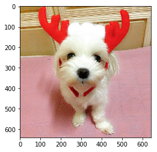

```python
%matplotlib inline
```

# 파이썬 딥러닝

파이썬 기반으로 딥러닝 기법을 논의합니다.


```python
print('파이썬 딥러닝')
print('셀 실행은 shift+Enter')
```

    파이썬 딥러닝
    셀 실행은 shift+Enter
    


```python
x = 1
```


```python
print(x)
```

    1
    

# 필수 라이브러리


```python
data = list(range(1, 11))
```

객체 출력


```python
data
```


    [1, 2, 3, 4, 5, 6, 7, 8, 9, 10]


문자열 출력


```python
print(data)
```

    [1, 2, 3, 4, 5, 6, 7, 8, 9, 10]
    


```python
[n*2 for n in data]
```


    [2, 4, 6, 8, 10, 12, 14, 16, 18, 20]


```python
data = [[1,2,3], [4,5,6], [7,8,9]]
```

## NumPy

산술연산에 적합한 자료구조 및 함수 제공


```python
import numpy as np
```


```python
arr = np.array(data)
```


```python
arr
```


    array([[1, 2, 3],
           [4, 5, 6],
           [7, 8, 9]])


```python
type(arr)
```


    numpy.ndarray


```python
arr.dtype
```


    dtype('int32')


```python
arr.astype('uint8')
```


    array([[1, 2, 3],
           [4, 5, 6],
           [7, 8, 9]], dtype=uint8)


```python
arr.astype('float32')
```


    array([[ 1.,  2.,  3.],
           [ 4.,  5.,  6.],
           [ 7.,  8.,  9.]], dtype=float32)


```python
arr.dtype
```


    dtype('int32')


```python
arr * 2
```


    array([[ 2,  4,  6],
           [ 8, 10, 12],
           [14, 16, 18]])


```python
arr - arr
```


    array([[0, 0, 0],
           [0, 0, 0],
           [0, 0, 0]])


연산 속도 비교


```python
arr = np.arange(1e7)
```


```python
nums = arr.tolist()
```


```python
len(arr)
```


    10000000


```python
%timeit arr * 1.1
```

    28.6 ms ± 763 µs per loop (mean ± std. dev. of 7 runs, 10 loops each)
    


```python
%timeit [n*1.1 for n in nums]
```

    852 ms ± 137 ms per loop (mean ± std. dev. of 7 runs, 1 loop each)
    

## 색인 시스템

특정 자료의 선택


```python
arr = np.arange(9)
arr
```


    array([0, 1, 2, 3, 4, 5, 6, 7, 8])


```python
arr.shape
```


    (9,)


```python
arr = arr.reshape(3, 3)
```


```python
arr
```


    array([[0, 1, 2],
           [3, 4, 5],
           [6, 7, 8]])


```python
arr.shape
```


    (3, 3)


```python
arr[0]
```


    array([0, 1, 2])


```python
arr[:, 0]
```


    array([0, 3, 6])


#### 연습

주어진 배열의 4,5,7,8 원소를 2x2 형상으로 선택합니다.


```python
arr[1:, 1:]
```


    array([[4, 5],
           [7, 8]])


팬시 색인


```python
arr[[2, 0]]
```


    array([[6, 7, 8],
           [0, 1, 2]])


불리언 색인


```python
arr[arr > 3]
```


    array([4, 5, 6, 7, 8])


```python
arr.flatten().reshape(9, 1)
```


    array([[0],
           [1],
           [2],
           [3],
           [4],
           [5],
           [6],
           [7],
           [8]])


```python
np.hstack([arr, arr])
```


    array([[0, 1, 2, 0, 1, 2],
           [3, 4, 5, 3, 4, 5],
           [6, 7, 8, 6, 7, 8]])


## matplotlib

수치의 시각화


```python
import matplotlib.pyplot as plt
```


```python
x = np.arange(0, 6, 0.1)
x[:5]
```


    array([ 0. ,  0.1,  0.2,  0.3,  0.4])


```python
y = np.sin(x)
```


```python
y[:5]
```


    array([ 0.        ,  0.09983342,  0.19866933,  0.29552021,  0.38941834])


그래프 출력을 위한 *노트북* 설정


```python
plt.plot(x, y)
```


    [<matplotlib.lines.Line2D at 0x8605f98>]


두 개 이상의 그래프를 한번에 그리기


```python
y1 = y
y2 = np.cos(x)
```


```python
plt.plot(x, y1)
plt.plot(x, y2)
```


    [<matplotlib.lines.Line2D at 0x87c8e80>]


그래프 스타일 설정


```python
#plt.plot(x, y, color='r', marker='x', linestyle='--')
plt.plot(x, y, 'rx--')
```


    [<matplotlib.lines.Line2D at 0x903bfd0>]


이미지 파일을 ndarray로 읽어와 출력하기


```python
from matplotlib.image import imread
```


```python
img = imread('data/mozzi.jpg')
```


```python
img.shape
```


    (640, 640, 3)


```python
plt.imshow(img)
```


    <matplotlib.image.AxesImage at 0xa1913c8>





## pandas

데이터 입출력과 정리에 사용합니다.


```python
import pandas as pd
```


```python
iris = pd.read_csv('data/iris.data', header=None)
```


```python
type(iris)
```


    pandas.core.frame.DataFrame


```python
X = iris.values[:, 0:4].astype('float32')
```


```python
y = iris.values[:, 4]
```

핵심 자료구조


```python
arr = np.arange(4).reshape(2, 2)
arr
```


    array([[0, 1],
           [2, 3]])


```python
frame = pd.DataFrame(arr)
frame.index = ['가', '나']
frame.columns = ['A', 'B']
frame
```


<div>
<style>
    .dataframe thead tr:only-child th {
        text-align: right;
    }

    .dataframe thead th {
        text-align: left;
    }

    .dataframe tbody tr th {
        vertical-align: top;
    }
</style>
<table border="1" class="dataframe">
  <thead>
    <tr style="text-align: right;">
      <th></th>
      <th>A</th>
      <th>B</th>
    </tr>
  </thead>
  <tbody>
    <tr>
      <th>가</th>
      <td>0</td>
      <td>1</td>
    </tr>
    <tr>
      <th>나</th>
      <td>2</td>
      <td>3</td>
    </tr>
  </tbody>
</table>
</div>


```python
iris[0][:5]
```


    0    5.1
    1    4.9
    2    4.7
    3    4.6
    4    5.0
    Name: 0, dtype: float64


```python
iris[4][:5]
```


    0    Iris-setosa
    1    Iris-setosa
    2    Iris-setosa
    3    Iris-setosa
    4    Iris-setosa
    Name: 4, dtype: object


```python
frame = pd.read_clipboard()
```


```python
frame['현재가'].str.replace(',', '').astype('int32').mean()
```


    22387.0


# 기계학습 리뷰


```python
iris = pd.read_csv('data/iris.data', header=None)
iris[:5]
```


<div>
<style>
    .dataframe thead tr:only-child th {
        text-align: right;
    }

    .dataframe thead th {
        text-align: left;
    }

    .dataframe tbody tr th {
        vertical-align: top;
    }
</style>
<table border="1" class="dataframe">
  <thead>
    <tr style="text-align: right;">
      <th></th>
      <th>0</th>
      <th>1</th>
      <th>2</th>
      <th>3</th>
      <th>4</th>
    </tr>
  </thead>
  <tbody>
    <tr>
      <th>0</th>
      <td>5.1</td>
      <td>3.5</td>
      <td>1.4</td>
      <td>0.2</td>
      <td>Iris-setosa</td>
    </tr>
    <tr>
      <th>1</th>
      <td>4.9</td>
      <td>3.0</td>
      <td>1.4</td>
      <td>0.2</td>
      <td>Iris-setosa</td>
    </tr>
    <tr>
      <th>2</th>
      <td>4.7</td>
      <td>3.2</td>
      <td>1.3</td>
      <td>0.2</td>
      <td>Iris-setosa</td>
    </tr>
    <tr>
      <th>3</th>
      <td>4.6</td>
      <td>3.1</td>
      <td>1.5</td>
      <td>0.2</td>
      <td>Iris-setosa</td>
    </tr>
    <tr>
      <th>4</th>
      <td>5.0</td>
      <td>3.6</td>
      <td>1.4</td>
      <td>0.2</td>
      <td>Iris-setosa</td>
    </tr>
  </tbody>
</table>
</div>


```python
iris.shape
```


    (150, 5)


```python
iris[4].value_counts()
```


    Iris-versicolor    50
    Iris-setosa        50
    Iris-virginica     50
    Name: 4, dtype: int64


#### 연습

data/wine.data 를 읽어와서 다음을 살펴봅니다.

1. 샘플과 특징의 개수는?
1. 레이블은 어떤 열일까?
1. 레이블은 몇 개의 클래스인가?


```python
wine = pd.read_csv('data/wine.data')
```


```python
wine[:5]
```


<div>
<style>
    .dataframe thead tr:only-child th {
        text-align: right;
    }

    .dataframe thead th {
        text-align: left;
    }

    .dataframe tbody tr th {
        vertical-align: top;
    }
</style>
<table border="1" class="dataframe">
  <thead>
    <tr style="text-align: right;">
      <th></th>
      <th>Class label</th>
      <th>Alcohol</th>
      <th>Malic acid</th>
      <th>Ash</th>
      <th>Alcalinity of ash</th>
      <th>Magnesium</th>
      <th>Total phenols</th>
      <th>Flavanoids</th>
      <th>Nonflavnoid phenols</th>
      <th>Proanthocyanins</th>
      <th>Color intensity</th>
      <th>Hue</th>
      <th>OD280/OD315 of diluted wines</th>
      <th>Proline</th>
    </tr>
  </thead>
  <tbody>
    <tr>
      <th>0</th>
      <td>1</td>
      <td>14.23</td>
      <td>1.71</td>
      <td>2.43</td>
      <td>15.6</td>
      <td>127</td>
      <td>2.80</td>
      <td>3.06</td>
      <td>0.28</td>
      <td>2.29</td>
      <td>5.64</td>
      <td>1.04</td>
      <td>3.92</td>
      <td>1065</td>
    </tr>
    <tr>
      <th>1</th>
      <td>1</td>
      <td>13.20</td>
      <td>1.78</td>
      <td>2.14</td>
      <td>11.2</td>
      <td>100</td>
      <td>2.65</td>
      <td>2.76</td>
      <td>0.26</td>
      <td>1.28</td>
      <td>4.38</td>
      <td>1.05</td>
      <td>3.40</td>
      <td>1050</td>
    </tr>
    <tr>
      <th>2</th>
      <td>1</td>
      <td>13.16</td>
      <td>2.36</td>
      <td>2.67</td>
      <td>18.6</td>
      <td>101</td>
      <td>2.80</td>
      <td>3.24</td>
      <td>0.30</td>
      <td>2.81</td>
      <td>5.68</td>
      <td>1.03</td>
      <td>3.17</td>
      <td>1185</td>
    </tr>
    <tr>
      <th>3</th>
      <td>1</td>
      <td>14.37</td>
      <td>1.95</td>
      <td>2.50</td>
      <td>16.8</td>
      <td>113</td>
      <td>3.85</td>
      <td>3.49</td>
      <td>0.24</td>
      <td>2.18</td>
      <td>7.80</td>
      <td>0.86</td>
      <td>3.45</td>
      <td>1480</td>
    </tr>
    <tr>
      <th>4</th>
      <td>1</td>
      <td>13.24</td>
      <td>2.59</td>
      <td>2.87</td>
      <td>21.0</td>
      <td>118</td>
      <td>2.80</td>
      <td>2.69</td>
      <td>0.39</td>
      <td>1.82</td>
      <td>4.32</td>
      <td>1.04</td>
      <td>2.93</td>
      <td>735</td>
    </tr>
  </tbody>
</table>
</div>


```python
wine.shape
```


    (178, 14)


```python
wine['Class label'].value_counts()
```


    2    71
    1    59
    3    48
    Name: Class label, dtype: int64


기계학습에 활용할 수 있는 형태로 가공하기


```python
y = iris[4]
X = iris.values[:, 0:4].astype('float32')
```


```python
X.shape
```


    (150, 4)


```python
X[:3]
```


    array([[ 5.0999999 ,  3.5       ,  1.39999998,  0.2       ],
           [ 4.9000001 ,  3.        ,  1.39999998,  0.2       ],
           [ 4.69999981,  3.20000005,  1.29999995,  0.2       ]], dtype=float32)


훈련/테스트 분리


```python
from sklearn.model_selection import train_test_split
```


```python
X_train, X_test, y_train, y_test = train_test_split(X, y)
```


```python
y_train[:5]
```


    66    Iris-versicolor
    29        Iris-setosa
    84    Iris-versicolor
    50    Iris-versicolor
    37        Iris-setosa
    Name: 4, dtype: object


```python
from sklearn.linear_model import LogisticRegression
```

모델 생성


```python
model = LogisticRegression()
```

모델 훈련


```python
model.fit(X_train, y_train)
```

모델 활용


```python
y_pred = model.predict(X_test)
```

모델 평가


```python
#np.mean(y_test == y_pred)
model.score(X_test, y_test)
```


    0.92105263157894735


```python
cancer = pd.read_csv('data/wdbc.data')
```


```python
y = cancer['class']
```


```python
y.value_counts()
```


    benign       357
    malignant    212
    Name: class, dtype: int64


```python
X = cancer.values[:, 1:].astype('float32')
```


```python
X.shape
```


    (569, 30)


#### 연습

LogisticRegression 모델을 활용해 종양 데이터를 훈련하고, 예측, 평가합니다.


```python
X_train, X_test, y_train, y_test = train_test_split(X, y)
```


```python
model = LogisticRegression()
```


```python
model.fit(X_train, y_train)
```


    LogisticRegression(C=1.0, class_weight=None, dual=False, fit_intercept=True,
              intercept_scaling=1, max_iter=100, multi_class='ovr', n_jobs=1,
              penalty='l2', random_state=None, solver='liblinear', tol=0.0001,
              verbose=0, warm_start=False)


```python
model.score(X_test, y_test)
```


    0.94405594405594406


```python
boston = pd.read_csv('data/boston.csv')
```


```python
y = boston['Price']
```


```python
X = boston.values[:, 1:].astype('float32')
```


```python
X.shape
```


    (506, 13)


```python
X_train, X_test, y_train, y_test = train_test_split(X, y)
```


```python
from sklearn.neighbors import KNeighborsRegressor
```


```python
model = KNeighborsRegressor(n_neighbors=1)
```


```python
model.fit(X_train, y_train)
```


    KNeighborsRegressor(algorithm='auto', leaf_size=30, metric='minkowski',
              metric_params=None, n_jobs=1, n_neighbors=1, p=2,
              weights='uniform')


```python
model.score(X_train, y_train)
```


    1.0


```python
model.score(X_test, y_test)
```


    0.29553481797764247


### 하이퍼 파라메터 튜닝


```python
이웃수_범위 = list(range(1, 11))

점수 = []
for 이웃수 in 이웃수_범위:
    model = KNeighborsRegressor(n_neighbors=이웃수)
    model.fit(X_train, y_train)
    훈련점수 = model.score(X_train, y_train)
    테스트점수 = model.score(X_test, y_test)
    점수.append((훈련점수, 테스트점수))
```


```python
훈련결과 = pd.DataFrame(점수, columns=['train', 'test'])
훈련결과.index = 이웃수_범위
훈련결과.index.name = 'n_neighbors'
훈련결과
```


<div>
<style>
    .dataframe thead tr:only-child th {
        text-align: right;
    }

    .dataframe thead th {
        text-align: left;
    }

    .dataframe tbody tr th {
        vertical-align: top;
    }
</style>
<table border="1" class="dataframe">
  <thead>
    <tr style="text-align: right;">
      <th></th>
      <th>train</th>
      <th>test</th>
    </tr>
    <tr>
      <th>n_neighbors</th>
      <th></th>
      <th></th>
    </tr>
  </thead>
  <tbody>
    <tr>
      <th>1</th>
      <td>1.000000</td>
      <td>0.295535</td>
    </tr>
    <tr>
      <th>2</th>
      <td>0.852167</td>
      <td>0.321040</td>
    </tr>
    <tr>
      <th>3</th>
      <td>0.806306</td>
      <td>0.354785</td>
    </tr>
    <tr>
      <th>4</th>
      <td>0.766203</td>
      <td>0.385206</td>
    </tr>
    <tr>
      <th>5</th>
      <td>0.731288</td>
      <td>0.408709</td>
    </tr>
    <tr>
      <th>6</th>
      <td>0.704887</td>
      <td>0.426564</td>
    </tr>
    <tr>
      <th>7</th>
      <td>0.666054</td>
      <td>0.438385</td>
    </tr>
    <tr>
      <th>8</th>
      <td>0.636460</td>
      <td>0.412784</td>
    </tr>
    <tr>
      <th>9</th>
      <td>0.617447</td>
      <td>0.434869</td>
    </tr>
    <tr>
      <th>10</th>
      <td>0.589311</td>
      <td>0.421638</td>
    </tr>
  </tbody>
</table>
</div>


```python
훈련결과.plot(style=['go--', 'ro--'])
```


    <matplotlib.axes._subplots.AxesSubplot at 0xa19ffd0>


```python
from sklearn.ensemble import RandomForestRegressor
```


```python
model = RandomForestRegressor(n_estimators=100)
```


```python
model.fit(X_train, y_train)
```


    RandomForestRegressor(bootstrap=True, criterion='mse', max_depth=None,
               max_features='auto', max_leaf_nodes=None,
               min_impurity_decrease=0.0, min_impurity_split=None,
               min_samples_leaf=1, min_samples_split=2,
               min_weight_fraction_leaf=0.0, n_estimators=100, n_jobs=1,
               oob_score=False, random_state=None, verbose=0, warm_start=False)


```python
model.score(X_train, y_train)
```


    0.9836173929421218


```python
model.score(X_test, y_test)
```


    0.82193179660306703


```python
from sklearn.svm import SVR
```


```python
model = SVR(C=1.0).fit(X_train, y_train)
```


```python
model.score(X_train, y_train)
```


    0.13874576064231492


```python
model.score(X_test, y_test)
```


    0.036535739258363842


```python
boston[:5]
```


<div>
<style>
    .dataframe thead tr:only-child th {
        text-align: right;
    }

    .dataframe thead th {
        text-align: left;
    }

    .dataframe tbody tr th {
        vertical-align: top;
    }
</style>
<table border="1" class="dataframe">
  <thead>
    <tr style="text-align: right;">
      <th></th>
      <th>Price</th>
      <th>CRIM</th>
      <th>ZN</th>
      <th>INDUS</th>
      <th>CHAS</th>
      <th>NOX</th>
      <th>RM</th>
      <th>AGE</th>
      <th>DIS</th>
      <th>RAD</th>
      <th>TAX</th>
      <th>PTRATIO</th>
      <th>B</th>
      <th>LSTAT</th>
    </tr>
  </thead>
  <tbody>
    <tr>
      <th>0</th>
      <td>24.0</td>
      <td>0.00632</td>
      <td>18.0</td>
      <td>2.31</td>
      <td>0.0</td>
      <td>0.538</td>
      <td>6.575</td>
      <td>65.2</td>
      <td>4.0900</td>
      <td>1.0</td>
      <td>296.0</td>
      <td>15.3</td>
      <td>396.90</td>
      <td>4.98</td>
    </tr>
    <tr>
      <th>1</th>
      <td>21.6</td>
      <td>0.02731</td>
      <td>0.0</td>
      <td>7.07</td>
      <td>0.0</td>
      <td>0.469</td>
      <td>6.421</td>
      <td>78.9</td>
      <td>4.9671</td>
      <td>2.0</td>
      <td>242.0</td>
      <td>17.8</td>
      <td>396.90</td>
      <td>9.14</td>
    </tr>
    <tr>
      <th>2</th>
      <td>34.7</td>
      <td>0.02729</td>
      <td>0.0</td>
      <td>7.07</td>
      <td>0.0</td>
      <td>0.469</td>
      <td>7.185</td>
      <td>61.1</td>
      <td>4.9671</td>
      <td>2.0</td>
      <td>242.0</td>
      <td>17.8</td>
      <td>392.83</td>
      <td>4.03</td>
    </tr>
    <tr>
      <th>3</th>
      <td>33.4</td>
      <td>0.03237</td>
      <td>0.0</td>
      <td>2.18</td>
      <td>0.0</td>
      <td>0.458</td>
      <td>6.998</td>
      <td>45.8</td>
      <td>6.0622</td>
      <td>3.0</td>
      <td>222.0</td>
      <td>18.7</td>
      <td>394.63</td>
      <td>2.94</td>
    </tr>
    <tr>
      <th>4</th>
      <td>36.2</td>
      <td>0.06905</td>
      <td>0.0</td>
      <td>2.18</td>
      <td>0.0</td>
      <td>0.458</td>
      <td>7.147</td>
      <td>54.2</td>
      <td>6.0622</td>
      <td>3.0</td>
      <td>222.0</td>
      <td>18.7</td>
      <td>396.90</td>
      <td>5.33</td>
    </tr>
  </tbody>
</table>
</div>


### 데이터 전처리

모델에 따라서 요구되는 데이터 전처리가 있을 수 있습니다.


```python
from sklearn.preprocessing import MinMaxScaler
```


```python
scaler = MinMaxScaler()
```


```python
Xmm_train = scaler.fit_transform(X_train)
```


```python
Xmm_test = scaler.transform(X_test)
```


```python
pd.DataFrame(Xmm_train)[:5]
```


<div>
<style>
    .dataframe thead tr:only-child th {
        text-align: right;
    }

    .dataframe thead th {
        text-align: left;
    }

    .dataframe tbody tr th {
        vertical-align: top;
    }
</style>
<table border="1" class="dataframe">
  <thead>
    <tr style="text-align: right;">
      <th></th>
      <th>0</th>
      <th>1</th>
      <th>2</th>
      <th>3</th>
      <th>4</th>
      <th>5</th>
      <th>6</th>
      <th>7</th>
      <th>8</th>
      <th>9</th>
      <th>10</th>
      <th>11</th>
      <th>12</th>
    </tr>
  </thead>
  <tbody>
    <tr>
      <th>0</th>
      <td>0.000534</td>
      <td>0.000000</td>
      <td>0.098889</td>
      <td>0.0</td>
      <td>0.207469</td>
      <td>0.667312</td>
      <td>0.858908</td>
      <td>0.239241</td>
      <td>0.043478</td>
      <td>0.156788</td>
      <td>0.553191</td>
      <td>1.000000</td>
      <td>0.104029</td>
    </tr>
    <tr>
      <th>1</th>
      <td>0.002049</td>
      <td>0.231579</td>
      <td>0.189630</td>
      <td>0.0</td>
      <td>0.087137</td>
      <td>0.395817</td>
      <td>0.693100</td>
      <td>0.712401</td>
      <td>0.260870</td>
      <td>0.271511</td>
      <td>0.691489</td>
      <td>0.980298</td>
      <td>0.461645</td>
    </tr>
    <tr>
      <th>2</th>
      <td>0.006081</td>
      <td>0.210526</td>
      <td>0.119630</td>
      <td>0.0</td>
      <td>0.535270</td>
      <td>0.705848</td>
      <td>0.913491</td>
      <td>0.083553</td>
      <td>0.173913</td>
      <td>0.145315</td>
      <td>0.042553</td>
      <td>0.977154</td>
      <td>0.175773</td>
    </tr>
    <tr>
      <th>3</th>
      <td>0.041242</td>
      <td>0.000000</td>
      <td>0.642963</td>
      <td>0.0</td>
      <td>0.790456</td>
      <td>0.348761</td>
      <td>0.960865</td>
      <td>0.101663</td>
      <td>1.000000</td>
      <td>0.913958</td>
      <td>0.808511</td>
      <td>0.959151</td>
      <td>0.233444</td>
    </tr>
    <tr>
      <th>4</th>
      <td>0.000248</td>
      <td>0.000000</td>
      <td>0.135185</td>
      <td>0.0</td>
      <td>0.109959</td>
      <td>0.475019</td>
      <td>0.469619</td>
      <td>0.718528</td>
      <td>0.086957</td>
      <td>0.313576</td>
      <td>0.659574</td>
      <td>0.971449</td>
      <td>0.242826</td>
    </tr>
  </tbody>
</table>
</div>


```python
model.fit(Xmm_train, y_train)
```


    SVR(C=1.0, cache_size=200, coef0=0.0, degree=3, epsilon=0.1, gamma='auto',
      kernel='rbf', max_iter=-1, shrinking=True, tol=0.001, verbose=False)


```python
model.score(Xmm_train, y_train)
```


    0.35346374692246085


```python
model.score(Xmm_test, y_test)
```


    0.42467897395150889


### 차원축소

모델의 표현력 (~"손가락")을 제한하기 위해 특징의 수를 줄일 수도 있습니다.


```python
from sklearn.decomposition import PCA
```


```python
pca = PCA(n_components=2)
```


```python
Xpca_train = pca.fit_transform(X_train)
```


```python
X_train.shape
```


    (379, 13)


```python
Xpca_train.shape
```


    (379, 2)


