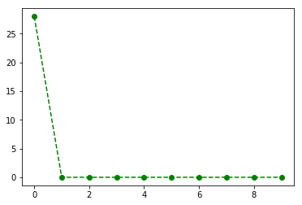
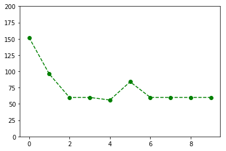
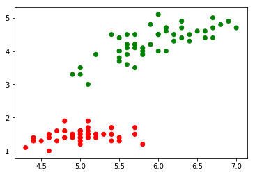
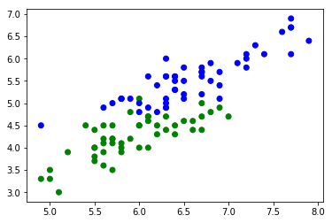
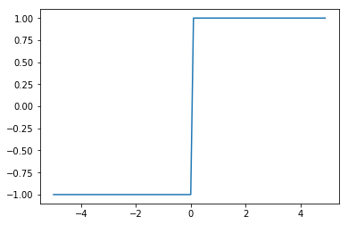
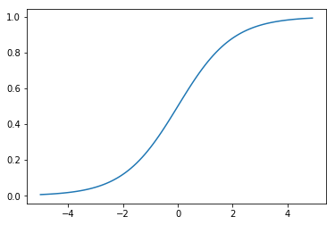
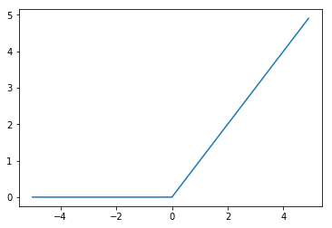
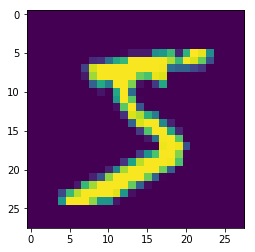

```python
import numpy as np
import pandas as pd
import matplotlib.pyplot as plt

from sklearn.model_selection import train_test_split

%matplotlib inline
```

# 1943 MCP 뉴런


```python
x = np.array([0.5, 0.5])
```


```python
w = np.array([0.1, 0.2])
```


```python
z = np.sum(w*x)
z
```


    0.15000000000000002


```python
b = 0.3
y = 1 if z > b else -1
y
```


    -1


인공 뉴런의 가중치 설정으로 논리게이트를 만들 수 있을까?


```python
def test(logic):
    for x1, x2 in [(0, 0), (0, 1), (1, 0), (1, 1)]:
        y = logic(x1, x2)
        print(x1, x2, '|', y)
```


```python
def AND(x1, x2):
    x = np.array([x1, x2])
    w = np.array([0.5, 0.5])
    z = np.sum(w*x)
    b = 0.7
    y = 1 if z > b else 0
    return y
```


```python
test(AND)
```

    0 0 | 0
    0 1 | 0
    1 0 | 0
    1 1 | 1
    


```python
def NAND(x1, x2):
    x = np.array([x1, x2])
    w = np.array([-0.5, -0.5])
    z = np.sum(w*x)
    b = -0.7
    y = 1 if z > b else 0
    return y
```


```python
test(NAND)
```

    0 0 | 1
    0 1 | 1
    1 0 | 1
    1 1 | 0
    


```python
def OR(x1, x2):
    x = np.array([x1, x2])
    w = np.array([0.5, 0.5])
    b = -0.2
    z = np.sum(w*x) + b     
    y = 1 if z > 0 else 0
    return y
```


```python
test(OR)
```

    0 0 | 0
    0 1 | 1
    1 0 | 1
    1 1 | 1
    

## 1957 퍼셉트론


```python
class 뉴런:
    def net_input(self, X):
        z = np.dot(X, self.w) + self.b
        return z
    
    def predict(self, X):
        z = self.net_input(X)
        y = np.where(z > 0, 1, -1)
        return y
```


```python
neuron = 뉴런()
```


```python
# OR
neuron.w = np.array([0.5, 0.5])
neuron.b = -0.2
```


```python
x = np.array([0, 0])
neuron.predict(x)
```


    array(-1)


```python
class 퍼셉트론(뉴런):
    def __init__(self, 학습률, 학습횟수):
        self.학습률 = 학습률
        self.학습횟수 = 학습횟수
        
    def fit(self, X, y):
        # 가중치 초기화
        self.w = np.zeros(X.shape[1])
        self.b = 0.
        
        # 훈련 
        error_history = []
        for i in range(self.학습횟수):
            # 각 샘플별
            오류제곱합 = 0
            for xi, yi in zip(X, y):
                y_pred = self.predict(xi)
                error = yi - y_pred
                오류제곱합 += error ** 2
                update = error * self.학습률
                self.w += update * xi
                self.b += update
            error_history.append(오류제곱합)
        return error_history
```


```python
iris = pd.read_csv('data/iris.data', header=None)
iris[:5]
```


<div>
<style>
    .dataframe thead tr:only-child th {
        text-align: right;
    }

    .dataframe thead th {
        text-align: left;
    }

    .dataframe tbody tr th {
        vertical-align: top;
    }
</style>
<table border="1" class="dataframe">
  <thead>
    <tr style="text-align: right;">
      <th></th>
      <th>0</th>
      <th>1</th>
      <th>2</th>
      <th>3</th>
      <th>4</th>
    </tr>
  </thead>
  <tbody>
    <tr>
      <th>0</th>
      <td>5.1</td>
      <td>3.5</td>
      <td>1.4</td>
      <td>0.2</td>
      <td>Iris-setosa</td>
    </tr>
    <tr>
      <th>1</th>
      <td>4.9</td>
      <td>3.0</td>
      <td>1.4</td>
      <td>0.2</td>
      <td>Iris-setosa</td>
    </tr>
    <tr>
      <th>2</th>
      <td>4.7</td>
      <td>3.2</td>
      <td>1.3</td>
      <td>0.2</td>
      <td>Iris-setosa</td>
    </tr>
    <tr>
      <th>3</th>
      <td>4.6</td>
      <td>3.1</td>
      <td>1.5</td>
      <td>0.2</td>
      <td>Iris-setosa</td>
    </tr>
    <tr>
      <th>4</th>
      <td>5.0</td>
      <td>3.6</td>
      <td>1.4</td>
      <td>0.2</td>
      <td>Iris-setosa</td>
    </tr>
  </tbody>
</table>
</div>


```python
y = iris[4]
X = iris.values[:, 0:4].astype('float32')
```


```python
X.shape
```


    (150, 4)


```python
y.value_counts()
```


    Iris-versicolor    50
    Iris-setosa        50
    Iris-virginica     50
    Name: 4, dtype: int64


```python
X1 = X[:100]
y1 = y[:100]
```


```python
y1.value_counts()
```


    Iris-versicolor    50
    Iris-setosa        50
    Name: 4, dtype: int64


```python
y1 = np.where(y1 == 'Iris-setosa', 1, -1)
```


```python
np.unique(y1)
```


    array([-1,  1])


```python
X1_train, X1_test, y1_train, y1_test = train_test_split(X1, y1)
```


```python
from perceptron import 퍼셉트론
```


```python
model = 퍼셉트론(학습률=0.1, 학습횟수=10)
```


```python
error_history = model.fit(X1_train, y1_train)
```


```python
plt.plot(error_history, 'go--')
```


    [<matplotlib.lines.Line2D at 0xd57be80>]





```python
model.w
```


    array([ 0.49999988,  0.83999991, -1.50000006, -0.68000001])


```python
model.b
```


    0.20000000000000001


#### 연습

다른 두 개의 클래스에 대해 퍼셉트론을 훈련하고 평가합니다.


```python
y2 = y[50:]
X2 = X[50:]
```


```python
X2.shape
```


    (100, 4)


```python
y2 = np.where(y2 == 'Iris-versicolor', 1, -1)
```


```python
np.unique(y2)
```


    array([-1,  1])


```python
X2_train, X2_test, y2_train, y2_test = train_test_split(X2, y2)
```


```python
model = 퍼셉트론(학습률=0.01, 학습횟수=10)
```


```python
error_history = model.fit(X2_train, y2_train)
```


```python
plt.plot(error_history, 'go--')
plt.ylim(0, 200)
```


    (0, 200)





### 퍼셉트론의 한계


```python
colormap = np.where(y1 == 1, 'r', 'g')
plt.scatter(X1[:, 0], X1[:, 2], c=colormap)
```


    <matplotlib.collections.PathCollection at 0xd67f240>





```python
colormap = np.where(y2 == 1, 'g', 'b')
plt.scatter(X2[:, 0], X2[:, 2], c=colormap)
```


    <matplotlib.collections.PathCollection at 0xd375eb8>





다층 퍼셉트론으로 XOR 뛰어넘기


```python
def XOR(x1, x2):
    s1 = NAND(x1, x2)
    s2 = OR(x1, x2)
    y = AND(s1, s2)
    return y
```


```python
test(XOR)
```

    0 0 | 0
    0 1 | 1
    1 0 | 1
    1 1 | 0
    

### 활성화 함수

최적화에 큰 역할을 수행합니다.


```python
def step(x):
    return np.where(x > 0, 1, -1)
```


```python
x = np.arange(-5., 5., 0.1)
```


```python
plt.plot(x, step(x))
```


    [<matplotlib.lines.Line2D at 0xced4a20>]





```python
def sigmoid(x):
    return 1 / (1 + np.exp(-x))
```


```python
plt.plot(x, sigmoid(x))
```


    [<matplotlib.lines.Line2D at 0xd4c3f98>]





```python
from sklearn.linear_model import LogisticRegression
```


```python
model = LogisticRegression(C=1.)
```


```python
X_train, X_test, y_train, y_test = train_test_split(X, y)
```


```python
model.fit(X_train, y_train)
```


    LogisticRegression(C=1.0, class_weight=None, dual=False, fit_intercept=True,
              intercept_scaling=1, max_iter=100, multi_class='ovr', n_jobs=1,
              penalty='l2', random_state=None, solver='liblinear', tol=0.0001,
              verbose=0, warm_start=False)


```python
model.score(X_train, y_train)
```


    0.9642857142857143


```python
model.score(X_test, y_test)
```


    0.89473684210526316


```python
w = model.coef_
b = model.intercept_
```


```python
w.shape
```


    (3, 4)


```python
b
```


    array([ 0.26786686,  0.43337871, -0.80055254])


```python
y.value_counts()
```


    Iris-versicolor    50
    Iris-setosa        50
    Iris-virginica     50
    Name: 4, dtype: int64


One Hot Encoding


```python
Y = pd.get_dummies(y)
```


```python
클래스예측확률 = model.predict_proba(X_test)
```


```python
pd.DataFrame(클래스예측확률)
```


<div>
<style>
    .dataframe thead tr:only-child th {
        text-align: right;
    }

    .dataframe thead th {
        text-align: left;
    }

    .dataframe tbody tr th {
        vertical-align: top;
    }
</style>
<table border="1" class="dataframe">
  <thead>
    <tr style="text-align: right;">
      <th></th>
      <th>0</th>
      <th>1</th>
      <th>2</th>
    </tr>
  </thead>
  <tbody>
    <tr>
      <th>0</th>
      <td>0.078225</td>
      <td>0.576707</td>
      <td>0.345069</td>
    </tr>
    <tr>
      <th>1</th>
      <td>0.003500</td>
      <td>0.526745</td>
      <td>0.469754</td>
    </tr>
    <tr>
      <th>2</th>
      <td>0.869001</td>
      <td>0.130888</td>
      <td>0.000111</td>
    </tr>
    <tr>
      <th>3</th>
      <td>0.884819</td>
      <td>0.115158</td>
      <td>0.000022</td>
    </tr>
    <tr>
      <th>4</th>
      <td>0.935140</td>
      <td>0.064844</td>
      <td>0.000016</td>
    </tr>
    <tr>
      <th>5</th>
      <td>0.069322</td>
      <td>0.796817</td>
      <td>0.133861</td>
    </tr>
    <tr>
      <th>6</th>
      <td>0.002176</td>
      <td>0.246105</td>
      <td>0.751720</td>
    </tr>
    <tr>
      <th>7</th>
      <td>0.793956</td>
      <td>0.205952</td>
      <td>0.000092</td>
    </tr>
    <tr>
      <th>8</th>
      <td>0.864812</td>
      <td>0.135148</td>
      <td>0.000039</td>
    </tr>
    <tr>
      <th>9</th>
      <td>0.011069</td>
      <td>0.741588</td>
      <td>0.247343</td>
    </tr>
    <tr>
      <th>10</th>
      <td>0.922365</td>
      <td>0.077593</td>
      <td>0.000042</td>
    </tr>
    <tr>
      <th>11</th>
      <td>0.001317</td>
      <td>0.343711</td>
      <td>0.654973</td>
    </tr>
    <tr>
      <th>12</th>
      <td>0.159482</td>
      <td>0.783831</td>
      <td>0.056687</td>
    </tr>
    <tr>
      <th>13</th>
      <td>0.119105</td>
      <td>0.731377</td>
      <td>0.149518</td>
    </tr>
    <tr>
      <th>14</th>
      <td>0.049318</td>
      <td>0.748516</td>
      <td>0.202166</td>
    </tr>
    <tr>
      <th>15</th>
      <td>0.014270</td>
      <td>0.656257</td>
      <td>0.329473</td>
    </tr>
    <tr>
      <th>16</th>
      <td>0.895011</td>
      <td>0.104944</td>
      <td>0.000045</td>
    </tr>
    <tr>
      <th>17</th>
      <td>0.019435</td>
      <td>0.362868</td>
      <td>0.617698</td>
    </tr>
    <tr>
      <th>18</th>
      <td>0.041359</td>
      <td>0.725482</td>
      <td>0.233160</td>
    </tr>
    <tr>
      <th>19</th>
      <td>0.001736</td>
      <td>0.382276</td>
      <td>0.615987</td>
    </tr>
    <tr>
      <th>20</th>
      <td>0.016661</td>
      <td>0.303384</td>
      <td>0.679955</td>
    </tr>
    <tr>
      <th>21</th>
      <td>0.000344</td>
      <td>0.418735</td>
      <td>0.580922</td>
    </tr>
    <tr>
      <th>22</th>
      <td>0.847019</td>
      <td>0.152926</td>
      <td>0.000056</td>
    </tr>
    <tr>
      <th>23</th>
      <td>0.291781</td>
      <td>0.631350</td>
      <td>0.076869</td>
    </tr>
    <tr>
      <th>24</th>
      <td>0.058653</td>
      <td>0.397522</td>
      <td>0.543825</td>
    </tr>
    <tr>
      <th>25</th>
      <td>0.001341</td>
      <td>0.508003</td>
      <td>0.490656</td>
    </tr>
    <tr>
      <th>26</th>
      <td>0.795658</td>
      <td>0.204262</td>
      <td>0.000080</td>
    </tr>
    <tr>
      <th>27</th>
      <td>0.000616</td>
      <td>0.216415</td>
      <td>0.782969</td>
    </tr>
    <tr>
      <th>28</th>
      <td>0.000434</td>
      <td>0.228118</td>
      <td>0.771449</td>
    </tr>
    <tr>
      <th>29</th>
      <td>0.000749</td>
      <td>0.151575</td>
      <td>0.847676</td>
    </tr>
    <tr>
      <th>30</th>
      <td>0.875143</td>
      <td>0.124820</td>
      <td>0.000037</td>
    </tr>
    <tr>
      <th>31</th>
      <td>0.000349</td>
      <td>0.435164</td>
      <td>0.564487</td>
    </tr>
    <tr>
      <th>32</th>
      <td>0.683354</td>
      <td>0.316245</td>
      <td>0.000401</td>
    </tr>
    <tr>
      <th>33</th>
      <td>0.069484</td>
      <td>0.644544</td>
      <td>0.285972</td>
    </tr>
    <tr>
      <th>34</th>
      <td>0.918746</td>
      <td>0.081193</td>
      <td>0.000060</td>
    </tr>
    <tr>
      <th>35</th>
      <td>0.005312</td>
      <td>0.270670</td>
      <td>0.724017</td>
    </tr>
    <tr>
      <th>36</th>
      <td>0.051817</td>
      <td>0.797115</td>
      <td>0.151068</td>
    </tr>
    <tr>
      <th>37</th>
      <td>0.853872</td>
      <td>0.146075</td>
      <td>0.000052</td>
    </tr>
  </tbody>
</table>
</div>


```python
def relu(x):
    return np.maximum(0, x)
```


```python
plt.plot(x, relu(x))
```


    [<matplotlib.lines.Line2D at 0xe2fa320>]





```python
A = np.array([[1,2], [3,4]])
B = np.array([[5,6], [7,8]])
```


```python
A * B
```


    array([[ 5, 12],
           [21, 32]])


```python
np.dot(A, B)
```


    array([[19, 22],
           [43, 50]])


### 신경망 순전파


```python
x = np.array([1.0, 0.5])
```


```python
W1 = np.array([[0.1, 0.3, 0.5], [0.2, 0.4, 0.6]])
```


```python
b1 = np.array([0.1, 0.2, 0.3])
```

가중치 행렬의 형상: 입력수 x 출력수


```python
W1.shape
```


    (2, 3)


```python
z = np.dot(x, W1) + b1
```


```python
z1 = sigmoid(z)
z1
```


    array([ 0.57444252,  0.66818777,  0.75026011])


```python
W2 = np.array([[0.1, 0.4], [0.2, 0.5], [0.3, 0.6]])
b2 = np.array([0.1, 0.2])
```


```python
W2.shape
```


    (3, 2)


```python
a2 = np.dot(z1, W2) + b2
z2 = sigmoid(a2)
z2
```


    array([ 0.62624937,  0.7710107 ])


출력


```python
W3 = np.array([[0.1, 0.3], [0.2, 0.4]])
b3 = np.array([0.1, 0.2])
```


```python
a3 = np.dot(z2, W3) + b3
```

### 출력층

회귀는 항등함수


```python
y = a3
```

분류는 소프트맥스


```python
def softmax(a):
    c = np.max(a)
    exp_a = np.exp(a-c)
    sum_exp_a = np.sum(exp_a)
    y = exp_a / sum_exp_a
    return y
```


```python
y = softmax(a3)
y
```


    array([ 0.40625907,  0.59374093])


```python
np.sum(y)
```


    1.0


```python
np.argmax(y)
```


    1


```python
np.argmax([0.33, 0.34, 0.33])
```


    1


## 손글씨 숫자인식


```python
from deepy.dataset import mnist
```


```python
(X_train, y_train), (X_test, y_test) = mnist.load_mnist(
    flatten=False, normalize=False)
```


```python
X_train.shape
```


    (60000, 1, 28, 28)


```python
x = X_train[0]
```


```python
x = x.transpose([1, 2, 0])
```


```python
plt.imshow(x.reshape(28, 28))
```


    <matplotlib.image.AxesImage at 0xde32748>





```python
from imageio import imsave
```


```python
imsave('mnist sample.png', x)
```


```python
y_train[0]
```


    5


```python
X_train = X_train.reshape(60000, 1*28*28)
```


```python
X_test = X_test.reshape(10000, 1*28*28)
```


```python
from neuralnet import Layer, FeedForwardNet
```

레이어 생성


```python
layer1 = Layer(입력수=784, 출력수=50, 활성화_함수=sigmoid)
```


```python
layer2 = Layer(50, 100, sigmoid)
```


```python
layer3 = Layer(100, 10, softmax)
```

훈련된 가중치 가져오기


```python
import pickle
```


```python
with open('data/mnist_weight.pkl', 'rb') as fp:
    params = pickle.load(fp)
```


```python
layer1.W = params['W1']
layer1.b = params['b1']
layer2.W = params['W2']
layer2.b = params['b2']
layer3.W = params['W3']
layer3.b = params['b3']
```


```python
model = FeedForwardNet()
```


```python
for layer in [layer1, layer2, layer3]:
    model.add(layer)
```


```python
len(model.layers)
```


    3


```python
Y_pred = model.predict(X_test)
```

    C:\ProgramData\Anaconda3\lib\site-packages\ipykernel_launcher.py:2: RuntimeWarning: overflow encountered in exp
      
    


```python
y_pred = np.argmax(Y_pred, axis=1)
```


```python
y_pred
```


    array([7, 2, 1, ..., 4, 8, 6], dtype=int64)


```python
np.mean(y_pred == y_test)
```


    0.92069999999999996


