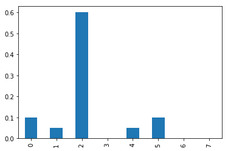
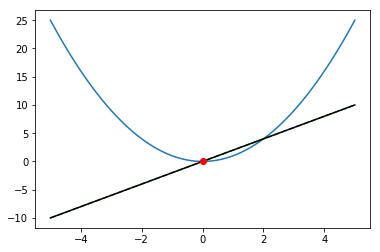
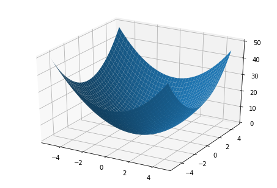

```python
import numpy as np
import pandas as pd
import matplotlib.pyplot as plt

%matplotlib inline
```


```python
from neuralnet import Layer, FeedForwardNet
from neuralnet import sigmoid, relu, softmax
```


```python
model = FeedForwardNet()
```


```python
model.add(Layer(입력수=784, 출력수=50, 활성화_함수=sigmoid))
model.add(Layer(50, 100, sigmoid))
model.add(Layer(100, 10, softmax))
```


```python
import pickle
```


```python
with open('data/mnist_weight.pkl', 'rb') as fp:
    params = pickle.load(fp)
```


```python
model.layers[0].W = params['W1']
model.layers[0].b = params['b1']
model.layers[1].W = params['W2']
model.layers[1].b = params['b2']
model.layers[2].W = params['W3']
model.layers[2].b = params['b3']
```


```python
from deepy.dataset import mnist
```


```python
(X_train, y_train), (X_test, y_test) = mnist.load_mnist(
    flatten=False, normalize=False)
```


```python
X_train = X_train.reshape(60000, 1*28*28)
X_test = X_test.reshape(10000, 1*28*28)
```


```python
X_train = X_train.astype('float32')
X_test = X_test.astype('float32')
```


```python
X_train /= X_train.max()
X_test /= X_test.max()
```


```python
X_train.max(), X_train.min()
```


    (1.0, 0.0)


```python
Y_pred = model.predict(X_test)
```


```python
y_pred = np.argmax(Y_pred, axis=1)
```


```python
np.mean(y_pred == y_test)
```


    0.93520000000000003


# 최적화

## 손실함수


```python
y = np.array([0, 0, 1, 0, 0, 0, 0, 0, 0, 0])
```


```python
np.argmax(y)
```


    2


```python
y1_pred = np.array([0.1, 0.05, 0.6, 0.0, 0.05, 0.1, 0.0, 0.1, 0.0, 0.0])
y2_pred = np.array([0.1, 0.05, 0.1, 0.0, 0.05, 0.1, 0.0, 0.6, 0.0, 0.0])
```


```python
np.argmax(y1_pred)
```


    2


```python
np.argmax(y2_pred)
```


    7


```python
pd.Series(y1_pred).plot(kind='bar')
```


    <matplotlib.axes._subplots.AxesSubplot at 0xa7811d0>





```python
def 평균제곱오차(y_pred, y):
    return 0.5 * np.sum((y-y_pred)**2)
```


```python
평균제곱오차(y1_pred, y)
```


    0.097500000000000031


```python
평균제곱오차(y2_pred, y)
```


    0.59750000000000003


```python
def 교차엔트로피오차(y_pred, y):
    delta = 1e-7
    return -np.sum(y * np.log(y_pred + delta))
```


```python
교차엔트로피오차(y1_pred, y)
```


    0.51082545709933802


```python
교차엔트로피오차(y2_pred, y)
```


    2.3025840929945458


```python
데이터색인 = list(range(10))
데이터색인
```


    [0, 1, 2, 3, 4, 5, 6, 7, 8, 9]


```python
np.random.choice(10, 3)
```


    array([0, 1, 1])


```python
def cross_entropy(y_pred, y):
    "batch_size: mini batch 크기"
    batch_size = len(y)
    return -np.sum(y * np.log(y_pred)) / batch_size
```

## 최적화 기법

수치 미분을 통한 손실함수의 최적화 ... 가 곧 "학습


```python
x = np.linspace(-5., 5., 100)
```


```python
x[:5]
```


    array([-5.       , -4.8989899, -4.7979798, -4.6969697, -4.5959596])


```python
def f(x):
    return x ** 2
```

해석적


```python
dydx = lambda x: 2*x
```

수치미분


```python
def numerical_diff(f, x):
    h = 1e-4 # 작은 값
    return (f(x+h) - f(x-h)) / (2*h)
```


```python
plt.plot(x, f(x))
plt.plot(x, dydx(x), 'g--')
plt.plot(x, numerical_diff(f, x), 'k-')
plt.plot(0, 0, 'ro')
```


    [<matplotlib.lines.Line2D at 0xe3c2a58>]





$$ y = f(x_1, x_2) = x_1^2 + x_2^2 $$


```python
f2 = lambda x: np.sum(x**2, axis=0)
```


```python
x0 = np.arange(-5., 5., 0.25)
x1 = np.arange(-5., 5, 0.25)
```


```python
X0, X1 = np.meshgrid(x0, x1)
```


```python
from mpl_toolkits.mplot3d import Axes3D
```


```python
fig = plt.figure()
ax = Axes3D(fig)
ax.plot_surface(X0, X1, f2(np.array([X0, X1])))
```


    <mpl_toolkits.mplot3d.art3d.Poly3DCollection at 0xe428b38>





### 기울기 (Gradient)


```python
def numerical_gradient(f, x):
    h = 1e-4
    기울기 = np.zeros_like(x)
    
    # 각 xi에 대한 수치 미분 수행
    for idx in range(x.size):
        tmp_val = x[idx]
        # f(x+h)
        x[idx] = tmp_val + h
        fxh1 = f(x)
        # f(x-h)
        x[idx] = tmp_val - h
        fxh2 = f(x)
        
        # (x_i, x_j) 에서의 기울기
        기울기[idx] = (fxh1 - fxh2) / (2*h)
        x[idx] = tmp_val
        
    return 기울기
```


```python
numerical_gradient(f2, np.array([3., 4.]))
```


    array([ 6.,  8.])


```python
numerical_gradient(f2, np.array([0., 2.]))
```


    array([ 0.,  4.])


```python
numerical_gradient(f2, np.array([3., 0.]))
```


    array([ 6.,  0.])


### 경사 하강법


```python
x = np.array([-3., 4.])
```


```python
x_history = [x.copy()]
학습률 = 0.1
for i in range(100):
    grad = numerical_gradient(f2, x)
    x -= grad * 학습률
    x_history.append(x.copy())
```


```python
np.allclose(x, 0)
```


    True


```python
x_history = np.array(x_history)
plt.plot(x_history[:, 0], x_history[:, 1], 'ro')
# 보조선
plt.plot([-5, 5], [0, 0], 'b--')
plt.plot([0, 0], [-5, 5], 'b--')
```


    [<matplotlib.lines.Line2D at 0xe2f53c8>]


### 신경망 가중치 최적화


```python
# %load neuralnet.py
import numpy as np

def sigmoid(x):
    return 1 / (1+np.exp(-x))

def relu(x):
    return np.maximum(0, x)

def softmax(a):
    c = np.max(a)
    exp_a = np.exp(a-c)
    y = exp_a / np.sum(exp_a)
    return y

def cross_entropy(y_pred, y):
    "batch_size: mini batch 크기"
    batch_size = len(y)
    return -np.sum(y * np.log(y_pred)) / batch_size

def numerical_gradient_batch(f, X):
    if X.ndim == 1:
        return numerical_gradient(f, X)
    
    grad = np.zeros_like(X)
    # 각 샘플에 대해 기울기 산출
    for idx, x in enumerate(X):
        grad[idx] = numerical_gradient(f, X)
    return grad    

class Layer:
    def __init__(self, 입력수, 출력수, 활성화_함수):
        self.W = np.random.randn(입력수, 출력수)
        self.b = np.random.randn(출력수)
        self.activation = 활성화_함수
        
    def output(self, X):
        z = np.dot(X, self.W) + self.b
        y = self.activation(z)
        return y
    
    def get_params(self):
        return np.vstack([self.W, self.b])

class FeedForwardNet:
    def __init__(self, 학습률, 학습횟수, 손실함수):
        self.layers = []
        self.learning_rate = 학습률
        self.epoch = 학습횟수
        self.loss_func = 손실함수
        
    def add(self, layer):
        self.layers.append(layer)
        
    def predict(self, X):
        """순전파"""
        layer_input = X
        for layer in self.layers:
            layer_input = layer.output(layer_input)
        
        y = layer_input
        return y
    
    def compute_loss(self, X, y):
        y_pred = self.predict(X)
        return self.loss_func(y_pred, y)
    
    def fit(self, X, Y, batch_size):
        loss_history = []
        for i in range(self.epoch):
            print('Epoch ', i+1)
            # 미니배치
            batch_indice = np.random.choice(len(X), batch_size)
            X_batch = X[batch_indice]
            Y_batch = Y[batch_indice]
            # 최적화
            for layer in self.layers:
                params = layer.get_params()
                # 경사하강법
                목표함수 = lambda params: self.compute_loss(
                    X_batch, y_batch)
                dW = numerical_gradient_batch(목표함수, params)
                params -= dW * self.학습률
            loss = self.compute_loss(X, y)
            loss_history.append(loss)
        return loss_history
```


```python
model = FeedForwardNet(
    학습률=0.1, 학습횟수=10, 손실함수=cross_entropy)
```


```python
model.add(Layer(784, 50, sigmoid))
model.add(Layer(50, 100, sigmoid))
model.add(Layer(100, 10, softmax))
```


```python
Y_train = pd.get_dummies(y_train).values.astype('float32')
Y_train
```


    array([[ 0.,  0.,  0., ...,  0.,  0.,  0.],
           [ 1.,  0.,  0., ...,  0.,  0.,  0.],
           [ 0.,  0.,  0., ...,  0.,  0.,  0.],
           ..., 
           [ 0.,  0.,  0., ...,  0.,  0.,  0.],
           [ 0.,  0.,  0., ...,  0.,  0.,  0.],
           [ 0.,  0.,  0., ...,  0.,  1.,  0.]], dtype=float32)


```python
loss_history = model.fit(X_train, Y_train, batch_size=100)
```

    Epoch  1
    


    ---------------------------------------------------------------------------

    IndexError                                Traceback (most recent call last)

    <ipython-input-140-1dd35a299834> in <module>()
    ----> 1 loss_history = model.fit(X_train, Y_train, batch_size=100)
    

    <ipython-input-136-4f7a7b0909a6> in fit(self, X, Y, batch_size)
         79                 # 경사하강법
         80                 목표함수 = lambda params: self.compute_loss(X, y)
    ---> 81                 dW = numerical_gradient_batch(목표함수, params)
         82                 params -= dW * self.학습률
         83             loss = self.compute_loss(X, y)
    

    <ipython-input-136-4f7a7b0909a6> in numerical_gradient_batch(f, X)
         26     # 각 샘플에 대해 기울기 산출
         27     for idx, x in enumerate(X):
    ---> 28         grad[idx] = numerical_gradient(f, X)
         29     return grad
         30 
    

    <ipython-input-88-7ecfca1b2cad> in numerical_gradient(f, x)
          5     # 각 xi에 대한 수치 미분 수행
          6     for idx in range(x.size):
    ----> 7         tmp_val = x[idx]
          8         # f(x+h)
          9         x[idx] = tmp_val + h
    

    IndexError: index 785 is out of bounds for axis 0 with size 785


TensorFlow


```python
import tensorflow as tf
```
