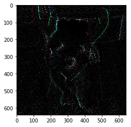

```python
import numpy as np
import pandas as pd
import matplotlib.pyplot as plt

%matplotlib inline
```


```python
import tensorflow as tf
```


```python
tf.VERSION
```


    '1.8.0'


데이터 적재


```python
from deepy.dataset import mnist
```


```python
(X_train, y_train), (X_test, y_test) = mnist.load_mnist(
    flatten=True, normalize=True)
```


```python
train_input_fn = tf.estimator.inputs.numpy_input_fn(
    x={'x': X_train}, y=y_train, batch_size=100,
    num_epochs=None, shuffle=True
)
```

모델 만들기


```python
def model_fn(features, labels, mode):
    input_layer = tf.reshape(features['x'], [-1, 784])
    layer1 = tf.layers.dense(
        inputs=input_layer, units=50, activation=tf.nn.sigmoid)
    layer2 = tf.layers.dense(
        inputs=layer1, units=100, activation=tf.nn.sigmoid)
    layer3 = tf.layers.dense(
        inputs=layer2, units=10)
    
    # 출력 처리 방식
    predictions = {
        'classes': tf.argmax(input=layer3, axis=1),
        'proba': tf.nn.softmax(layer3)
    }
    
    # .predict()
    if mode == tf.estimator.ModeKeys.PREDICT:
        return tf.estimator.EstimatorSpec(
            mode=mode, predictions=predictions)
    
    # 손실함수
    onehot_labels = tf.one_hot(
        indices=tf.cast(labels, tf.int32), depth=10)
    loss = tf.losses.softmax_cross_entropy(
        onehot_labels=onehot_labels, logits=layer3)
    
    if mode == tf.estimator.ModeKeys.TRAIN:
        # 최적화
        optimizer = tf.train.GradientDescentOptimizer(
            learning_rate=0.001)
        train_op = optimizer.minimize(
            loss=loss, global_step= tf.train.get_global_step())
        return tf.estimator.EstimatorSpec(
            mode=mode, loss=loss, train_op=train_op)
    
    # 평가 방법
    eval_metric_ops = {
        'accuracy': tf.metrics.accuracy(
            labels=labels, predictions=predictions['classes'])
    }
    return tf.estimator.EstimatorSpec(
        mode=mode, loss=loss, eval_metric_ops=eval_metric_ops)
```


```python
model = tf.estimator.Estimator(
    model_fn=model_fn, model_dir='mnist_model')
```

    INFO:tensorflow:Using default config.
    INFO:tensorflow:Using config: {'_model_dir': 'mnist_model', '_tf_random_seed': None, '_save_summary_steps': 100, '_save_checkpoints_steps': None, '_save_checkpoints_secs': 600, '_session_config': None, '_keep_checkpoint_max': 5, '_keep_checkpoint_every_n_hours': 10000, '_log_step_count_steps': 100, '_train_distribute': None, '_service': None, '_cluster_spec': <tensorflow.python.training.server_lib.ClusterSpec object at 0x000000001193F048>, '_task_type': 'worker', '_task_id': 0, '_global_id_in_cluster': 0, '_master': '', '_evaluation_master': '', '_is_chief': True, '_num_ps_replicas': 0, '_num_worker_replicas': 1}
    


```python
model.train(train_input_fn, steps=200)
```

    INFO:tensorflow:Calling model_fn.
    INFO:tensorflow:Done calling model_fn.
    INFO:tensorflow:Create CheckpointSaverHook.
    INFO:tensorflow:Graph was finalized.
    INFO:tensorflow:Running local_init_op.
    INFO:tensorflow:Done running local_init_op.
    INFO:tensorflow:Saving checkpoints for 1 into mnist_model\model.ckpt.
    INFO:tensorflow:loss = 2.61232, step = 1
    INFO:tensorflow:global_step/sec: 524.655
    INFO:tensorflow:loss = 2.4858, step = 101 (0.191 sec)
    INFO:tensorflow:Saving checkpoints for 200 into mnist_model\model.ckpt.
    INFO:tensorflow:Loss for final step: 2.33625.
    


    <tensorflow.python.estimator.estimator.Estimator at 0x11941dd8>


```python
test_input_fn = tf.estimator.inputs.numpy_input_fn(
    x={'x': X_test}, y=y_test, num_epochs=1, shuffle=False)
```


```python
model.evaluate(input_fn=test_input_fn)
```

    INFO:tensorflow:Calling model_fn.
    INFO:tensorflow:Done calling model_fn.
    INFO:tensorflow:Starting evaluation at 2018-06-21-01:39:50
    INFO:tensorflow:Graph was finalized.
    INFO:tensorflow:Restoring parameters from mnist_model\model.ckpt-200
    INFO:tensorflow:Running local_init_op.
    INFO:tensorflow:Done running local_init_op.
    INFO:tensorflow:Finished evaluation at 2018-06-21-01:39:50
    INFO:tensorflow:Saving dict for global step 200: accuracy = 0.1252, global_step = 200, loss = 2.39638
    


    {'accuracy': 0.1252, 'global_step': 200, 'loss': 2.3963842}


# keras

텐서플로우 코드는 어렵습니다 ...


```python
Y_train = pd.get_dummies(y_train).values.astype('float32')
Y_test = pd.get_dummies(y_test).values.astype('float32')
```


```python
import keras
```

    Using TensorFlow backend.
    


```python
from keras.models import Sequential
```


```python
from keras.layers.core import Dense
```


```python
model = Sequential()

model.add(Dense(50, input_shape=(784,), activation='sigmoid'))
model.add(Dense(100, activation='sigmoid'))
model.add(Dense(10, activation='softmax'))
```


```python
from keras.optimizers import SGD
```


```python
model.compile(
    loss='categorical_crossentropy', optimizer=SGD(lr=0.1),
    metrics=['accuracy']
)
```


```python
model.summary()
```

    _________________________________________________________________
    Layer (type)                 Output Shape              Param #   
    =================================================================
    dense_4 (Dense)              (None, 50)                39250     
    _________________________________________________________________
    dense_5 (Dense)              (None, 100)               5100      
    _________________________________________________________________
    dense_6 (Dense)              (None, 10)                1010      
    =================================================================
    Total params: 45,360
    Trainable params: 45,360
    Non-trainable params: 0
    _________________________________________________________________
    

모델 훈련


```python
history = model.fit(
    X_train, Y_train, batch_size=128, epochs=200,
    validation_split=0.2
)
```

    Train on 48000 samples, validate on 12000 samples
    Epoch 1/200
    48000/48000 [==============================] - 1s 16us/step - loss: 2.3038 - acc: 0.1239 - val_loss: 2.2761 - val_acc: 0.1101
    Epoch 2/200
    48000/48000 [==============================] - 1s 14us/step - loss: 2.2636 - acc: 0.2102 - val_loss: 2.2506 - val_acc: 0.1547
    Epoch 3/200
    48000/48000 [==============================] - 1s 14us/step - loss: 2.2357 - acc: 0.2864 - val_loss: 2.2185 - val_acc: 0.2689
    Epoch 4/200
    48000/48000 [==============================] - 1s 13us/step - loss: 2.1996 - acc: 0.3558 - val_loss: 2.1772 - val_acc: 0.3866
    Epoch 5/200
    48000/48000 [==============================] - 1s 14us/step - loss: 2.1514 - acc: 0.3996 - val_loss: 2.1202 - val_acc: 0.4314
    Epoch 6/200
    48000/48000 [==============================] - 1s 14us/step - loss: 2.0871 - acc: 0.4360 - val_loss: 2.0459 - val_acc: 0.4478
    Epoch 7/200
    48000/48000 [==============================] - 1s 13us/step - loss: 2.0042 - acc: 0.4701 - val_loss: 1.9532 - val_acc: 0.4947
    Epoch 8/200
    48000/48000 [==============================] - 1s 14us/step - loss: 1.9043 - acc: 0.5066 - val_loss: 1.8454 - val_acc: 0.5492
    Epoch 9/200
    48000/48000 [==============================] - 1s 14us/step - loss: 1.7919 - acc: 0.5529 - val_loss: 1.7258 - val_acc: 0.6027
    Epoch 10/200
    48000/48000 [==============================] - 1s 14us/step - loss: 1.6719 - acc: 0.5887 - val_loss: 1.6019 - val_acc: 0.6315
    Epoch 11/200
    48000/48000 [==============================] - 1s 14us/step - loss: 1.5492 - acc: 0.6272 - val_loss: 1.4775 - val_acc: 0.6655
    Epoch 12/200
    48000/48000 [==============================] - 1s 14us/step - loss: 1.4290 - acc: 0.6603 - val_loss: 1.3574 - val_acc: 0.6819
    Epoch 13/200
    48000/48000 [==============================] - 1s 14us/step - loss: 1.3163 - acc: 0.6890 - val_loss: 1.2467 - val_acc: 0.7226
    Epoch 14/200
    48000/48000 [==============================] - 1s 14us/step - loss: 1.2144 - acc: 0.7148 - val_loss: 1.1484 - val_acc: 0.7535
    Epoch 15/200
    48000/48000 [==============================] - 1s 14us/step - loss: 1.1246 - acc: 0.7404 - val_loss: 1.0622 - val_acc: 0.7640
    Epoch 16/200
    48000/48000 [==============================] - 1s 14us/step - loss: 1.0464 - acc: 0.7553 - val_loss: 0.9878 - val_acc: 0.7836
    Epoch 17/200
    48000/48000 [==============================] - 1s 13us/step - loss: 0.9785 - acc: 0.7687 - val_loss: 0.9225 - val_acc: 0.7945
    Epoch 18/200
    48000/48000 [==============================] - 1s 14us/step - loss: 0.9192 - acc: 0.7818 - val_loss: 0.8657 - val_acc: 0.8009
    Epoch 19/200
    48000/48000 [==============================] - 1s 14us/step - loss: 0.8675 - acc: 0.7901 - val_loss: 0.8165 - val_acc: 0.8115
    Epoch 20/200
    48000/48000 [==============================] - 1s 14us/step - loss: 0.8221 - acc: 0.7984 - val_loss: 0.7730 - val_acc: 0.8218
    Epoch 21/200
    48000/48000 [==============================] - 1s 14us/step - loss: 0.7820 - acc: 0.8060 - val_loss: 0.7346 - val_acc: 0.8257
    Epoch 22/200
    48000/48000 [==============================] - 1s 13us/step - loss: 0.7465 - acc: 0.8121 - val_loss: 0.7010 - val_acc: 0.8324
    Epoch 23/200
    48000/48000 [==============================] - 1s 14us/step - loss: 0.7148 - acc: 0.8177 - val_loss: 0.6709 - val_acc: 0.8356
    Epoch 24/200
    48000/48000 [==============================] - 1s 14us/step - loss: 0.6866 - acc: 0.8234 - val_loss: 0.6448 - val_acc: 0.8415
    Epoch 25/200
    48000/48000 [==============================] - 1s 14us/step - loss: 0.6613 - acc: 0.8281 - val_loss: 0.6211 - val_acc: 0.8444
    Epoch 26/200
    48000/48000 [==============================] - 1s 15us/step - loss: 0.6387 - acc: 0.8323 - val_loss: 0.5993 - val_acc: 0.8475
    Epoch 27/200
    48000/48000 [==============================] - 1s 15us/step - loss: 0.6182 - acc: 0.8365 - val_loss: 0.5800 - val_acc: 0.8493
    Epoch 28/200
    48000/48000 [==============================] - 1s 15us/step - loss: 0.5997 - acc: 0.8406 - val_loss: 0.5628 - val_acc: 0.8523
    Epoch 29/200
    48000/48000 [==============================] - 1s 17us/step - loss: 0.5828 - acc: 0.8442 - val_loss: 0.5468 - val_acc: 0.8568
    Epoch 30/200
    48000/48000 [==============================] - 1s 15us/step - loss: 0.5674 - acc: 0.8477 - val_loss: 0.5323 - val_acc: 0.8603
    Epoch 31/200
    48000/48000 [==============================] - 1s 15us/step - loss: 0.5532 - acc: 0.8510 - val_loss: 0.5192 - val_acc: 0.8639
    Epoch 32/200
    48000/48000 [==============================] - 1s 15us/step - loss: 0.5401 - acc: 0.8539 - val_loss: 0.5071 - val_acc: 0.8662
    Epoch 33/200
    48000/48000 [==============================] - 1s 14us/step - loss: 0.5280 - acc: 0.8569 - val_loss: 0.4957 - val_acc: 0.8680
    Epoch 34/200
    48000/48000 [==============================] - 1s 15us/step - loss: 0.5168 - acc: 0.8590 - val_loss: 0.4851 - val_acc: 0.8698
    Epoch 35/200
    48000/48000 [==============================] - 1s 16us/step - loss: 0.5063 - acc: 0.8620 - val_loss: 0.4753 - val_acc: 0.8728
    Epoch 36/200
    48000/48000 [==============================] - 1s 17us/step - loss: 0.4964 - acc: 0.8646 - val_loss: 0.4663 - val_acc: 0.8743
    Epoch 37/200
    48000/48000 [==============================] - 1s 15us/step - loss: 0.4872 - acc: 0.8679 - val_loss: 0.4577 - val_acc: 0.8754
    Epoch 38/200
    48000/48000 [==============================] - 1s 15us/step - loss: 0.4784 - acc: 0.8694 - val_loss: 0.4496 - val_acc: 0.8775
    Epoch 39/200
    48000/48000 [==============================] - 1s 14us/step - loss: 0.4704 - acc: 0.8712 - val_loss: 0.4419 - val_acc: 0.8806
    Epoch 40/200
    48000/48000 [==============================] - 1s 14us/step - loss: 0.4626 - acc: 0.8735 - val_loss: 0.4346 - val_acc: 0.8821
    Epoch 41/200
    48000/48000 [==============================] - 1s 15us/step - loss: 0.4553 - acc: 0.8754 - val_loss: 0.4279 - val_acc: 0.8841
    Epoch 42/200
    48000/48000 [==============================] - 1s 14us/step - loss: 0.4484 - acc: 0.8779 - val_loss: 0.4215 - val_acc: 0.8852
    Epoch 43/200
    48000/48000 [==============================] - 1s 14us/step - loss: 0.4418 - acc: 0.8791 - val_loss: 0.4155 - val_acc: 0.8865
    Epoch 44/200
    48000/48000 [==============================] - 1s 15us/step - loss: 0.4355 - acc: 0.8813 - val_loss: 0.4097 - val_acc: 0.8878
    Epoch 45/200
    48000/48000 [==============================] - 1s 14us/step - loss: 0.4296 - acc: 0.8829 - val_loss: 0.4042 - val_acc: 0.8892
    Epoch 46/200
    48000/48000 [==============================] - 1s 14us/step - loss: 0.4240 - acc: 0.8844 - val_loss: 0.3989 - val_acc: 0.8914
    Epoch 47/200
    48000/48000 [==============================] - 1s 15us/step - loss: 0.4186 - acc: 0.8858 - val_loss: 0.3941 - val_acc: 0.8917
    Epoch 48/200
    48000/48000 [==============================] - 1s 15us/step - loss: 0.4135 - acc: 0.8864 - val_loss: 0.3893 - val_acc: 0.8934
    Epoch 49/200
    48000/48000 [==============================] - 1s 16us/step - loss: 0.4086 - acc: 0.8882 - val_loss: 0.3848 - val_acc: 0.8947
    Epoch 50/200
    48000/48000 [==============================] - 1s 18us/step - loss: 0.4039 - acc: 0.8895 - val_loss: 0.3804 - val_acc: 0.8960
    Epoch 51/200
    48000/48000 [==============================] - 1s 17us/step - loss: 0.3994 - acc: 0.8906 - val_loss: 0.3764 - val_acc: 0.8974
    Epoch 52/200
    48000/48000 [==============================] - 1s 19us/step - loss: 0.3952 - acc: 0.8919 - val_loss: 0.3724 - val_acc: 0.8985
    Epoch 53/200
    48000/48000 [==============================] - 1s 18us/step - loss: 0.3911 - acc: 0.8928 - val_loss: 0.3686 - val_acc: 0.8986
    Epoch 54/200
    48000/48000 [==============================] - 1s 16us/step - loss: 0.3871 - acc: 0.8942 - val_loss: 0.3650 - val_acc: 0.8998
    Epoch 55/200
    48000/48000 [==============================] - 1s 16us/step - loss: 0.3834 - acc: 0.8950 - val_loss: 0.3614 - val_acc: 0.9003
    Epoch 56/200
    48000/48000 [==============================] - 1s 14us/step - loss: 0.3798 - acc: 0.8959 - val_loss: 0.3581 - val_acc: 0.9013
    Epoch 57/200
    48000/48000 [==============================] - 1s 15us/step - loss: 0.3762 - acc: 0.8970 - val_loss: 0.3548 - val_acc: 0.9019
    Epoch 58/200
    48000/48000 [==============================] - 1s 15us/step - loss: 0.3729 - acc: 0.8977 - val_loss: 0.3519 - val_acc: 0.9030
    Epoch 59/200
    48000/48000 [==============================] - 1s 14us/step - loss: 0.3697 - acc: 0.8983 - val_loss: 0.3489 - val_acc: 0.9035
    Epoch 60/200
    48000/48000 [==============================] - 1s 14us/step - loss: 0.3665 - acc: 0.8990 - val_loss: 0.3461 - val_acc: 0.9039
    Epoch 61/200
    48000/48000 [==============================] - 1s 14us/step - loss: 0.3635 - acc: 0.8998 - val_loss: 0.3431 - val_acc: 0.9047
    Epoch 62/200
    48000/48000 [==============================] - 1s 15us/step - loss: 0.3606 - acc: 0.9002 - val_loss: 0.3404 - val_acc: 0.9053
    Epoch 63/200
    48000/48000 [==============================] - 1s 16us/step - loss: 0.3577 - acc: 0.9010 - val_loss: 0.3378 - val_acc: 0.9054
    Epoch 64/200
    48000/48000 [==============================] - 1s 17us/step - loss: 0.3550 - acc: 0.9015 - val_loss: 0.3353 - val_acc: 0.9062
    Epoch 65/200
    48000/48000 [==============================] - 1s 18us/step - loss: 0.3523 - acc: 0.9022 - val_loss: 0.3329 - val_acc: 0.9073
    Epoch 66/200
    48000/48000 [==============================] - 1s 17us/step - loss: 0.3497 - acc: 0.9030 - val_loss: 0.3305 - val_acc: 0.9073
    Epoch 67/200
    48000/48000 [==============================] - 1s 18us/step - loss: 0.3472 - acc: 0.9032 - val_loss: 0.3281 - val_acc: 0.9080
    Epoch 68/200
    48000/48000 [==============================] - 1s 17us/step - loss: 0.3448 - acc: 0.9042 - val_loss: 0.3258 - val_acc: 0.9090
    Epoch 69/200
    48000/48000 [==============================] - 1s 16us/step - loss: 0.3424 - acc: 0.9045 - val_loss: 0.3238 - val_acc: 0.9096
    Epoch 70/200
    48000/48000 [==============================] - 1s 14us/step - loss: 0.3401 - acc: 0.9050 - val_loss: 0.3218 - val_acc: 0.9102
    Epoch 71/200
    48000/48000 [==============================] - 1s 14us/step - loss: 0.3378 - acc: 0.9056 - val_loss: 0.3198 - val_acc: 0.9112
    Epoch 72/200
    48000/48000 [==============================] - 1s 14us/step - loss: 0.3356 - acc: 0.9061 - val_loss: 0.3176 - val_acc: 0.9119
    Epoch 73/200
    48000/48000 [==============================] - 1s 14us/step - loss: 0.3334 - acc: 0.9067 - val_loss: 0.3155 - val_acc: 0.9123
    Epoch 74/200
    48000/48000 [==============================] - 1s 14us/step - loss: 0.3313 - acc: 0.9073 - val_loss: 0.3137 - val_acc: 0.9133
    Epoch 75/200
    48000/48000 [==============================] - 1s 13us/step - loss: 0.3292 - acc: 0.9077 - val_loss: 0.3117 - val_acc: 0.9139
    Epoch 76/200
    48000/48000 [==============================] - 1s 14us/step - loss: 0.3272 - acc: 0.9080 - val_loss: 0.3098 - val_acc: 0.9143
    Epoch 77/200
    48000/48000 [==============================] - 1s 14us/step - loss: 0.3253 - acc: 0.9089 - val_loss: 0.3080 - val_acc: 0.9148
    Epoch 78/200
    48000/48000 [==============================] - 1s 14us/step - loss: 0.3233 - acc: 0.9089 - val_loss: 0.3063 - val_acc: 0.9147
    Epoch 79/200
    48000/48000 [==============================] - 1s 14us/step - loss: 0.3214 - acc: 0.9094 - val_loss: 0.3047 - val_acc: 0.9162
    Epoch 80/200
    48000/48000 [==============================] - 1s 14us/step - loss: 0.3194 - acc: 0.9100 - val_loss: 0.3028 - val_acc: 0.9153
    Epoch 81/200
    48000/48000 [==============================] - 1s 16us/step - loss: 0.3178 - acc: 0.9104 - val_loss: 0.3011 - val_acc: 0.9161
    Epoch 82/200
    48000/48000 [==============================] - 1s 14us/step - loss: 0.3159 - acc: 0.9111 - val_loss: 0.2996 - val_acc: 0.9175
    Epoch 83/200
    48000/48000 [==============================] - 1s 14us/step - loss: 0.3141 - acc: 0.9115 - val_loss: 0.2978 - val_acc: 0.9174
    Epoch 84/200
    48000/48000 [==============================] - 1s 15us/step - loss: 0.3124 - acc: 0.9120 - val_loss: 0.2965 - val_acc: 0.9184
    Epoch 85/200
    48000/48000 [==============================] - 1s 15us/step - loss: 0.3107 - acc: 0.9122 - val_loss: 0.2948 - val_acc: 0.9183
    Epoch 86/200
    48000/48000 [==============================] - 1s 16us/step - loss: 0.3090 - acc: 0.9128 - val_loss: 0.2932 - val_acc: 0.9183
    Epoch 87/200
    48000/48000 [==============================] - 1s 18us/step - loss: 0.3073 - acc: 0.9134 - val_loss: 0.2918 - val_acc: 0.9182
    Epoch 88/200
    48000/48000 [==============================] - 1s 15us/step - loss: 0.3057 - acc: 0.9140 - val_loss: 0.2904 - val_acc: 0.9193
    Epoch 89/200
    48000/48000 [==============================] - 1s 14us/step - loss: 0.3041 - acc: 0.9142 - val_loss: 0.2887 - val_acc: 0.9191
    Epoch 90/200
    48000/48000 [==============================] - 1s 14us/step - loss: 0.3025 - acc: 0.9148 - val_loss: 0.2873 - val_acc: 0.9201
    Epoch 91/200
    48000/48000 [==============================] - 1s 14us/step - loss: 0.3009 - acc: 0.9153 - val_loss: 0.2860 - val_acc: 0.9208
    Epoch 92/200
    48000/48000 [==============================] - 1s 14us/step - loss: 0.2993 - acc: 0.9155 - val_loss: 0.2846 - val_acc: 0.9206
    Epoch 93/200
    48000/48000 [==============================] - 1s 14us/step - loss: 0.2978 - acc: 0.9159 - val_loss: 0.2832 - val_acc: 0.9213
    Epoch 94/200
    48000/48000 [==============================] - 1s 14us/step - loss: 0.2963 - acc: 0.9166 - val_loss: 0.2818 - val_acc: 0.9216
    Epoch 95/200
    48000/48000 [==============================] - 1s 14us/step - loss: 0.2948 - acc: 0.9170 - val_loss: 0.2805 - val_acc: 0.9219
    Epoch 96/200
    48000/48000 [==============================] - 1s 14us/step - loss: 0.2933 - acc: 0.9172 - val_loss: 0.2792 - val_acc: 0.9222
    Epoch 97/200
    48000/48000 [==============================] - 1s 14us/step - loss: 0.2919 - acc: 0.9174 - val_loss: 0.2778 - val_acc: 0.9223
    Epoch 98/200
    48000/48000 [==============================] - 1s 14us/step - loss: 0.2904 - acc: 0.9178 - val_loss: 0.2765 - val_acc: 0.9227
    Epoch 99/200
    48000/48000 [==============================] - 1s 14us/step - loss: 0.2890 - acc: 0.9184 - val_loss: 0.2752 - val_acc: 0.9232
    Epoch 100/200
    48000/48000 [==============================] - 1s 14us/step - loss: 0.2876 - acc: 0.9188 - val_loss: 0.2741 - val_acc: 0.9238
    Epoch 101/200
    48000/48000 [==============================] - 1s 14us/step - loss: 0.2861 - acc: 0.9189 - val_loss: 0.2727 - val_acc: 0.9232
    Epoch 102/200
    48000/48000 [==============================] - 1s 18us/step - loss: 0.2848 - acc: 0.9191 - val_loss: 0.2716 - val_acc: 0.9235
    Epoch 103/200
    48000/48000 [==============================] - 1s 19us/step - loss: 0.2834 - acc: 0.9195 - val_loss: 0.2703 - val_acc: 0.9243
    Epoch 104/200
    48000/48000 [==============================] - 1s 17us/step - loss: 0.2821 - acc: 0.9203 - val_loss: 0.2692 - val_acc: 0.9247
    Epoch 105/200
    48000/48000 [==============================] - 1s 17us/step - loss: 0.2808 - acc: 0.9204 - val_loss: 0.2680 - val_acc: 0.9256
    Epoch 106/200
    48000/48000 [==============================] - 1s 14us/step - loss: 0.2794 - acc: 0.9205 - val_loss: 0.2667 - val_acc: 0.9252
    Epoch 107/200
    48000/48000 [==============================] - 1s 14us/step - loss: 0.2781 - acc: 0.9211 - val_loss: 0.2657 - val_acc: 0.9248
    Epoch 108/200
    48000/48000 [==============================] - 1s 14us/step - loss: 0.2768 - acc: 0.9213 - val_loss: 0.2645 - val_acc: 0.9255
    Epoch 109/200
    48000/48000 [==============================] - 1s 14us/step - loss: 0.2755 - acc: 0.9215 - val_loss: 0.2636 - val_acc: 0.9252
    Epoch 110/200
    48000/48000 [==============================] - 1s 14us/step - loss: 0.2743 - acc: 0.9221 - val_loss: 0.2622 - val_acc: 0.9256
    Epoch 111/200
    48000/48000 [==============================] - 1s 14us/step - loss: 0.2730 - acc: 0.9223 - val_loss: 0.2611 - val_acc: 0.9258
    Epoch 112/200
    48000/48000 [==============================] - 1s 16us/step - loss: 0.2717 - acc: 0.9225 - val_loss: 0.2602 - val_acc: 0.9268
    Epoch 113/200
    48000/48000 [==============================] - 1s 16us/step - loss: 0.2705 - acc: 0.9230 - val_loss: 0.2591 - val_acc: 0.9265
    Epoch 114/200
    48000/48000 [==============================] - 1s 17us/step - loss: 0.2693 - acc: 0.9231 - val_loss: 0.2579 - val_acc: 0.9268
    Epoch 115/200
    48000/48000 [==============================] - 1s 18us/step - loss: 0.2681 - acc: 0.9236 - val_loss: 0.2569 - val_acc: 0.9273
    Epoch 116/200
    48000/48000 [==============================] - 1s 18us/step - loss: 0.2669 - acc: 0.9238 - val_loss: 0.2559 - val_acc: 0.9278
    Epoch 117/200
    48000/48000 [==============================] - 1s 16us/step - loss: 0.2657 - acc: 0.9241 - val_loss: 0.2549 - val_acc: 0.9283
    Epoch 118/200
    48000/48000 [==============================] - 1s 17us/step - loss: 0.2645 - acc: 0.9248 - val_loss: 0.2539 - val_acc: 0.9285
    Epoch 119/200
    48000/48000 [==============================] - 1s 17us/step - loss: 0.2634 - acc: 0.9250 - val_loss: 0.2527 - val_acc: 0.9274
    Epoch 120/200
    48000/48000 [==============================] - 1s 17us/step - loss: 0.2622 - acc: 0.9255 - val_loss: 0.2518 - val_acc: 0.9287
    Epoch 121/200
    48000/48000 [==============================] - 1s 16us/step - loss: 0.2611 - acc: 0.9256 - val_loss: 0.2508 - val_acc: 0.9288
    Epoch 122/200
    48000/48000 [==============================] - 1s 16us/step - loss: 0.2599 - acc: 0.9261 - val_loss: 0.2499 - val_acc: 0.9288
    Epoch 123/200
    48000/48000 [==============================] - 1s 18us/step - loss: 0.2588 - acc: 0.9266 - val_loss: 0.2488 - val_acc: 0.9292
    Epoch 124/200
    48000/48000 [==============================] - 1s 15us/step - loss: 0.2577 - acc: 0.9269 - val_loss: 0.2480 - val_acc: 0.9297
    Epoch 125/200
    48000/48000 [==============================] - 1s 14us/step - loss: 0.2566 - acc: 0.9270 - val_loss: 0.2471 - val_acc: 0.9297
    Epoch 126/200
    48000/48000 [==============================] - 1s 13us/step - loss: 0.2554 - acc: 0.9271 - val_loss: 0.2461 - val_acc: 0.9303
    Epoch 127/200
    48000/48000 [==============================] - 1s 14us/step - loss: 0.2544 - acc: 0.9279 - val_loss: 0.2451 - val_acc: 0.9303
    Epoch 128/200
    48000/48000 [==============================] - 1s 14us/step - loss: 0.2533 - acc: 0.9280 - val_loss: 0.2441 - val_acc: 0.9301
    Epoch 129/200
    48000/48000 [==============================] - 1s 13us/step - loss: 0.2522 - acc: 0.9288 - val_loss: 0.2434 - val_acc: 0.9303
    Epoch 130/200
    48000/48000 [==============================] - 1s 13us/step - loss: 0.2512 - acc: 0.9286 - val_loss: 0.2424 - val_acc: 0.9307
    Epoch 131/200
    48000/48000 [==============================] - 1s 14us/step - loss: 0.2502 - acc: 0.9289 - val_loss: 0.2414 - val_acc: 0.9314
    Epoch 132/200
    48000/48000 [==============================] - 1s 14us/step - loss: 0.2491 - acc: 0.9293 - val_loss: 0.2406 - val_acc: 0.9319
    Epoch 133/200
    48000/48000 [==============================] - 1s 14us/step - loss: 0.2481 - acc: 0.9295 - val_loss: 0.2397 - val_acc: 0.9323
    Epoch 134/200
    48000/48000 [==============================] - 1s 13us/step - loss: 0.2471 - acc: 0.9299 - val_loss: 0.2389 - val_acc: 0.9322
    Epoch 135/200
    48000/48000 [==============================] - 1s 14us/step - loss: 0.2461 - acc: 0.9301 - val_loss: 0.2380 - val_acc: 0.9328
    Epoch 136/200
    48000/48000 [==============================] - 1s 13us/step - loss: 0.2450 - acc: 0.9305 - val_loss: 0.2372 - val_acc: 0.9333
    Epoch 137/200
    48000/48000 [==============================] - 1s 14us/step - loss: 0.2441 - acc: 0.9307 - val_loss: 0.2364 - val_acc: 0.9329
    Epoch 138/200
    48000/48000 [==============================] - 1s 14us/step - loss: 0.2430 - acc: 0.9309 - val_loss: 0.2354 - val_acc: 0.9336
    Epoch 139/200
    48000/48000 [==============================] - 1s 14us/step - loss: 0.2421 - acc: 0.9307 - val_loss: 0.2346 - val_acc: 0.9334
    Epoch 140/200
    48000/48000 [==============================] - 1s 14us/step - loss: 0.2411 - acc: 0.9315 - val_loss: 0.2338 - val_acc: 0.9338
    Epoch 141/200
    48000/48000 [==============================] - 1s 14us/step - loss: 0.2402 - acc: 0.9320 - val_loss: 0.2330 - val_acc: 0.9344
    Epoch 142/200
    48000/48000 [==============================] - 1s 14us/step - loss: 0.2392 - acc: 0.9320 - val_loss: 0.2322 - val_acc: 0.9346
    Epoch 143/200
    48000/48000 [==============================] - 1s 14us/step - loss: 0.2382 - acc: 0.9320 - val_loss: 0.2313 - val_acc: 0.9350
    Epoch 144/200
    48000/48000 [==============================] - 1s 14us/step - loss: 0.2373 - acc: 0.9323 - val_loss: 0.2305 - val_acc: 0.9351
    Epoch 145/200
    48000/48000 [==============================] - 1s 14us/step - loss: 0.2364 - acc: 0.9326 - val_loss: 0.2296 - val_acc: 0.9353
    Epoch 146/200
    48000/48000 [==============================] - 1s 14us/step - loss: 0.2355 - acc: 0.9329 - val_loss: 0.2290 - val_acc: 0.9353
    Epoch 147/200
    48000/48000 [==============================] - 1s 14us/step - loss: 0.2346 - acc: 0.9330 - val_loss: 0.2282 - val_acc: 0.9355
    Epoch 148/200
    48000/48000 [==============================] - 1s 13us/step - loss: 0.2337 - acc: 0.9334 - val_loss: 0.2274 - val_acc: 0.9360
    Epoch 149/200
    48000/48000 [==============================] - 1s 13us/step - loss: 0.2327 - acc: 0.9337 - val_loss: 0.2267 - val_acc: 0.9355
    Epoch 150/200
    48000/48000 [==============================] - 1s 14us/step - loss: 0.2318 - acc: 0.9341 - val_loss: 0.2260 - val_acc: 0.9362
    Epoch 151/200
    48000/48000 [==============================] - 1s 14us/step - loss: 0.2309 - acc: 0.9340 - val_loss: 0.2252 - val_acc: 0.9368
    Epoch 152/200
    48000/48000 [==============================] - 1s 14us/step - loss: 0.2301 - acc: 0.9346 - val_loss: 0.2244 - val_acc: 0.9370
    Epoch 153/200
    48000/48000 [==============================] - 1s 14us/step - loss: 0.2292 - acc: 0.9349 - val_loss: 0.2237 - val_acc: 0.9377
    Epoch 154/200
    48000/48000 [==============================] - 1s 14us/step - loss: 0.2283 - acc: 0.9347 - val_loss: 0.2231 - val_acc: 0.9373
    Epoch 155/200
    48000/48000 [==============================] - 1s 14us/step - loss: 0.2275 - acc: 0.9353 - val_loss: 0.2223 - val_acc: 0.9375
    Epoch 156/200
    48000/48000 [==============================] - 1s 13us/step - loss: 0.2266 - acc: 0.9355 - val_loss: 0.2216 - val_acc: 0.9381
    Epoch 157/200
    48000/48000 [==============================] - 1s 14us/step - loss: 0.2258 - acc: 0.9356 - val_loss: 0.2209 - val_acc: 0.9378
    Epoch 158/200
    48000/48000 [==============================] - 1s 13us/step - loss: 0.2249 - acc: 0.9358 - val_loss: 0.2201 - val_acc: 0.9382
    Epoch 159/200
    48000/48000 [==============================] - 1s 14us/step - loss: 0.2241 - acc: 0.9362 - val_loss: 0.2195 - val_acc: 0.9382
    Epoch 160/200
    48000/48000 [==============================] - 1s 13us/step - loss: 0.2232 - acc: 0.9364 - val_loss: 0.2188 - val_acc: 0.9383
    Epoch 161/200
    48000/48000 [==============================] - 1s 14us/step - loss: 0.2224 - acc: 0.9367 - val_loss: 0.2181 - val_acc: 0.9387
    Epoch 162/200
    48000/48000 [==============================] - 1s 14us/step - loss: 0.2216 - acc: 0.9365 - val_loss: 0.2173 - val_acc: 0.9386
    Epoch 163/200
    48000/48000 [==============================] - 1s 14us/step - loss: 0.2208 - acc: 0.9369 - val_loss: 0.2167 - val_acc: 0.9390
    Epoch 164/200
    48000/48000 [==============================] - 1s 14us/step - loss: 0.2200 - acc: 0.9372 - val_loss: 0.2161 - val_acc: 0.9390
    Epoch 165/200
    48000/48000 [==============================] - 1s 14us/step - loss: 0.2192 - acc: 0.9373 - val_loss: 0.2154 - val_acc: 0.9393
    Epoch 166/200
    48000/48000 [==============================] - 1s 14us/step - loss: 0.2184 - acc: 0.9374 - val_loss: 0.2146 - val_acc: 0.9398
    Epoch 167/200
    48000/48000 [==============================] - 1s 17us/step - loss: 0.2176 - acc: 0.9379 - val_loss: 0.2140 - val_acc: 0.9399
    Epoch 168/200
    48000/48000 [==============================] - 1s 14us/step - loss: 0.2168 - acc: 0.9380 - val_loss: 0.2134 - val_acc: 0.9403
    Epoch 169/200
    48000/48000 [==============================] - 1s 14us/step - loss: 0.2160 - acc: 0.9385 - val_loss: 0.2126 - val_acc: 0.9404
    Epoch 170/200
    48000/48000 [==============================] - 1s 14us/step - loss: 0.2153 - acc: 0.9386 - val_loss: 0.2120 - val_acc: 0.9403
    Epoch 171/200
    48000/48000 [==============================] - 1s 14us/step - loss: 0.2145 - acc: 0.9385 - val_loss: 0.2115 - val_acc: 0.9405
    Epoch 172/200
    48000/48000 [==============================] - 1s 14us/step - loss: 0.2138 - acc: 0.9387 - val_loss: 0.2108 - val_acc: 0.9406
    Epoch 173/200
    48000/48000 [==============================] - 1s 14us/step - loss: 0.2130 - acc: 0.9389 - val_loss: 0.2102 - val_acc: 0.9405
    Epoch 174/200
    48000/48000 [==============================] - 1s 14us/step - loss: 0.2122 - acc: 0.9396 - val_loss: 0.2095 - val_acc: 0.9412
    Epoch 175/200
    48000/48000 [==============================] - 1s 14us/step - loss: 0.2115 - acc: 0.9396 - val_loss: 0.2091 - val_acc: 0.9407
    Epoch 176/200
    48000/48000 [==============================] - 1s 14us/step - loss: 0.2108 - acc: 0.9398 - val_loss: 0.2084 - val_acc: 0.9413
    Epoch 177/200
    48000/48000 [==============================] - 1s 14us/step - loss: 0.2100 - acc: 0.9401 - val_loss: 0.2078 - val_acc: 0.9417
    Epoch 178/200
    48000/48000 [==============================] - 1s 14us/step - loss: 0.2093 - acc: 0.9400 - val_loss: 0.2071 - val_acc: 0.9421
    Epoch 179/200
    48000/48000 [==============================] - 1s 14us/step - loss: 0.2086 - acc: 0.9403 - val_loss: 0.2064 - val_acc: 0.9421
    Epoch 180/200
    48000/48000 [==============================] - 1s 14us/step - loss: 0.2078 - acc: 0.9407 - val_loss: 0.2060 - val_acc: 0.9417
    Epoch 181/200
    48000/48000 [==============================] - 1s 14us/step - loss: 0.2071 - acc: 0.9406 - val_loss: 0.2054 - val_acc: 0.9416
    Epoch 182/200
    48000/48000 [==============================] - 1s 14us/step - loss: 0.2064 - acc: 0.9412 - val_loss: 0.2047 - val_acc: 0.9427
    Epoch 183/200
    48000/48000 [==============================] - 1s 14us/step - loss: 0.2057 - acc: 0.9415 - val_loss: 0.2041 - val_acc: 0.9429
    Epoch 184/200
    48000/48000 [==============================] - 1s 14us/step - loss: 0.2050 - acc: 0.9414 - val_loss: 0.2035 - val_acc: 0.9428
    Epoch 185/200
    48000/48000 [==============================] - 1s 14us/step - loss: 0.2043 - acc: 0.9417 - val_loss: 0.2030 - val_acc: 0.9431
    Epoch 186/200
    48000/48000 [==============================] - 1s 14us/step - loss: 0.2036 - acc: 0.9418 - val_loss: 0.2024 - val_acc: 0.9429
    Epoch 187/200
    48000/48000 [==============================] - 1s 14us/step - loss: 0.2029 - acc: 0.9421 - val_loss: 0.2018 - val_acc: 0.9431
    Epoch 188/200
    48000/48000 [==============================] - 1s 14us/step - loss: 0.2022 - acc: 0.9423 - val_loss: 0.2013 - val_acc: 0.9435
    Epoch 189/200
    48000/48000 [==============================] - 1s 14us/step - loss: 0.2016 - acc: 0.9423 - val_loss: 0.2007 - val_acc: 0.9433
    Epoch 190/200
    48000/48000 [==============================] - 1s 17us/step - loss: 0.2009 - acc: 0.9426 - val_loss: 0.2001 - val_acc: 0.9438
    Epoch 191/200
    48000/48000 [==============================] - 1s 18us/step - loss: 0.2002 - acc: 0.9429 - val_loss: 0.1997 - val_acc: 0.9436
    Epoch 192/200
    48000/48000 [==============================] - 1s 18us/step - loss: 0.1995 - acc: 0.9429 - val_loss: 0.1990 - val_acc: 0.9438
    Epoch 193/200
    48000/48000 [==============================] - 1s 15us/step - loss: 0.1989 - acc: 0.9433 - val_loss: 0.1985 - val_acc: 0.9437
    Epoch 194/200
    48000/48000 [==============================] - 1s 18us/step - loss: 0.1982 - acc: 0.9434 - val_loss: 0.1978 - val_acc: 0.9442
    Epoch 195/200
    48000/48000 [==============================] - 1s 18us/step - loss: 0.1975 - acc: 0.9436 - val_loss: 0.1973 - val_acc: 0.9441
    Epoch 196/200
    48000/48000 [==============================] - 1s 16us/step - loss: 0.1969 - acc: 0.9438 - val_loss: 0.1967 - val_acc: 0.9448
    Epoch 197/200
    48000/48000 [==============================] - 1s 14us/step - loss: 0.1962 - acc: 0.9440 - val_loss: 0.1963 - val_acc: 0.9443
    Epoch 198/200
    48000/48000 [==============================] - 1s 14us/step - loss: 0.1956 - acc: 0.9443 - val_loss: 0.1958 - val_acc: 0.9446
    Epoch 199/200
    48000/48000 [==============================] - 1s 14us/step - loss: 0.1949 - acc: 0.9445 - val_loss: 0.1954 - val_acc: 0.9446
    Epoch 200/200
    48000/48000 [==============================] - 1s 14us/step - loss: 0.1943 - acc: 0.9445 - val_loss: 0.1948 - val_acc: 0.9451
    

훈련 결과 평가


```python
훈련결과 = pd.DataFrame(history.history)
```


```python
훈련결과[['loss', 'val_loss']].plot()
```


    <matplotlib.axes._subplots.AxesSubplot at 0x18acf0f0>


적용


```python
score = model.evaluate(X_test, Y_test)
```

    10000/10000 [==============================] - 0s 16us/step
    


```python
print('Loss: {0}, Acc.: {1}'.format(*score))
```

    Loss: 0.19739119328558444, Acc.: 0.9429
    


```python
Y_pred = model.predict(X_test)
```


```python
y_pred = np.argmax(Y_pred, axis=1)
```

#### 연습

"더 깊게 ..."

dense(50) + dense(100) + dense(100) + dense(10)


```python
model = Sequential()
```


```python
model.add(Dense(50, input_shape=(784,), activation='relu'))
model.add(Dense(100, activation='relu'))
model.add(Dense(100, activation='relu'))
model.add(Dense(10, activation='softmax'))
```


```python
model.compile(
    loss='categorical_crossentropy', 
    optimizer='adam',
    metrics=['accuracy']
)
```


```python
history = model.fit(
    X_train, Y_train, batch_size=128, epochs=200,
    validation_split=0.2
)
```

    Train on 48000 samples, validate on 12000 samples
    Epoch 1/200
    48000/48000 [==============================] - 1s 23us/step - loss: 0.4052 - acc: 0.8817 - val_loss: 0.1902 - val_acc: 0.9462
    Epoch 2/200
    48000/48000 [==============================] - 1s 18us/step - loss: 0.1666 - acc: 0.9510 - val_loss: 0.1514 - val_acc: 0.9536
    Epoch 3/200
    48000/48000 [==============================] - 1s 18us/step - loss: 0.1254 - acc: 0.9622 - val_loss: 0.1354 - val_acc: 0.9578
    Epoch 4/200
    48000/48000 [==============================] - 1s 18us/step - loss: 0.1014 - acc: 0.9697 - val_loss: 0.1223 - val_acc: 0.9620
    Epoch 5/200
    48000/48000 [==============================] - 1s 18us/step - loss: 0.0834 - acc: 0.9741 - val_loss: 0.1094 - val_acc: 0.9658
    Epoch 6/200
    48000/48000 [==============================] - 1s 17us/step - loss: 0.0714 - acc: 0.9779 - val_loss: 0.1044 - val_acc: 0.9698
    Epoch 7/200
    48000/48000 [==============================] - 1s 17us/step - loss: 0.0598 - acc: 0.9811 - val_loss: 0.1100 - val_acc: 0.9678
    Epoch 8/200
    48000/48000 [==============================] - 1s 17us/step - loss: 0.0521 - acc: 0.9836 - val_loss: 0.1061 - val_acc: 0.9685
    Epoch 9/200
    48000/48000 [==============================] - 1s 18us/step - loss: 0.0459 - acc: 0.9859 - val_loss: 0.1086 - val_acc: 0.9697
    Epoch 10/200
    48000/48000 [==============================] - 1s 17us/step - loss: 0.0405 - acc: 0.9874 - val_loss: 0.1117 - val_acc: 0.9720
    Epoch 11/200
    48000/48000 [==============================] - 1s 17us/step - loss: 0.0336 - acc: 0.9895 - val_loss: 0.1074 - val_acc: 0.9712
    Epoch 12/200
    48000/48000 [==============================] - 1s 17us/step - loss: 0.0308 - acc: 0.9900 - val_loss: 0.1046 - val_acc: 0.9714
    Epoch 13/200
    48000/48000 [==============================] - 1s 17us/step - loss: 0.0293 - acc: 0.9907 - val_loss: 0.1164 - val_acc: 0.9707
    Epoch 14/200
    48000/48000 [==============================] - 1s 17us/step - loss: 0.0267 - acc: 0.9908 - val_loss: 0.1168 - val_acc: 0.9713
    Epoch 15/200
    48000/48000 [==============================] - 1s 18us/step - loss: 0.0225 - acc: 0.9927 - val_loss: 0.1203 - val_acc: 0.9714
    Epoch 16/200
    48000/48000 [==============================] - 1s 17us/step - loss: 0.0192 - acc: 0.9940 - val_loss: 0.1138 - val_acc: 0.9719
    Epoch 17/200
    48000/48000 [==============================] - 1s 17us/step - loss: 0.0165 - acc: 0.9946 - val_loss: 0.1198 - val_acc: 0.9727
    Epoch 18/200
    48000/48000 [==============================] - 1s 18us/step - loss: 0.0216 - acc: 0.9924 - val_loss: 0.1301 - val_acc: 0.9707
    Epoch 19/200
    48000/48000 [==============================] - 1s 17us/step - loss: 0.0162 - acc: 0.9941 - val_loss: 0.1275 - val_acc: 0.9723
    Epoch 20/200
    48000/48000 [==============================] - 1s 18us/step - loss: 0.0144 - acc: 0.9953 - val_loss: 0.1488 - val_acc: 0.9681
    Epoch 21/200
    48000/48000 [==============================] - 1s 17us/step - loss: 0.0135 - acc: 0.9955 - val_loss: 0.1483 - val_acc: 0.9694
    Epoch 22/200
    48000/48000 [==============================] - 1s 18us/step - loss: 0.0143 - acc: 0.9952 - val_loss: 0.1520 - val_acc: 0.9688
    Epoch 23/200
    48000/48000 [==============================] - 1s 18us/step - loss: 0.0134 - acc: 0.9955 - val_loss: 0.1582 - val_acc: 0.9694
    Epoch 24/200
    48000/48000 [==============================] - 1s 17us/step - loss: 0.0123 - acc: 0.9957 - val_loss: 0.1477 - val_acc: 0.9711
    Epoch 25/200
    48000/48000 [==============================] - 1s 19us/step - loss: 0.0093 - acc: 0.9970 - val_loss: 0.1608 - val_acc: 0.9717
    Epoch 26/200
    48000/48000 [==============================] - 1s 18us/step - loss: 0.0139 - acc: 0.9953 - val_loss: 0.1398 - val_acc: 0.9732
    Epoch 27/200
    48000/48000 [==============================] - 1s 18us/step - loss: 0.0102 - acc: 0.9961 - val_loss: 0.1474 - val_acc: 0.9719
    Epoch 28/200
    48000/48000 [==============================] - 1s 19us/step - loss: 0.0090 - acc: 0.9974 - val_loss: 0.1592 - val_acc: 0.9702
    Epoch 29/200
    48000/48000 [==============================] - 1s 18us/step - loss: 0.0120 - acc: 0.9957 - val_loss: 0.1464 - val_acc: 0.9751
    Epoch 30/200
    48000/48000 [==============================] - 1s 18us/step - loss: 0.0133 - acc: 0.9956 - val_loss: 0.1424 - val_acc: 0.9736
    Epoch 31/200
    48000/48000 [==============================] - 1s 19us/step - loss: 0.0084 - acc: 0.9973 - val_loss: 0.1632 - val_acc: 0.9700
    Epoch 32/200
    48000/48000 [==============================] - 1s 18us/step - loss: 0.0086 - acc: 0.9975 - val_loss: 0.1584 - val_acc: 0.9723
    Epoch 33/200
    48000/48000 [==============================] - 1s 18us/step - loss: 0.0127 - acc: 0.9960 - val_loss: 0.1602 - val_acc: 0.9724
    Epoch 34/200
    48000/48000 [==============================] - 1s 19us/step - loss: 0.0065 - acc: 0.9979 - val_loss: 0.1720 - val_acc: 0.9684
    Epoch 35/200
    48000/48000 [==============================] - 1s 19us/step - loss: 0.0109 - acc: 0.9964 - val_loss: 0.1688 - val_acc: 0.9720
    Epoch 36/200
    48000/48000 [==============================] - 1s 18us/step - loss: 0.0103 - acc: 0.9965 - val_loss: 0.1467 - val_acc: 0.9743
    Epoch 37/200
    48000/48000 [==============================] - 1s 18us/step - loss: 0.0060 - acc: 0.9979 - val_loss: 0.1668 - val_acc: 0.9721
    Epoch 38/200
    48000/48000 [==============================] - 1s 18us/step - loss: 0.0096 - acc: 0.9970 - val_loss: 0.1884 - val_acc: 0.9677
    Epoch 39/200
    48000/48000 [==============================] - 1s 18us/step - loss: 0.0118 - acc: 0.9964 - val_loss: 0.1668 - val_acc: 0.9713
    Epoch 40/200
    48000/48000 [==============================] - 1s 18us/step - loss: 0.0035 - acc: 0.9990 - val_loss: 0.1701 - val_acc: 0.9716
    Epoch 41/200
    48000/48000 [==============================] - 1s 18us/step - loss: 0.0047 - acc: 0.9984 - val_loss: 0.1873 - val_acc: 0.9698
    Epoch 42/200
    48000/48000 [==============================] - 1s 18us/step - loss: 0.0138 - acc: 0.9956 - val_loss: 0.1819 - val_acc: 0.9695
    Epoch 43/200
    48000/48000 [==============================] - 1s 18us/step - loss: 0.0073 - acc: 0.9976 - val_loss: 0.1723 - val_acc: 0.9720
    Epoch 44/200
    48000/48000 [==============================] - 1s 19us/step - loss: 0.0054 - acc: 0.9983 - val_loss: 0.1501 - val_acc: 0.9755
    Epoch 45/200
    48000/48000 [==============================] - 1s 18us/step - loss: 9.4877e-04 - acc: 0.9998 - val_loss: 0.1658 - val_acc: 0.9739
    Epoch 46/200
    48000/48000 [==============================] - 1s 18us/step - loss: 0.0161 - acc: 0.9953 - val_loss: 0.1651 - val_acc: 0.9729
    Epoch 47/200
    48000/48000 [==============================] - 1s 18us/step - loss: 0.0097 - acc: 0.9970 - val_loss: 0.1687 - val_acc: 0.9721
    Epoch 48/200
    48000/48000 [==============================] - 1s 18us/step - loss: 0.0070 - acc: 0.9973 - val_loss: 0.1676 - val_acc: 0.9718
    Epoch 49/200
    48000/48000 [==============================] - 1s 18us/step - loss: 0.0088 - acc: 0.9969 - val_loss: 0.1849 - val_acc: 0.9722
    Epoch 50/200
    48000/48000 [==============================] - 1s 18us/step - loss: 0.0079 - acc: 0.9978 - val_loss: 0.1747 - val_acc: 0.9723
    Epoch 51/200
    48000/48000 [==============================] - 1s 18us/step - loss: 0.0078 - acc: 0.9975 - val_loss: 0.1622 - val_acc: 0.9738
    Epoch 52/200
    48000/48000 [==============================] - 1s 18us/step - loss: 0.0021 - acc: 0.9992 - val_loss: 0.1568 - val_acc: 0.9754
    Epoch 53/200
    48000/48000 [==============================] - 1s 18us/step - loss: 2.8572e-04 - acc: 1.0000 - val_loss: 0.1544 - val_acc: 0.9762
    Epoch 54/200
    48000/48000 [==============================] - 1s 18us/step - loss: 9.0510e-05 - acc: 1.0000 - val_loss: 0.1554 - val_acc: 0.9767
    Epoch 55/200
    48000/48000 [==============================] - 1s 19us/step - loss: 5.7914e-05 - acc: 1.0000 - val_loss: 0.1564 - val_acc: 0.9765
    Epoch 56/200
    48000/48000 [==============================] - 1s 18us/step - loss: 4.6548e-05 - acc: 1.0000 - val_loss: 0.1573 - val_acc: 0.9768
    Epoch 57/200
    48000/48000 [==============================] - 1s 19us/step - loss: 3.8495e-05 - acc: 1.0000 - val_loss: 0.1588 - val_acc: 0.9766
    Epoch 58/200
    48000/48000 [==============================] - 1s 18us/step - loss: 3.2102e-05 - acc: 1.0000 - val_loss: 0.1601 - val_acc: 0.9767
    Epoch 59/200
    48000/48000 [==============================] - 1s 17us/step - loss: 2.7189e-05 - acc: 1.0000 - val_loss: 0.1612 - val_acc: 0.9767
    Epoch 60/200
    48000/48000 [==============================] - 1s 18us/step - loss: 2.2976e-05 - acc: 1.0000 - val_loss: 0.1622 - val_acc: 0.9771
    Epoch 61/200
    48000/48000 [==============================] - 1s 18us/step - loss: 1.9712e-05 - acc: 1.0000 - val_loss: 0.1633 - val_acc: 0.9768
    Epoch 62/200
    48000/48000 [==============================] - 1s 18us/step - loss: 1.6791e-05 - acc: 1.0000 - val_loss: 0.1644 - val_acc: 0.9768
    Epoch 63/200
    48000/48000 [==============================] - 1s 19us/step - loss: 1.4346e-05 - acc: 1.0000 - val_loss: 0.1664 - val_acc: 0.9770
    Epoch 64/200
    48000/48000 [==============================] - 1s 18us/step - loss: 1.2294e-05 - acc: 1.0000 - val_loss: 0.1678 - val_acc: 0.9770
    Epoch 65/200
    48000/48000 [==============================] - 1s 18us/step - loss: 1.0532e-05 - acc: 1.0000 - val_loss: 0.1690 - val_acc: 0.9769
    Epoch 66/200
    48000/48000 [==============================] - 1s 18us/step - loss: 8.9050e-06 - acc: 1.0000 - val_loss: 0.1709 - val_acc: 0.9772
    Epoch 67/200
    48000/48000 [==============================] - 1s 17us/step - loss: 7.5513e-06 - acc: 1.0000 - val_loss: 0.1724 - val_acc: 0.9771
    Epoch 68/200
    48000/48000 [==============================] - 1s 17us/step - loss: 6.3470e-06 - acc: 1.0000 - val_loss: 0.1740 - val_acc: 0.9769
    Epoch 69/200
    48000/48000 [==============================] - 1s 18us/step - loss: 5.4868e-06 - acc: 1.0000 - val_loss: 0.1756 - val_acc: 0.9772
    Epoch 70/200
    48000/48000 [==============================] - 1s 18us/step - loss: 4.7168e-06 - acc: 1.0000 - val_loss: 0.1766 - val_acc: 0.9771
    Epoch 71/200
    48000/48000 [==============================] - 1s 18us/step - loss: 3.9558e-06 - acc: 1.0000 - val_loss: 0.1772 - val_acc: 0.9769
    Epoch 72/200
    48000/48000 [==============================] - 1s 17us/step - loss: 3.4875e-06 - acc: 1.0000 - val_loss: 0.1789 - val_acc: 0.9771
    Epoch 73/200
    48000/48000 [==============================] - 1s 17us/step - loss: 3.1859e-06 - acc: 1.0000 - val_loss: 0.1809 - val_acc: 0.9773
    Epoch 74/200
    48000/48000 [==============================] - 1s 17us/step - loss: 2.6773e-06 - acc: 1.0000 - val_loss: 0.1827 - val_acc: 0.9767
    Epoch 75/200
    48000/48000 [==============================] - 1s 18us/step - loss: 0.0589 - acc: 0.9864 - val_loss: 0.1796 - val_acc: 0.9671
    Epoch 76/200
    48000/48000 [==============================] - 1s 17us/step - loss: 0.0078 - acc: 0.9973 - val_loss: 0.1633 - val_acc: 0.9730
    Epoch 77/200
    48000/48000 [==============================] - 1s 18us/step - loss: 0.0034 - acc: 0.9989 - val_loss: 0.1698 - val_acc: 0.9730
    Epoch 78/200
    48000/48000 [==============================] - 1s 18us/step - loss: 0.0018 - acc: 0.9993 - val_loss: 0.1748 - val_acc: 0.9733
    Epoch 79/200
    48000/48000 [==============================] - 1s 18us/step - loss: 8.4926e-04 - acc: 0.9998 - val_loss: 0.1707 - val_acc: 0.9741
    Epoch 80/200
    48000/48000 [==============================] - 1s 19us/step - loss: 1.1720e-04 - acc: 1.0000 - val_loss: 0.1679 - val_acc: 0.9748
    Epoch 81/200
    48000/48000 [==============================] - 1s 17us/step - loss: 5.9448e-05 - acc: 1.0000 - val_loss: 0.1702 - val_acc: 0.9750
    Epoch 82/200
    48000/48000 [==============================] - 1s 17us/step - loss: 4.6562e-05 - acc: 1.0000 - val_loss: 0.1720 - val_acc: 0.9750
    Epoch 83/200
    48000/48000 [==============================] - 1s 18us/step - loss: 3.7847e-05 - acc: 1.0000 - val_loss: 0.1738 - val_acc: 0.9753
    Epoch 84/200
    48000/48000 [==============================] - 1s 17us/step - loss: 3.1429e-05 - acc: 1.0000 - val_loss: 0.1749 - val_acc: 0.9752
    Epoch 85/200
    48000/48000 [==============================] - 1s 17us/step - loss: 2.6405e-05 - acc: 1.0000 - val_loss: 0.1765 - val_acc: 0.9750
    Epoch 86/200
    48000/48000 [==============================] - 1s 18us/step - loss: 2.2300e-05 - acc: 1.0000 - val_loss: 0.1781 - val_acc: 0.9752
    Epoch 87/200
    48000/48000 [==============================] - 1s 17us/step - loss: 1.8637e-05 - acc: 1.0000 - val_loss: 0.1799 - val_acc: 0.9753
    Epoch 88/200
    48000/48000 [==============================] - 1s 17us/step - loss: 1.5736e-05 - acc: 1.0000 - val_loss: 0.1817 - val_acc: 0.9755
    Epoch 89/200
    48000/48000 [==============================] - 1s 18us/step - loss: 1.3243e-05 - acc: 1.0000 - val_loss: 0.1829 - val_acc: 0.9753
    Epoch 90/200
    48000/48000 [==============================] - 1s 17us/step - loss: 1.1210e-05 - acc: 1.0000 - val_loss: 0.1846 - val_acc: 0.9753
    Epoch 91/200
    48000/48000 [==============================] - 1s 18us/step - loss: 9.3875e-06 - acc: 1.0000 - val_loss: 0.1857 - val_acc: 0.9755
    Epoch 92/200
    48000/48000 [==============================] - 1s 17us/step - loss: 7.9234e-06 - acc: 1.0000 - val_loss: 0.1873 - val_acc: 0.9756
    Epoch 93/200
    48000/48000 [==============================] - 1s 18us/step - loss: 6.6916e-06 - acc: 1.0000 - val_loss: 0.1888 - val_acc: 0.9753
    Epoch 94/200
    48000/48000 [==============================] - 1s 18us/step - loss: 5.5824e-06 - acc: 1.0000 - val_loss: 0.1899 - val_acc: 0.9753
    Epoch 95/200
    48000/48000 [==============================] - 1s 18us/step - loss: 4.6213e-06 - acc: 1.0000 - val_loss: 0.1914 - val_acc: 0.9754
    Epoch 96/200
    48000/48000 [==============================] - 1s 17us/step - loss: 3.9454e-06 - acc: 1.0000 - val_loss: 0.1930 - val_acc: 0.9757
    Epoch 97/200
    48000/48000 [==============================] - 1s 19us/step - loss: 3.2677e-06 - acc: 1.0000 - val_loss: 0.1951 - val_acc: 0.9754
    Epoch 98/200
    48000/48000 [==============================] - 1s 18us/step - loss: 2.7384e-06 - acc: 1.0000 - val_loss: 0.1962 - val_acc: 0.9758
    Epoch 99/200
    48000/48000 [==============================] - 1s 18us/step - loss: 2.3056e-06 - acc: 1.0000 - val_loss: 0.1978 - val_acc: 0.9755
    Epoch 100/200
    48000/48000 [==============================] - 1s 19us/step - loss: 1.9425e-06 - acc: 1.0000 - val_loss: 0.1989 - val_acc: 0.9757
    Epoch 101/200
    48000/48000 [==============================] - 1s 19us/step - loss: 1.6312e-06 - acc: 1.0000 - val_loss: 0.2004 - val_acc: 0.9753
    Epoch 102/200
    48000/48000 [==============================] - 1s 19us/step - loss: 1.3892e-06 - acc: 1.0000 - val_loss: 0.2019 - val_acc: 0.9753
    Epoch 103/200
    48000/48000 [==============================] - 1s 19us/step - loss: 1.1769e-06 - acc: 1.0000 - val_loss: 0.2036 - val_acc: 0.9752
    Epoch 104/200
    48000/48000 [==============================] - 1s 18us/step - loss: 1.0026e-06 - acc: 1.0000 - val_loss: 0.2046 - val_acc: 0.9758
    Epoch 105/200
    48000/48000 [==============================] - 1s 19us/step - loss: 8.4653e-07 - acc: 1.0000 - val_loss: 0.2065 - val_acc: 0.9753
    Epoch 106/200
    48000/48000 [==============================] - 1s 20us/step - loss: 7.2129e-07 - acc: 1.0000 - val_loss: 0.2078 - val_acc: 0.9756
    Epoch 107/200
    48000/48000 [==============================] - 1s 20us/step - loss: 6.2066e-07 - acc: 1.0000 - val_loss: 0.2094 - val_acc: 0.9756
    Epoch 108/200
    48000/48000 [==============================] - 1s 18us/step - loss: 5.3601e-07 - acc: 1.0000 - val_loss: 0.2111 - val_acc: 0.9756
    Epoch 109/200
    48000/48000 [==============================] - 1s 18us/step - loss: 4.6972e-07 - acc: 1.0000 - val_loss: 0.2125 - val_acc: 0.9756
    Epoch 110/200
    48000/48000 [==============================] - 1s 18us/step - loss: 4.1868e-07 - acc: 1.0000 - val_loss: 0.2136 - val_acc: 0.9757
    Epoch 111/200
    48000/48000 [==============================] - 1s 18us/step - loss: 3.5711e-07 - acc: 1.0000 - val_loss: 0.2158 - val_acc: 0.9760
    Epoch 112/200
    48000/48000 [==============================] - 1s 19us/step - loss: 3.1365e-07 - acc: 1.0000 - val_loss: 0.2167 - val_acc: 0.9759
    Epoch 113/200
    48000/48000 [==============================] - 1s 18us/step - loss: 2.8329e-07 - acc: 1.0000 - val_loss: 0.2184 - val_acc: 0.9759
    Epoch 114/200
    48000/48000 [==============================] - 1s 18us/step - loss: 0.0574 - acc: 0.9911 - val_loss: 0.2308 - val_acc: 0.9663
    Epoch 115/200
    48000/48000 [==============================] - 1s 19us/step - loss: 0.0166 - acc: 0.9951 - val_loss: 0.1715 - val_acc: 0.9723
    Epoch 116/200
    48000/48000 [==============================] - 1s 18us/step - loss: 0.0042 - acc: 0.9986 - val_loss: 0.1718 - val_acc: 0.9737
    Epoch 117/200
    48000/48000 [==============================] - 1s 17us/step - loss: 0.0012 - acc: 0.9996 - val_loss: 0.1727 - val_acc: 0.9755
    Epoch 118/200
    48000/48000 [==============================] - 1s 17us/step - loss: 0.0014 - acc: 0.9997 - val_loss: 0.1883 - val_acc: 0.9732
    Epoch 119/200
    48000/48000 [==============================] - 1s 17us/step - loss: 0.0072 - acc: 0.9977 - val_loss: 0.1813 - val_acc: 0.9738
    Epoch 120/200
    48000/48000 [==============================] - 1s 18us/step - loss: 0.0089 - acc: 0.9970 - val_loss: 0.1985 - val_acc: 0.9727
    Epoch 121/200
    48000/48000 [==============================] - 1s 18us/step - loss: 0.0091 - acc: 0.9971 - val_loss: 0.1828 - val_acc: 0.9729
    Epoch 122/200
    48000/48000 [==============================] - 1s 17us/step - loss: 0.0035 - acc: 0.9988 - val_loss: 0.1894 - val_acc: 0.9736
    Epoch 123/200
    48000/48000 [==============================] - 1s 17us/step - loss: 0.0023 - acc: 0.9992 - val_loss: 0.1916 - val_acc: 0.9749
    Epoch 124/200
    48000/48000 [==============================] - 1s 17us/step - loss: 0.0116 - acc: 0.9971 - val_loss: 0.1996 - val_acc: 0.9717
    Epoch 125/200
    48000/48000 [==============================] - 1s 18us/step - loss: 0.0057 - acc: 0.9980 - val_loss: 0.1900 - val_acc: 0.9748
    Epoch 126/200
    48000/48000 [==============================] - 1s 17us/step - loss: 0.0073 - acc: 0.9980 - val_loss: 0.1895 - val_acc: 0.9728
    Epoch 127/200
    48000/48000 [==============================] - 1s 17us/step - loss: 0.0032 - acc: 0.9990 - val_loss: 0.2057 - val_acc: 0.9714
    Epoch 128/200
    48000/48000 [==============================] - 1s 17us/step - loss: 0.0082 - acc: 0.9974 - val_loss: 0.2158 - val_acc: 0.9702
    Epoch 129/200
    48000/48000 [==============================] - 1s 18us/step - loss: 0.0047 - acc: 0.9987 - val_loss: 0.1867 - val_acc: 0.9740
    Epoch 130/200
    48000/48000 [==============================] - 1s 17us/step - loss: 0.0067 - acc: 0.9978 - val_loss: 0.2016 - val_acc: 0.9723
    Epoch 131/200
    48000/48000 [==============================] - 1s 17us/step - loss: 0.0023 - acc: 0.9993 - val_loss: 0.1987 - val_acc: 0.9733
    Epoch 132/200
    48000/48000 [==============================] - 1s 18us/step - loss: 4.3237e-04 - acc: 0.9999 - val_loss: 0.1980 - val_acc: 0.9748
    Epoch 133/200
    48000/48000 [==============================] - 1s 17us/step - loss: 0.0036 - acc: 0.9988 - val_loss: 0.2135 - val_acc: 0.9719
    Epoch 134/200
    48000/48000 [==============================] - 1s 18us/step - loss: 0.0112 - acc: 0.9966 - val_loss: 0.1996 - val_acc: 0.9728
    Epoch 135/200
    48000/48000 [==============================] - 1s 18us/step - loss: 0.0036 - acc: 0.9989 - val_loss: 0.1979 - val_acc: 0.9729
    Epoch 136/200
    48000/48000 [==============================] - 1s 17us/step - loss: 0.0034 - acc: 0.9990 - val_loss: 0.2132 - val_acc: 0.9706
    Epoch 137/200
    48000/48000 [==============================] - 1s 17us/step - loss: 0.0104 - acc: 0.9969 - val_loss: 0.2028 - val_acc: 0.9734
    Epoch 138/200
    48000/48000 [==============================] - 1s 17us/step - loss: 0.0027 - acc: 0.9991 - val_loss: 0.2094 - val_acc: 0.9726
    Epoch 139/200
    48000/48000 [==============================] - 1s 17us/step - loss: 0.0027 - acc: 0.9992 - val_loss: 0.2005 - val_acc: 0.9743
    Epoch 140/200
    48000/48000 [==============================] - 1s 17us/step - loss: 6.5625e-04 - acc: 0.9998 - val_loss: 0.2137 - val_acc: 0.9718
    Epoch 141/200
    48000/48000 [==============================] - 1s 18us/step - loss: 0.0116 - acc: 0.9970 - val_loss: 0.2056 - val_acc: 0.9723
    Epoch 142/200
    48000/48000 [==============================] - 1s 17us/step - loss: 0.0072 - acc: 0.9979 - val_loss: 0.2037 - val_acc: 0.9731
    Epoch 143/200
    48000/48000 [==============================] - 1s 18us/step - loss: 0.0040 - acc: 0.9988 - val_loss: 0.1908 - val_acc: 0.9743
    Epoch 144/200
    48000/48000 [==============================] - 1s 17us/step - loss: 9.8794e-04 - acc: 0.9997 - val_loss: 0.1937 - val_acc: 0.9741
    Epoch 145/200
    48000/48000 [==============================] - 1s 18us/step - loss: 3.1593e-04 - acc: 0.9999 - val_loss: 0.1881 - val_acc: 0.9747
    Epoch 146/200
    48000/48000 [==============================] - 1s 18us/step - loss: 0.0016 - acc: 0.9996 - val_loss: 0.2033 - val_acc: 0.9731
    Epoch 147/200
    48000/48000 [==============================] - 1s 18us/step - loss: 0.0114 - acc: 0.9968 - val_loss: 0.2105 - val_acc: 0.9718
    Epoch 148/200
    48000/48000 [==============================] - 1s 18us/step - loss: 0.0073 - acc: 0.9979 - val_loss: 0.1986 - val_acc: 0.9737
    Epoch 149/200
    48000/48000 [==============================] - 1s 19us/step - loss: 0.0040 - acc: 0.9988 - val_loss: 0.1992 - val_acc: 0.9740
    Epoch 150/200
    48000/48000 [==============================] - 1s 18us/step - loss: 0.0063 - acc: 0.9981 - val_loss: 0.1948 - val_acc: 0.9756
    Epoch 151/200
    48000/48000 [==============================] - 1s 17us/step - loss: 0.0033 - acc: 0.9989 - val_loss: 0.2046 - val_acc: 0.9730
    Epoch 152/200
    48000/48000 [==============================] - 1s 17us/step - loss: 0.0031 - acc: 0.9990 - val_loss: 0.2059 - val_acc: 0.9737
    Epoch 153/200
    48000/48000 [==============================] - 1s 18us/step - loss: 0.0092 - acc: 0.9975 - val_loss: 0.2198 - val_acc: 0.9713
    Epoch 154/200
    48000/48000 [==============================] - 1s 18us/step - loss: 0.0022 - acc: 0.9991 - val_loss: 0.1976 - val_acc: 0.9739
    Epoch 155/200
    48000/48000 [==============================] - 1s 18us/step - loss: 5.6692e-04 - acc: 0.9999 - val_loss: 0.1948 - val_acc: 0.9744
    Epoch 156/200
    48000/48000 [==============================] - 1s 18us/step - loss: 4.7629e-05 - acc: 1.0000 - val_loss: 0.1937 - val_acc: 0.9743
    Epoch 157/200
    48000/48000 [==============================] - 1s 18us/step - loss: 2.5299e-05 - acc: 1.0000 - val_loss: 0.1939 - val_acc: 0.9748
    Epoch 158/200
    48000/48000 [==============================] - 1s 17us/step - loss: 1.9472e-05 - acc: 1.0000 - val_loss: 0.1943 - val_acc: 0.9748
    Epoch 159/200
    48000/48000 [==============================] - 1s 18us/step - loss: 1.5942e-05 - acc: 1.0000 - val_loss: 0.1948 - val_acc: 0.9749
    Epoch 160/200
    48000/48000 [==============================] - 1s 18us/step - loss: 1.3260e-05 - acc: 1.0000 - val_loss: 0.1953 - val_acc: 0.9748
    Epoch 161/200
    48000/48000 [==============================] - 1s 18us/step - loss: 1.1170e-05 - acc: 1.0000 - val_loss: 0.1960 - val_acc: 0.9748
    Epoch 162/200
    48000/48000 [==============================] - 1s 19us/step - loss: 9.4530e-06 - acc: 1.0000 - val_loss: 0.1967 - val_acc: 0.9748
    Epoch 163/200
    48000/48000 [==============================] - 1s 19us/step - loss: 8.0640e-06 - acc: 1.0000 - val_loss: 0.1972 - val_acc: 0.9748
    Epoch 164/200
    48000/48000 [==============================] - 1s 18us/step - loss: 6.8779e-06 - acc: 1.0000 - val_loss: 0.1980 - val_acc: 0.9748
    Epoch 165/200
    48000/48000 [==============================] - 1s 18us/step - loss: 5.8664e-06 - acc: 1.0000 - val_loss: 0.1985 - val_acc: 0.9750
    Epoch 166/200
    48000/48000 [==============================] - 1s 19us/step - loss: 4.9940e-06 - acc: 1.0000 - val_loss: 0.1995 - val_acc: 0.9750
    Epoch 167/200
    48000/48000 [==============================] - 1s 18us/step - loss: 4.2408e-06 - acc: 1.0000 - val_loss: 0.2003 - val_acc: 0.9751
    Epoch 168/200
    48000/48000 [==============================] - 1s 18us/step - loss: 3.6369e-06 - acc: 1.0000 - val_loss: 0.2010 - val_acc: 0.9752
    Epoch 169/200
    48000/48000 [==============================] - 1s 19us/step - loss: 3.1044e-06 - acc: 1.0000 - val_loss: 0.2021 - val_acc: 0.9749
    Epoch 170/200
    48000/48000 [==============================] - 1s 18us/step - loss: 2.6399e-06 - acc: 1.0000 - val_loss: 0.2032 - val_acc: 0.9749
    Epoch 171/200
    48000/48000 [==============================] - 1s 18us/step - loss: 2.2433e-06 - acc: 1.0000 - val_loss: 0.2042 - val_acc: 0.9751
    Epoch 172/200
    48000/48000 [==============================] - 1s 18us/step - loss: 1.9085e-06 - acc: 1.0000 - val_loss: 0.2055 - val_acc: 0.9751
    Epoch 173/200
    48000/48000 [==============================] - 1s 19us/step - loss: 1.6268e-06 - acc: 1.0000 - val_loss: 0.2066 - val_acc: 0.9752
    Epoch 174/200
    48000/48000 [==============================] - 1s 17us/step - loss: 1.3909e-06 - acc: 1.0000 - val_loss: 0.2075 - val_acc: 0.9751
    Epoch 175/200
    48000/48000 [==============================] - 1s 18us/step - loss: 1.1848e-06 - acc: 1.0000 - val_loss: 0.2087 - val_acc: 0.9752
    Epoch 176/200
    48000/48000 [==============================] - 1s 18us/step - loss: 1.0143e-06 - acc: 1.0000 - val_loss: 0.2100 - val_acc: 0.9752
    Epoch 177/200
    48000/48000 [==============================] - 1s 17us/step - loss: 8.6466e-07 - acc: 1.0000 - val_loss: 0.2115 - val_acc: 0.9753
    Epoch 178/200
    48000/48000 [==============================] - 1s 17us/step - loss: 7.4608e-07 - acc: 1.0000 - val_loss: 0.2125 - val_acc: 0.9753
    Epoch 179/200
    48000/48000 [==============================] - 1s 17us/step - loss: 6.4424e-07 - acc: 1.0000 - val_loss: 0.2136 - val_acc: 0.9753
    Epoch 180/200
    48000/48000 [==============================] - 1s 17us/step - loss: 5.5788e-07 - acc: 1.0000 - val_loss: 0.2147 - val_acc: 0.9753
    Epoch 181/200
    48000/48000 [==============================] - 1s 17us/step - loss: 4.8540e-07 - acc: 1.0000 - val_loss: 0.2165 - val_acc: 0.9753
    Epoch 182/200
    48000/48000 [==============================] - 1s 17us/step - loss: 4.2509e-07 - acc: 1.0000 - val_loss: 0.2175 - val_acc: 0.9753
    Epoch 183/200
    48000/48000 [==============================] - 1s 18us/step - loss: 3.7331e-07 - acc: 1.0000 - val_loss: 0.2185 - val_acc: 0.9753
    Epoch 184/200
    48000/48000 [==============================] - 1s 17us/step - loss: 3.2887e-07 - acc: 1.0000 - val_loss: 0.2197 - val_acc: 0.9755
    Epoch 185/200
    48000/48000 [==============================] - 1s 17us/step - loss: 2.9355e-07 - acc: 1.0000 - val_loss: 0.2208 - val_acc: 0.9756
    Epoch 186/200
    48000/48000 [==============================] - 1s 18us/step - loss: 2.6449e-07 - acc: 1.0000 - val_loss: 0.2222 - val_acc: 0.9757
    Epoch 187/200
    48000/48000 [==============================] - 1s 17us/step - loss: 2.3949e-07 - acc: 1.0000 - val_loss: 0.2237 - val_acc: 0.9758
    Epoch 188/200
    48000/48000 [==============================] - 1s 17us/step - loss: 2.1765e-07 - acc: 1.0000 - val_loss: 0.2245 - val_acc: 0.9757
    Epoch 189/200
    48000/48000 [==============================] - 1s 18us/step - loss: 2.0094e-07 - acc: 1.0000 - val_loss: 0.2256 - val_acc: 0.9755
    Epoch 190/200
    48000/48000 [==============================] - 1s 17us/step - loss: 1.8580e-07 - acc: 1.0000 - val_loss: 0.2268 - val_acc: 0.9759
    Epoch 191/200
    48000/48000 [==============================] - 1s 17us/step - loss: 1.7567e-07 - acc: 1.0000 - val_loss: 0.2275 - val_acc: 0.9758
    Epoch 192/200
    48000/48000 [==============================] - 1s 17us/step - loss: 1.6433e-07 - acc: 1.0000 - val_loss: 0.2292 - val_acc: 0.9759
    Epoch 193/200
    48000/48000 [==============================] - 1s 17us/step - loss: 1.5624e-07 - acc: 1.0000 - val_loss: 0.2298 - val_acc: 0.9759
    Epoch 194/200
    48000/48000 [==============================] - 1s 18us/step - loss: 1.4983e-07 - acc: 1.0000 - val_loss: 0.2310 - val_acc: 0.9759
    Epoch 195/200
    48000/48000 [==============================] - 1s 17us/step - loss: 1.4418e-07 - acc: 1.0000 - val_loss: 0.2326 - val_acc: 0.9760
    Epoch 196/200
    48000/48000 [==============================] - 1s 17us/step - loss: 1.3940e-07 - acc: 1.0000 - val_loss: 0.2337 - val_acc: 0.9759
    Epoch 197/200
    48000/48000 [==============================] - 1s 17us/step - loss: 1.3576e-07 - acc: 1.0000 - val_loss: 0.2346 - val_acc: 0.9760
    Epoch 198/200
    48000/48000 [==============================] - 1s 18us/step - loss: 1.3287e-07 - acc: 1.0000 - val_loss: 0.2358 - val_acc: 0.9760
    Epoch 199/200
    48000/48000 [==============================] - 1s 17us/step - loss: 1.3022e-07 - acc: 1.0000 - val_loss: 0.2370 - val_acc: 0.9757
    Epoch 200/200
    48000/48000 [==============================] - 1s 18us/step - loss: 1.2809e-07 - acc: 1.0000 - val_loss: 0.2375 - val_acc: 0.9757
    


```python
훈련결과 = pd.DataFrame(history.history)
```


```python
훈련결과[['loss', 'val_loss']].plot()
```


    <matplotlib.axes._subplots.AxesSubplot at 0x1247eb38>


# 1997 CNN


```python
from keras.layers.convolutional import Conv2D, MaxPooling2D
from keras.layers.core import Activation, Flatten
```


```python
model = Sequential()
```


```python
# 1층
model.add(Conv2D(20, input_shape=(28, 28, 1), 
                 kernel_size=5, padding='same', 
                 activation='relu'))
model.add(MaxPooling2D(pool_size=(2,2), strides=(2,2)))
# 2층
model.add(Conv2D(50, kernel_size=5, padding='same', 
                 activation='relu'))
model.add(MaxPooling2D(pool_size=(2,2)))
# 3층 (출력 준비층)
model.add(Flatten())
model.add(Dense(500, activation='relu'))
# 출력층
model.add(Dense(10, activation='softmax'))
```


```python
model.compile(loss='categorical_crossentropy', 
              optimizer='adam', metrics=['accuracy'])
```


```python
X_train = X_train.reshape(-1, 28, 28, 1)
X_test = X_test.reshape(-1, 28, 28, 1)
```


```python
history = model.fit(X_train, Y_train, 
                    batch_size=128, epochs=20, 
                    validation_split=0.2)
```

    Train on 48000 samples, validate on 12000 samples
    Epoch 1/20
    48000/48000 [==============================] - 52s 1ms/step - loss: 0.1854 - acc: 0.9443 - val_loss: 0.0591 - val_acc: 0.9822
    Epoch 2/20
    48000/48000 [==============================] - 51s 1ms/step - loss: 0.0513 - acc: 0.9834 - val_loss: 0.0421 - val_acc: 0.9871
    Epoch 3/20
    48000/48000 [==============================] - 54s 1ms/step - loss: 0.0345 - acc: 0.9890 - val_loss: 0.0396 - val_acc: 0.9880
    Epoch 4/20
    48000/48000 [==============================] - 52s 1ms/step - loss: 0.0233 - acc: 0.9926 - val_loss: 0.0383 - val_acc: 0.9881
    Epoch 5/20
    48000/48000 [==============================] - 51s 1ms/step - loss: 0.0189 - acc: 0.9943 - val_loss: 0.0372 - val_acc: 0.9902
    Epoch 6/20
    48000/48000 [==============================] - 51s 1ms/step - loss: 0.0136 - acc: 0.9953 - val_loss: 0.0355 - val_acc: 0.9905
    Epoch 7/20
    48000/48000 [==============================] - 53s 1ms/step - loss: 0.0096 - acc: 0.9969 - val_loss: 0.0372 - val_acc: 0.9898
    Epoch 8/20
    48000/48000 [==============================] - 53s 1ms/step - loss: 0.0091 - acc: 0.9969 - val_loss: 0.0441 - val_acc: 0.9896
    Epoch 9/20
    48000/48000 [==============================] - 52s 1ms/step - loss: 0.0087 - acc: 0.9968 - val_loss: 0.0360 - val_acc: 0.9894
    Epoch 10/20
    48000/48000 [==============================] - 53s 1ms/step - loss: 0.0075 - acc: 0.9974 - val_loss: 0.0388 - val_acc: 0.9902
    Epoch 11/20
    48000/48000 [==============================] - 53s 1ms/step - loss: 0.0071 - acc: 0.9976 - val_loss: 0.0371 - val_acc: 0.9904
    Epoch 12/20
    48000/48000 [==============================] - 52s 1ms/step - loss: 0.0040 - acc: 0.9986 - val_loss: 0.0452 - val_acc: 0.9914
    Epoch 13/20
    48000/48000 [==============================] - 52s 1ms/step - loss: 0.0060 - acc: 0.9982 - val_loss: 0.0332 - val_acc: 0.9918
    Epoch 14/20
    48000/48000 [==============================] - 51s 1ms/step - loss: 0.0044 - acc: 0.9985 - val_loss: 0.0375 - val_acc: 0.9916
    Epoch 15/20
    48000/48000 [==============================] - 53s 1ms/step - loss: 0.0055 - acc: 0.9980 - val_loss: 0.0406 - val_acc: 0.9904
    Epoch 16/20
    48000/48000 [==============================] - 51s 1ms/step - loss: 0.0050 - acc: 0.9982 - val_loss: 0.0345 - val_acc: 0.9917
    Epoch 17/20
    48000/48000 [==============================] - 51s 1ms/step - loss: 0.0036 - acc: 0.9988 - val_loss: 0.0401 - val_acc: 0.9908
    Epoch 18/20
    48000/48000 [==============================] - 51s 1ms/step - loss: 0.0024 - acc: 0.9993 - val_loss: 0.0405 - val_acc: 0.9912
    Epoch 19/20
    48000/48000 [==============================] - 51s 1ms/step - loss: 0.0028 - acc: 0.9991 - val_loss: 0.0417 - val_acc: 0.9911
    Epoch 20/20
    48000/48000 [==============================] - 51s 1ms/step - loss: 0.0029 - acc: 0.9992 - val_loss: 0.0483 - val_acc: 0.9910
    

합성곱으로 윤곽선 추출하기


```python
from matplotlib.image import imread
```


```python
mozzi = imread('data/mozzi.jpg')
```


```python
plt.imshow(mozzi)
```


    <matplotlib.image.AxesImage at 0x1ba9de48>


```python
from scipy.signal import correlate

kernel = np.array([-1, 1]) * 4
kernel = np.expand_dims(np.expand_dims(kernel, -1), 0)
# 합성곱 수행
edges = correlate(mozzi, kernel, mode='same')
# [0, 255] 변환
edges = np.where(
    edges < 0, 0, np.where(
        edges > 255, 255, edges))
edges = edges.astype('uint8')
```


```python
plt.imshow(edges)
```


    <matplotlib.image.AxesImage at 0x2d5085f8>





```python
from imageio import imsave
```


```python
imsave('edges.png', edges)
```


```python
7*7*50
```


    2450


```python
from deepy.dataset import cifar10
```


```python
(X_train, y_train), (X_test, y_test) = cifar10.load(
    'data/keras/cifar-10-batches-py/')
```


```python
plt.imshow(X_train[0])
```


    <matplotlib.image.AxesImage at 0x2d86bcf8>


```python
imsave('cifar10-sample.png', X_train[0])
```


```python
X_train.shape
```


    (50000, 32, 32, 3)


```python
X_test.shape
```


    (10000, 32, 32, 3)


```python
X_train = X_train.astype('float32')
X_test = X_test.astype('float32')
```


```python
X_train /= 255
X_test /= 255
```


```python
Y_train = pd.get_dummies(y_train).values.astype('float32')
```


```python
from keras.utils import np_utils
```


```python
Y_test = np_utils.to_categorical(y_test)
```

conv2d + conv2d + MaxPooling + dense + dense


```python
from keras.layers.core import Dropout
```


```python
model = Sequential()
```


```python
model.add(Conv2D(32, kernel_size=3, padding='same', 
                 input_shape=(32, 32, 3), activation='relu'))
model.add(Conv2D(32, kernel_size=3, 
                 padding='same', activation='relu'))
model.add(MaxPooling2D(pool_size=(2,2)))
model.add(Dropout(0.25))

model.add(Conv2D(64, kernel_size=3, 
                 padding='same', activation='relu'))
model.add(Conv2D(64, kernel_size=3, 
                 padding='same', activation='relu'))
model.add(MaxPooling2D(pool_size=(2,2)))
model.add(Dropout(0.25))

model.add(Flatten())
model.add(Dense(512, activation='relu'))
model.add(Dropout(0.5))

model.add(Dense(10, activation='softmax'))
```


```python
model.summary()
```

    _________________________________________________________________
    Layer (type)                 Output Shape              Param #   
    =================================================================
    conv2d_4 (Conv2D)            (None, 32, 32, 32)        896       
    _________________________________________________________________
    conv2d_5 (Conv2D)            (None, 32, 32, 32)        9248      
    _________________________________________________________________
    max_pooling2d_4 (MaxPooling2 (None, 16, 16, 32)        0         
    _________________________________________________________________
    dropout_1 (Dropout)          (None, 16, 16, 32)        0         
    _________________________________________________________________
    conv2d_6 (Conv2D)            (None, 16, 16, 64)        18496     
    _________________________________________________________________
    conv2d_7 (Conv2D)            (None, 16, 16, 64)        36928     
    _________________________________________________________________
    max_pooling2d_5 (MaxPooling2 (None, 8, 8, 64)          0         
    _________________________________________________________________
    dropout_2 (Dropout)          (None, 8, 8, 64)          0         
    _________________________________________________________________
    flatten_3 (Flatten)          (None, 4096)              0         
    _________________________________________________________________
    dense_23 (Dense)             (None, 512)               2097664   
    _________________________________________________________________
    dropout_3 (Dropout)          (None, 512)               0         
    _________________________________________________________________
    dense_24 (Dense)             (None, 10)                5130      
    =================================================================
    Total params: 2,168,362
    Trainable params: 2,168,362
    Non-trainable params: 0
    _________________________________________________________________
    


```python
model.compile(loss='categorical_crossentropy', 
              optimizer='adam', metrics=['accuracy'])
```


```python
X_train.shape
```


    (50000, 32, 32, 3)


```python
Y_train.shape
```


    (50000, 10)


```python
history = model.fit(X_train, Y_train, 
                    batch_size=100, epochs=20, 
                    validation_split=0.2)
```

    Train on 40000 samples, validate on 10000 samples
    Epoch 1/20
      700/40000 [..............................] - ETA: 2:38 - loss: 14.5063 - acc: 0.1000


    ---------------------------------------------------------------------------

    KeyboardInterrupt                         Traceback (most recent call last)

    <ipython-input-143-686f69ca4fc4> in <module>()
          1 history = model.fit(X_train, Y_train, 
          2                     batch_size=100, epochs=20,
    ----> 3                     validation_split=0.2)
    

    C:\ProgramData\Anaconda3\lib\site-packages\keras\engine\training.py in fit(self, x, y, batch_size, epochs, verbose, callbacks, validation_split, validation_data, shuffle, class_weight, sample_weight, initial_epoch, steps_per_epoch, validation_steps, **kwargs)
       1040                                         initial_epoch=initial_epoch,
       1041                                         steps_per_epoch=steps_per_epoch,
    -> 1042                                         validation_steps=validation_steps)
       1043 
       1044     def evaluate(self, x=None, y=None,
    

    C:\ProgramData\Anaconda3\lib\site-packages\keras\engine\training_arrays.py in fit_loop(model, f, ins, out_labels, batch_size, epochs, verbose, callbacks, val_f, val_ins, shuffle, callback_metrics, initial_epoch, steps_per_epoch, validation_steps)
        197                     ins_batch[i] = ins_batch[i].toarray()
        198 
    --> 199                 outs = f(ins_batch)
        200                 if not isinstance(outs, list):
        201                     outs = [outs]
    

    C:\ProgramData\Anaconda3\lib\site-packages\keras\backend\tensorflow_backend.py in __call__(self, inputs)
       2659                 return self._legacy_call(inputs)
       2660 
    -> 2661             return self._call(inputs)
       2662         else:
       2663             if py_any(is_tensor(x) for x in inputs):
    

    C:\ProgramData\Anaconda3\lib\site-packages\keras\backend\tensorflow_backend.py in _call(self, inputs)
       2629                                 symbol_vals,
       2630                                 session)
    -> 2631         fetched = self._callable_fn(*array_vals)
       2632         return fetched[:len(self.outputs)]
       2633 
    

    C:\ProgramData\Anaconda3\lib\site-packages\tensorflow\python\client\session.py in __call__(self, *args)
       1449         if self._session._created_with_new_api:
       1450           return tf_session.TF_SessionRunCallable(
    -> 1451               self._session._session, self._handle, args, status, None)
       1452         else:
       1453           return tf_session.TF_DeprecatedSessionRunCallable(
    

    KeyboardInterrupt: 


모델 불러오기
