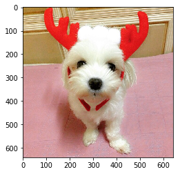
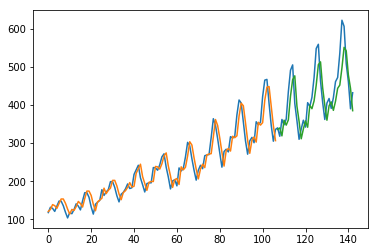

```python
import numpy as np
import pandas as pd
import matplotlib.pyplot as plt

%matplotlib inline
```


```python
from keras.models import load_model
```


```python
model = load_model('data/keras/cifar-10_cnn_deep.h5')
```

    C:\ProgramData\Anaconda3\lib\site-packages\keras\engine\saving.py:305: UserWarning: Error in loading the saved optimizer state. As a result, your model is starting with a freshly initialized optimizer.
      warnings.warn('Error in loading the saved optimizer '
    


```python
from deepy.dataset import cifar10
```


```python
(X_train, y_train), (X_test, y_test) = cifar10.load(
    'data/keras/cifar-10-batches-py/')
```


```python
X_train = X_train.astype('float32')
X_test = X_test.astype('float32')
```


```python
X_train /= 255
X_test /= 255
```


```python
from keras.utils import np_utils
```


```python
Y_train = np_utils.to_categorical(y_train)
Y_test = np_utils.to_categorical(y_test)
```


```python
scores = model.evaluate(X_test, Y_test)
```

    10000/10000 [==============================] - 11s 1ms/step
    


```python
print('Loss: {}, Acc.: {}'.format(*scores))
```

    Loss: 1.16856466960907, Acc.: 0.7347
    


```python
model.save('cifar10-cnn-model.h5')
```


```python
model.save_weights('cifar10-cnn-weights.h5')
```


```python
model.load_weights('cifar10-cnn-weights.h5')
```


```python
from matplotlib.image import imread
```


```python
mozzi = imread('data/mozzi.jpg')
```


```python
mozzi.shape
```


    (640, 640, 3)


이미지 형상 변환


```python
from skimage.transform import resize
```


```python
mozzi_32x32 = resize(mozzi, (32, 32, 3))
```

    C:\ProgramData\Anaconda3\lib\site-packages\skimage\transform\_warps.py:84: UserWarning: The default mode, 'constant', will be changed to 'reflect' in skimage 0.15.
      warn("The default mode, 'constant', will be changed to 'reflect' in "
    


```python
from imageio import imsave
```


```python
imsave('mozzi_32x32.png', mozzi_32x32)
```

    C:\ProgramData\Anaconda3\lib\site-packages\imageio\core\util.py:78: UserWarning: Lossy conversion from float64 to uint8, range [0, 1]
      dtype_str, out_type.__name__))
    


```python
Xnew = np.array([mozzi_32x32])
```


```python
Y_pred = model.predict(Xnew)
```


```python
np.argmax(Y_pred, axis=1)
```


    array([5], dtype=int64)


```python
import pickle
```


```python
with open('data/keras/cifar-10-batches-py/batches.meta', 'rb') as fp:
    cifar10_meta = pickle.load(fp)
```


```python
cifar10_labels = cifar10_meta['label_names']
```


```python
cifar10_labels[5]
```


    'dog'


```python
plt.imshow(mozzi)
```


    <matplotlib.image.AxesImage at 0x1672c978>





```python
car = imread('car.jpg')
```


```python
car_32x32 = resize(car, (32, 32, 3))
```

    C:\ProgramData\Anaconda3\lib\site-packages\skimage\transform\_warps.py:84: UserWarning: The default mode, 'constant', will be changed to 'reflect' in skimage 0.15.
      warn("The default mode, 'constant', will be changed to 'reflect' in "
    


```python
Xnew = np.array([mozzi_32x32, car_32x32])
```


```python
Xnew.shape
```


    (2, 32, 32, 3)


```python
Y_pred = model.predict(Xnew)
```


```python
np.argmax(Y_pred, axis=1)
```


    array([5, 9], dtype=int64)


```python
cifar10_labels[9]
```


    'truck'


```python
from keras.applications.vgg16 import VGG16
from keras.applications.vgg16 import preprocess_input
```


```python
vgg16 = VGG16(weights=None)
```


```python
vgg16.summary()
```

    _________________________________________________________________
    Layer (type)                 Output Shape              Param #   
    =================================================================
    input_1 (InputLayer)         (None, 224, 224, 3)       0         
    _________________________________________________________________
    block1_conv1 (Conv2D)        (None, 224, 224, 64)      1792      
    _________________________________________________________________
    block1_conv2 (Conv2D)        (None, 224, 224, 64)      36928     
    _________________________________________________________________
    block1_pool (MaxPooling2D)   (None, 112, 112, 64)      0         
    _________________________________________________________________
    block2_conv1 (Conv2D)        (None, 112, 112, 128)     73856     
    _________________________________________________________________
    block2_conv2 (Conv2D)        (None, 112, 112, 128)     147584    
    _________________________________________________________________
    block2_pool (MaxPooling2D)   (None, 56, 56, 128)       0         
    _________________________________________________________________
    block3_conv1 (Conv2D)        (None, 56, 56, 256)       295168    
    _________________________________________________________________
    block3_conv2 (Conv2D)        (None, 56, 56, 256)       590080    
    _________________________________________________________________
    block3_conv3 (Conv2D)        (None, 56, 56, 256)       590080    
    _________________________________________________________________
    block3_pool (MaxPooling2D)   (None, 28, 28, 256)       0         
    _________________________________________________________________
    block4_conv1 (Conv2D)        (None, 28, 28, 512)       1180160   
    _________________________________________________________________
    block4_conv2 (Conv2D)        (None, 28, 28, 512)       2359808   
    _________________________________________________________________
    block4_conv3 (Conv2D)        (None, 28, 28, 512)       2359808   
    _________________________________________________________________
    block4_pool (MaxPooling2D)   (None, 14, 14, 512)       0         
    _________________________________________________________________
    block5_conv1 (Conv2D)        (None, 14, 14, 512)       2359808   
    _________________________________________________________________
    block5_conv2 (Conv2D)        (None, 14, 14, 512)       2359808   
    _________________________________________________________________
    block5_conv3 (Conv2D)        (None, 14, 14, 512)       2359808   
    _________________________________________________________________
    block5_pool (MaxPooling2D)   (None, 7, 7, 512)         0         
    _________________________________________________________________
    flatten (Flatten)            (None, 25088)             0         
    _________________________________________________________________
    fc1 (Dense)                  (None, 4096)              102764544 
    _________________________________________________________________
    fc2 (Dense)                  (None, 4096)              16781312  
    _________________________________________________________________
    predictions (Dense)          (None, 1000)              4097000   
    =================================================================
    Total params: 138,357,544
    Trainable params: 138,357,544
    Non-trainable params: 0
    _________________________________________________________________
    


```python
vgg16.load_weights('data/keras/vgg16_weights_tf_dim_ordering_tf_kernels.h5')
```


```python
from keras.preprocessing import image

img = image.load_img('data/mozzi.jpg', target_size=(224, 224))
x = image.img_to_array(img)
X = np.array([x])
X = preprocess_input(X)
```


```python
Y_pred = vgg16.predict(X)
```


```python
np.argmax(Y_pred, axis=1)
```


    array([644], dtype=int64)


논문에서 제시한 모델이 있다면 ...


```python
from keras.models import Sequential
from keras.layers.convolutional import Conv2D, MaxPooling2D
from keras.layers.core import Dense, Flatten
from keras.layers.pooling import AveragePooling2D
```


```python
model = Sequential()

model.add(Conv2D(96, kernel_size=(3,3), padding='same',                   
                 activation='relu', input_shape=(32,32,3)))
model.add(Conv2D(96, kernel_size=(3,3), padding='same', 
                 activation='relu'))
#model.add(MaxPooling2D(pool_size=(3,3), strides=(2,2)))
model.add(Conv2D(96, kernel_size=(3,3), padding='same',
                 strides=(2,2),
                 activation='relu'))

model.add(Conv2D(192, kernel_size=(3,3), padding='same',                   
                 activation='relu'))
model.add(Conv2D(192, kernel_size=(3,3), padding='same', 
                 activation='relu'))
#model.add(MaxPooling2D(pool_size=(3,3), strides=(2,2)))
model.add(Conv2D(192, kernel_size=(3,3), padding='same',
                 strides=(2,2),
                 activation='relu'))

model.add(Conv2D(192, kernel_size=(3,3), padding='same',                   
                 activation='relu'))
model.add(Conv2D(192, kernel_size=(1,1), padding='same',                   
                 activation='relu'))
model.add(Conv2D(10, kernel_size=(1,1), padding='same', 
                 activation='relu'))

model.add(AveragePooling2D(pool_size=(6,6)))
model.add(Flatten())
model.add(Dense(10, activation='softmax'))
```


```python
model.summary()
```

    _________________________________________________________________
    Layer (type)                 Output Shape              Param #   
    =================================================================
    conv2d_29 (Conv2D)           (None, 32, 32, 96)        2688      
    _________________________________________________________________
    conv2d_30 (Conv2D)           (None, 32, 32, 96)        83040     
    _________________________________________________________________
    conv2d_31 (Conv2D)           (None, 16, 16, 96)        83040     
    _________________________________________________________________
    conv2d_32 (Conv2D)           (None, 16, 16, 192)       166080    
    _________________________________________________________________
    conv2d_33 (Conv2D)           (None, 16, 16, 192)       331968    
    _________________________________________________________________
    conv2d_34 (Conv2D)           (None, 8, 8, 192)         331968    
    _________________________________________________________________
    conv2d_35 (Conv2D)           (None, 8, 8, 192)         331968    
    _________________________________________________________________
    conv2d_36 (Conv2D)           (None, 8, 8, 192)         37056     
    _________________________________________________________________
    conv2d_37 (Conv2D)           (None, 8, 8, 10)          1930      
    _________________________________________________________________
    average_pooling2d_4 (Average (None, 1, 1, 10)          0         
    _________________________________________________________________
    flatten_2 (Flatten)          (None, 10)                0         
    _________________________________________________________________
    dense_3 (Dense)              (None, 10)                110       
    =================================================================
    Total params: 1,369,848
    Trainable params: 1,369,848
    Non-trainable params: 0
    _________________________________________________________________
    


```python
model.compile(loss='categorical_crossentropy', 
              optimizer='adam', metrics=['accuracy'])
```

CIFAR-10 2등 모델 (95.59%) 훈련 중...


```python
history = model.fit(
    X_train, Y_train, batch_size=100, epochs=20, 
    validation_split=0.2)
```

    Train on 40000 samples, validate on 10000 samples
    Epoch 1/20
    40000/40000 [==============================] - 941s 24ms/step - loss: 1.9505 - acc: 0.2647 - val_loss: 1.6471 - val_acc: 0.3950
    Epoch 2/20
    40000/40000 [==============================] - 939s 23ms/step - loss: 1.5325 - acc: 0.4333 - val_loss: 1.4066 - val_acc: 0.4800
    Epoch 3/20
    40000/40000 [==============================] - 938s 23ms/step - loss: 1.2945 - acc: 0.5247 - val_loss: 1.1839 - val_acc: 0.5734
    Epoch 4/20
    40000/40000 [==============================] - 946s 24ms/step - loss: 1.0940 - acc: 0.6083 - val_loss: 1.0314 - val_acc: 0.6312
    Epoch 5/20
    40000/40000 [==============================] - 953s 24ms/step - loss: 0.9501 - acc: 0.6628 - val_loss: 0.9422 - val_acc: 0.6728
    Epoch 6/20
    40000/40000 [==============================] - 954s 24ms/step - loss: 0.8332 - acc: 0.7055 - val_loss: 0.8508 - val_acc: 0.7049
    Epoch 7/20
     2400/40000 [>.............................] - ETA: 13:41 - loss: 0.7464 - acc: 0.7417


    ---------------------------------------------------------------------------

    KeyboardInterrupt                         Traceback (most recent call last)

    <ipython-input-85-9e9840c01cde> in <module>()
          1 history = model.fit(
          2     X_train, Y_train, batch_size=100, epochs=20,
    ----> 3     validation_split=0.2)
    

    C:\ProgramData\Anaconda3\lib\site-packages\keras\engine\training.py in fit(self, x, y, batch_size, epochs, verbose, callbacks, validation_split, validation_data, shuffle, class_weight, sample_weight, initial_epoch, steps_per_epoch, validation_steps, **kwargs)
       1040                                         initial_epoch=initial_epoch,
       1041                                         steps_per_epoch=steps_per_epoch,
    -> 1042                                         validation_steps=validation_steps)
       1043 
       1044     def evaluate(self, x=None, y=None,
    

    C:\ProgramData\Anaconda3\lib\site-packages\keras\engine\training_arrays.py in fit_loop(model, f, ins, out_labels, batch_size, epochs, verbose, callbacks, val_f, val_ins, shuffle, callback_metrics, initial_epoch, steps_per_epoch, validation_steps)
        197                     ins_batch[i] = ins_batch[i].toarray()
        198 
    --> 199                 outs = f(ins_batch)
        200                 if not isinstance(outs, list):
        201                     outs = [outs]
    

    C:\ProgramData\Anaconda3\lib\site-packages\keras\backend\tensorflow_backend.py in __call__(self, inputs)
       2659                 return self._legacy_call(inputs)
       2660 
    -> 2661             return self._call(inputs)
       2662         else:
       2663             if py_any(is_tensor(x) for x in inputs):
    

    C:\ProgramData\Anaconda3\lib\site-packages\keras\backend\tensorflow_backend.py in _call(self, inputs)
       2629                                 symbol_vals,
       2630                                 session)
    -> 2631         fetched = self._callable_fn(*array_vals)
       2632         return fetched[:len(self.outputs)]
       2633 
    

    C:\ProgramData\Anaconda3\lib\site-packages\tensorflow\python\client\session.py in __call__(self, *args)
       1449         if self._session._created_with_new_api:
       1450           return tf_session.TF_SessionRunCallable(
    -> 1451               self._session._session, self._handle, args, status, None)
       1452         else:
       1453           return tf_session.TF_DeprecatedSessionRunCallable(
    

    KeyboardInterrupt: 


# 1991 RNN


```python
airline = pd.read_csv(
    'data/international-airline-passengers.csv')
```


```python
airline
```


<div>
<style>
    .dataframe thead tr:only-child th {
        text-align: right;
    }

    .dataframe thead th {
        text-align: left;
    }

    .dataframe tbody tr th {
        vertical-align: top;
    }
</style>
<table border="1" class="dataframe">
  <thead>
    <tr style="text-align: right;">
      <th></th>
      <th>Month</th>
      <th>International airline passengers: monthly totals in thousands. Jan 49 ? Dec 60</th>
    </tr>
  </thead>
  <tbody>
    <tr>
      <th>0</th>
      <td>1949-01</td>
      <td>112.0</td>
    </tr>
    <tr>
      <th>1</th>
      <td>1949-02</td>
      <td>118.0</td>
    </tr>
    <tr>
      <th>2</th>
      <td>1949-03</td>
      <td>132.0</td>
    </tr>
    <tr>
      <th>3</th>
      <td>1949-04</td>
      <td>129.0</td>
    </tr>
    <tr>
      <th>4</th>
      <td>1949-05</td>
      <td>121.0</td>
    </tr>
    <tr>
      <th>5</th>
      <td>1949-06</td>
      <td>135.0</td>
    </tr>
    <tr>
      <th>6</th>
      <td>1949-07</td>
      <td>148.0</td>
    </tr>
    <tr>
      <th>7</th>
      <td>1949-08</td>
      <td>148.0</td>
    </tr>
    <tr>
      <th>8</th>
      <td>1949-09</td>
      <td>136.0</td>
    </tr>
    <tr>
      <th>9</th>
      <td>1949-10</td>
      <td>119.0</td>
    </tr>
    <tr>
      <th>10</th>
      <td>1949-11</td>
      <td>104.0</td>
    </tr>
    <tr>
      <th>11</th>
      <td>1949-12</td>
      <td>118.0</td>
    </tr>
    <tr>
      <th>12</th>
      <td>1950-01</td>
      <td>115.0</td>
    </tr>
    <tr>
      <th>13</th>
      <td>1950-02</td>
      <td>126.0</td>
    </tr>
    <tr>
      <th>14</th>
      <td>1950-03</td>
      <td>141.0</td>
    </tr>
    <tr>
      <th>15</th>
      <td>1950-04</td>
      <td>135.0</td>
    </tr>
    <tr>
      <th>16</th>
      <td>1950-05</td>
      <td>125.0</td>
    </tr>
    <tr>
      <th>17</th>
      <td>1950-06</td>
      <td>149.0</td>
    </tr>
    <tr>
      <th>18</th>
      <td>1950-07</td>
      <td>170.0</td>
    </tr>
    <tr>
      <th>19</th>
      <td>1950-08</td>
      <td>170.0</td>
    </tr>
    <tr>
      <th>20</th>
      <td>1950-09</td>
      <td>158.0</td>
    </tr>
    <tr>
      <th>21</th>
      <td>1950-10</td>
      <td>133.0</td>
    </tr>
    <tr>
      <th>22</th>
      <td>1950-11</td>
      <td>114.0</td>
    </tr>
    <tr>
      <th>23</th>
      <td>1950-12</td>
      <td>140.0</td>
    </tr>
    <tr>
      <th>24</th>
      <td>1951-01</td>
      <td>145.0</td>
    </tr>
    <tr>
      <th>25</th>
      <td>1951-02</td>
      <td>150.0</td>
    </tr>
    <tr>
      <th>26</th>
      <td>1951-03</td>
      <td>178.0</td>
    </tr>
    <tr>
      <th>27</th>
      <td>1951-04</td>
      <td>163.0</td>
    </tr>
    <tr>
      <th>28</th>
      <td>1951-05</td>
      <td>172.0</td>
    </tr>
    <tr>
      <th>29</th>
      <td>1951-06</td>
      <td>178.0</td>
    </tr>
    <tr>
      <th>...</th>
      <td>...</td>
      <td>...</td>
    </tr>
    <tr>
      <th>115</th>
      <td>1958-08</td>
      <td>505.0</td>
    </tr>
    <tr>
      <th>116</th>
      <td>1958-09</td>
      <td>404.0</td>
    </tr>
    <tr>
      <th>117</th>
      <td>1958-10</td>
      <td>359.0</td>
    </tr>
    <tr>
      <th>118</th>
      <td>1958-11</td>
      <td>310.0</td>
    </tr>
    <tr>
      <th>119</th>
      <td>1958-12</td>
      <td>337.0</td>
    </tr>
    <tr>
      <th>120</th>
      <td>1959-01</td>
      <td>360.0</td>
    </tr>
    <tr>
      <th>121</th>
      <td>1959-02</td>
      <td>342.0</td>
    </tr>
    <tr>
      <th>122</th>
      <td>1959-03</td>
      <td>406.0</td>
    </tr>
    <tr>
      <th>123</th>
      <td>1959-04</td>
      <td>396.0</td>
    </tr>
    <tr>
      <th>124</th>
      <td>1959-05</td>
      <td>420.0</td>
    </tr>
    <tr>
      <th>125</th>
      <td>1959-06</td>
      <td>472.0</td>
    </tr>
    <tr>
      <th>126</th>
      <td>1959-07</td>
      <td>548.0</td>
    </tr>
    <tr>
      <th>127</th>
      <td>1959-08</td>
      <td>559.0</td>
    </tr>
    <tr>
      <th>128</th>
      <td>1959-09</td>
      <td>463.0</td>
    </tr>
    <tr>
      <th>129</th>
      <td>1959-10</td>
      <td>407.0</td>
    </tr>
    <tr>
      <th>130</th>
      <td>1959-11</td>
      <td>362.0</td>
    </tr>
    <tr>
      <th>131</th>
      <td>1959-12</td>
      <td>405.0</td>
    </tr>
    <tr>
      <th>132</th>
      <td>1960-01</td>
      <td>417.0</td>
    </tr>
    <tr>
      <th>133</th>
      <td>1960-02</td>
      <td>391.0</td>
    </tr>
    <tr>
      <th>134</th>
      <td>1960-03</td>
      <td>419.0</td>
    </tr>
    <tr>
      <th>135</th>
      <td>1960-04</td>
      <td>461.0</td>
    </tr>
    <tr>
      <th>136</th>
      <td>1960-05</td>
      <td>472.0</td>
    </tr>
    <tr>
      <th>137</th>
      <td>1960-06</td>
      <td>535.0</td>
    </tr>
    <tr>
      <th>138</th>
      <td>1960-07</td>
      <td>622.0</td>
    </tr>
    <tr>
      <th>139</th>
      <td>1960-08</td>
      <td>606.0</td>
    </tr>
    <tr>
      <th>140</th>
      <td>1960-09</td>
      <td>508.0</td>
    </tr>
    <tr>
      <th>141</th>
      <td>1960-10</td>
      <td>461.0</td>
    </tr>
    <tr>
      <th>142</th>
      <td>1960-11</td>
      <td>390.0</td>
    </tr>
    <tr>
      <th>143</th>
      <td>1960-12</td>
      <td>432.0</td>
    </tr>
    <tr>
      <th>144</th>
      <td>International airline passengers: monthly tota...</td>
      <td>NaN</td>
    </tr>
  </tbody>
</table>
<p>145 rows × 2 columns</p>
</div>


```python
shampoo = pd.read_csv('data/shampoo.csv')
```


```python
stocks = pd.read_csv('data/stock_px.csv')
```


```python
airline = airline.set_index('Month')
```


```python
airline[:5]
```


<div>
<style>
    .dataframe thead tr:only-child th {
        text-align: right;
    }

    .dataframe thead th {
        text-align: left;
    }

    .dataframe tbody tr th {
        vertical-align: top;
    }
</style>
<table border="1" class="dataframe">
  <thead>
    <tr style="text-align: right;">
      <th></th>
      <th>International airline passengers: monthly totals in thousands. Jan 49 ? Dec 60</th>
    </tr>
    <tr>
      <th>Month</th>
      <th></th>
    </tr>
  </thead>
  <tbody>
    <tr>
      <th>1949-01</th>
      <td>112.0</td>
    </tr>
    <tr>
      <th>1949-02</th>
      <td>118.0</td>
    </tr>
    <tr>
      <th>1949-03</th>
      <td>132.0</td>
    </tr>
    <tr>
      <th>1949-04</th>
      <td>129.0</td>
    </tr>
    <tr>
      <th>1949-05</th>
      <td>121.0</td>
    </tr>
  </tbody>
</table>
</div>


없는 값 (NaN) 제거


```python
airline = airline.dropna()
```


```python
from sklearn.preprocessing import MinMaxScaler
```


```python
scaler = MinMaxScaler()
```


```python
data = scaler.fit_transform(airline)
```


```python
X = data[:-1]
```


```python
y = data[1:]
```


```python
len(X) == len(y)
```


    True


train/test


```python
from sklearn.model_selection import train_test_split
```


```python
X_train, X_test, y_train, y_test = train_test_split(
    X, y, shuffle=False)
```

X 형상: (samples, time steps, features)


```python
X = X.reshape(-1, 1, 1)
```


```python
from keras.layers import LSTM
```


```python
model = Sequential()
```


```python
model.add(LSTM(4, input_shape=(1, 1)))
model.add(Dense(1))
```


```python
model.compile(loss='mean_squared_error', optimizer='adam')
```


```python
history = model.fit(X_train, y_train, epochs=100, batch_size=1)
```

    Epoch 1/100
    107/107 [==============================] - 1s 6ms/step - loss: 0.0729
    Epoch 2/100
    107/107 [==============================] - 0s 1ms/step - loss: 0.0419
    Epoch 3/100
    107/107 [==============================] - 0s 1ms/step - loss: 0.0306
    Epoch 4/100
    107/107 [==============================] - 0s 1ms/step - loss: 0.0265
    Epoch 5/100
    107/107 [==============================] - 0s 1ms/step - loss: 0.0249
    Epoch 6/100
    107/107 [==============================] - 0s 1ms/step - loss: 0.0232
    Epoch 7/100
    107/107 [==============================] - 0s 1ms/step - loss: 0.0214
    Epoch 8/100
    107/107 [==============================] - 0s 1ms/step - loss: 0.0193
    Epoch 9/100
    107/107 [==============================] - 0s 1ms/step - loss: 0.0170
    Epoch 10/100
    107/107 [==============================] - 0s 1ms/step - loss: 0.0145
    Epoch 11/100
    107/107 [==============================] - 0s 1ms/step - loss: 0.0120
    Epoch 12/100
    107/107 [==============================] - 0s 1ms/step - loss: 0.0097
    Epoch 13/100
    107/107 [==============================] - 0s 1ms/step - loss: 0.0076
    Epoch 14/100
    107/107 [==============================] - 0s 1ms/step - loss: 0.0058
    Epoch 15/100
    107/107 [==============================] - 0s 1ms/step - loss: 0.0045
    Epoch 16/100
    107/107 [==============================] - 0s 1ms/step - loss: 0.0036
    Epoch 17/100
    107/107 [==============================] - 0s 1ms/step - loss: 0.0031
    Epoch 18/100
    107/107 [==============================] - 0s 1ms/step - loss: 0.0028
    Epoch 19/100
    107/107 [==============================] - 0s 1ms/step - loss: 0.0026
    Epoch 20/100
    107/107 [==============================] - 0s 1ms/step - loss: 0.0025
    Epoch 21/100
    107/107 [==============================] - 0s 1ms/step - loss: 0.0026
    Epoch 22/100
    107/107 [==============================] - 0s 1ms/step - loss: 0.0025
    Epoch 23/100
    107/107 [==============================] - 0s 1ms/step - loss: 0.0026
    Epoch 24/100
    107/107 [==============================] - 0s 1ms/step - loss: 0.0025
    Epoch 25/100
    107/107 [==============================] - 0s 1ms/step - loss: 0.0025
    Epoch 26/100
    107/107 [==============================] - 0s 1ms/step - loss: 0.0026
    Epoch 27/100
    107/107 [==============================] - 0s 1ms/step - loss: 0.0025
    Epoch 28/100
    107/107 [==============================] - 0s 1ms/step - loss: 0.0025
    Epoch 29/100
    107/107 [==============================] - 0s 1ms/step - loss: 0.0025
    Epoch 30/100
    107/107 [==============================] - 0s 1ms/step - loss: 0.0026
    Epoch 31/100
    107/107 [==============================] - 0s 1ms/step - loss: 0.0025
    Epoch 32/100
    107/107 [==============================] - 0s 1ms/step - loss: 0.0025
    Epoch 33/100
    107/107 [==============================] - 0s 1ms/step - loss: 0.0025
    Epoch 34/100
    107/107 [==============================] - 0s 1ms/step - loss: 0.0024
    Epoch 35/100
    107/107 [==============================] - 0s 1ms/step - loss: 0.0026
    Epoch 36/100
    107/107 [==============================] - 0s 1ms/step - loss: 0.0026
    Epoch 37/100
    107/107 [==============================] - 0s 1ms/step - loss: 0.0025
    Epoch 38/100
    107/107 [==============================] - 0s 1ms/step - loss: 0.0025
    Epoch 39/100
    107/107 [==============================] - 0s 1ms/step - loss: 0.0025
    Epoch 40/100
    107/107 [==============================] - 0s 1ms/step - loss: 0.0025
    Epoch 41/100
    107/107 [==============================] - 0s 1ms/step - loss: 0.0025
    Epoch 42/100
    107/107 [==============================] - 0s 1ms/step - loss: 0.0026
    Epoch 43/100
    107/107 [==============================] - 0s 1ms/step - loss: 0.0025
    Epoch 44/100
    107/107 [==============================] - 0s 1ms/step - loss: 0.0025
    Epoch 45/100
    107/107 [==============================] - 0s 1ms/step - loss: 0.0025
    Epoch 46/100
    107/107 [==============================] - 0s 1ms/step - loss: 0.0025
    Epoch 47/100
    107/107 [==============================] - 0s 1ms/step - loss: 0.0025
    Epoch 48/100
    107/107 [==============================] - 0s 1ms/step - loss: 0.0025
    Epoch 49/100
    107/107 [==============================] - 0s 1ms/step - loss: 0.0025
    Epoch 50/100
    107/107 [==============================] - 0s 1ms/step - loss: 0.0025
    Epoch 51/100
    107/107 [==============================] - 0s 1ms/step - loss: 0.0025
    Epoch 52/100
    107/107 [==============================] - 0s 1ms/step - loss: 0.0026
    Epoch 53/100
    107/107 [==============================] - 0s 1ms/step - loss: 0.0025
    Epoch 54/100
    107/107 [==============================] - 0s 1ms/step - loss: 0.0025
    Epoch 55/100
    107/107 [==============================] - 0s 1ms/step - loss: 0.0025
    Epoch 56/100
    107/107 [==============================] - 0s 1ms/step - loss: 0.0024
    Epoch 57/100
    107/107 [==============================] - 0s 1ms/step - loss: 0.0025
    Epoch 58/100
    107/107 [==============================] - 0s 1ms/step - loss: 0.0024
    Epoch 59/100
    107/107 [==============================] - 0s 1ms/step - loss: 0.0025
    Epoch 60/100
    107/107 [==============================] - 0s 1ms/step - loss: 0.0026
    Epoch 61/100
    107/107 [==============================] - 0s 1ms/step - loss: 0.0025
    Epoch 62/100
    107/107 [==============================] - 0s 1ms/step - loss: 0.0025
    Epoch 63/100
    107/107 [==============================] - 0s 1ms/step - loss: 0.0025
    Epoch 64/100
    107/107 [==============================] - 0s 1ms/step - loss: 0.0025
    Epoch 65/100
    107/107 [==============================] - 0s 1ms/step - loss: 0.0025
    Epoch 66/100
    107/107 [==============================] - 0s 1ms/step - loss: 0.0025
    Epoch 67/100
    107/107 [==============================] - 0s 1ms/step - loss: 0.0024
    Epoch 68/100
    107/107 [==============================] - 0s 1ms/step - loss: 0.0025
    Epoch 69/100
    107/107 [==============================] - 0s 1ms/step - loss: 0.0024
    Epoch 70/100
    107/107 [==============================] - 0s 1ms/step - loss: 0.0025
    Epoch 71/100
    107/107 [==============================] - 0s 1ms/step - loss: 0.0025
    Epoch 72/100
    107/107 [==============================] - 0s 1ms/step - loss: 0.0025
    Epoch 73/100
    107/107 [==============================] - 0s 1ms/step - loss: 0.0025
    Epoch 74/100
    107/107 [==============================] - 0s 1ms/step - loss: 0.0025
    Epoch 75/100
    107/107 [==============================] - 0s 1ms/step - loss: 0.0025
    Epoch 76/100
    107/107 [==============================] - 0s 1ms/step - loss: 0.0024
    Epoch 77/100
    107/107 [==============================] - 0s 1ms/step - loss: 0.0025
    Epoch 78/100
    107/107 [==============================] - 0s 1ms/step - loss: 0.0025
    Epoch 79/100
    107/107 [==============================] - 0s 1ms/step - loss: 0.0025
    Epoch 80/100
    107/107 [==============================] - 0s 1ms/step - loss: 0.0024
    Epoch 81/100
    107/107 [==============================] - 0s 1ms/step - loss: 0.0025
    Epoch 82/100
    107/107 [==============================] - 0s 1ms/step - loss: 0.0025
    Epoch 83/100
    107/107 [==============================] - 0s 1ms/step - loss: 0.0025
    Epoch 84/100
    107/107 [==============================] - 0s 1ms/step - loss: 0.0025
    Epoch 85/100
    107/107 [==============================] - 0s 1ms/step - loss: 0.0026
    Epoch 86/100
    107/107 [==============================] - 0s 1ms/step - loss: 0.0024
    Epoch 87/100
    107/107 [==============================] - 0s 1ms/step - loss: 0.0025
    Epoch 88/100
    107/107 [==============================] - 0s 1ms/step - loss: 0.0025
    Epoch 89/100
    107/107 [==============================] - 0s 1ms/step - loss: 0.0025
    Epoch 90/100
    107/107 [==============================] - 0s 1ms/step - loss: 0.0025
    Epoch 91/100
    107/107 [==============================] - 0s 1ms/step - loss: 0.0025
    Epoch 92/100
    107/107 [==============================] - 0s 1ms/step - loss: 0.0025
    Epoch 93/100
    107/107 [==============================] - 0s 1ms/step - loss: 0.0025
    Epoch 94/100
    107/107 [==============================] - 0s 1ms/step - loss: 0.0025
    Epoch 95/100
    107/107 [==============================] - 0s 1ms/step - loss: 0.0024
    Epoch 96/100
    107/107 [==============================] - 0s 1ms/step - loss: 0.0025
    Epoch 97/100
    107/107 [==============================] - 0s 1ms/step - loss: 0.0025
    Epoch 98/100
    107/107 [==============================] - 0s 1ms/step - loss: 0.0025
    Epoch 99/100
    107/107 [==============================] - 0s 1ms/step - loss: 0.0025
    Epoch 100/100
    107/107 [==============================] - 0s 1ms/step - loss: 0.0024
    


```python
y_pred_train = model.predict(X_train)
```


```python
y_pred_test = model.predict(X_test)
```


```python
from sklearn.metrics import r2_score
```


```python
train_score = r2_score(y_train.flatten(), y_pred_train.flatten())
```


```python
train_score
```


    0.9114706661745412


```python
test_score = r2_score(y_test.flatten(), y_pred_test.flatten())
```


```python
test_score
```


    0.59061273923005386


```python
xs_train = np.arange(len(X_train))
xs_test = np.arange(len(X_train), len(X))
plt.plot(scaler.inverse_transform(y))
plt.plot(xs_train, scaler.inverse_transform(y_pred_train))
plt.plot(xs_test, scaler.inverse_transform(y_pred_test))
```


    [<matplotlib.lines.Line2D at 0x1a8722b0>]





```python
pollution = pd.read_csv(
    'data/uci-ml/beijing-pm25.csv',
    index_col=0, 
    parse_dates=[['year', 'month', 'day', 'hour']]
)
```


```python
pollution[:5]
```


<div>
<style>
    .dataframe thead tr:only-child th {
        text-align: right;
    }

    .dataframe thead th {
        text-align: left;
    }

    .dataframe tbody tr th {
        vertical-align: top;
    }
</style>
<table border="1" class="dataframe">
  <thead>
    <tr style="text-align: right;">
      <th></th>
      <th>No</th>
      <th>pm2.5</th>
      <th>DEWP</th>
      <th>TEMP</th>
      <th>PRES</th>
      <th>cbwd</th>
      <th>Iws</th>
      <th>Is</th>
      <th>Ir</th>
    </tr>
    <tr>
      <th>year_month_day_hour</th>
      <th></th>
      <th></th>
      <th></th>
      <th></th>
      <th></th>
      <th></th>
      <th></th>
      <th></th>
      <th></th>
    </tr>
  </thead>
  <tbody>
    <tr>
      <th>2010 1 1 0</th>
      <td>1</td>
      <td>NaN</td>
      <td>-21</td>
      <td>-11.0</td>
      <td>1021.0</td>
      <td>NW</td>
      <td>1.79</td>
      <td>0</td>
      <td>0</td>
    </tr>
    <tr>
      <th>2010 1 1 1</th>
      <td>2</td>
      <td>NaN</td>
      <td>-21</td>
      <td>-12.0</td>
      <td>1020.0</td>
      <td>NW</td>
      <td>4.92</td>
      <td>0</td>
      <td>0</td>
    </tr>
    <tr>
      <th>2010 1 1 2</th>
      <td>3</td>
      <td>NaN</td>
      <td>-21</td>
      <td>-11.0</td>
      <td>1019.0</td>
      <td>NW</td>
      <td>6.71</td>
      <td>0</td>
      <td>0</td>
    </tr>
    <tr>
      <th>2010 1 1 3</th>
      <td>4</td>
      <td>NaN</td>
      <td>-21</td>
      <td>-14.0</td>
      <td>1019.0</td>
      <td>NW</td>
      <td>9.84</td>
      <td>0</td>
      <td>0</td>
    </tr>
    <tr>
      <th>2010 1 1 4</th>
      <td>5</td>
      <td>NaN</td>
      <td>-20</td>
      <td>-12.0</td>
      <td>1018.0</td>
      <td>NW</td>
      <td>12.97</td>
      <td>0</td>
      <td>0</td>
    </tr>
  </tbody>
</table>
</div>


누락 값 처리


```python
pollution = pollution.fillna(pollution['pm2.5'].mean())
```


```python
pollution.shape
```


    (43824, 9)


```python
pollution = pollution.drop('No', axis=1)
```


```python
data = pd.get_dummies(pollution)
```


```python
scaler = MinMaxScaler()
data = scaler.fit_transform(data)
```


```python
pd.DataFrame(data)[:5]
```


<div>
<style>
    .dataframe thead tr:only-child th {
        text-align: right;
    }

    .dataframe thead th {
        text-align: left;
    }

    .dataframe tbody tr th {
        vertical-align: top;
    }
</style>
<table border="1" class="dataframe">
  <thead>
    <tr style="text-align: right;">
      <th></th>
      <th>0</th>
      <th>1</th>
      <th>2</th>
      <th>3</th>
      <th>4</th>
      <th>5</th>
      <th>6</th>
      <th>7</th>
      <th>8</th>
      <th>9</th>
      <th>10</th>
    </tr>
  </thead>
  <tbody>
    <tr>
      <th>0</th>
      <td>0.099208</td>
      <td>0.279412</td>
      <td>0.131148</td>
      <td>0.545455</td>
      <td>0.002290</td>
      <td>0.0</td>
      <td>0.0</td>
      <td>0.0</td>
      <td>1.0</td>
      <td>0.0</td>
      <td>0.0</td>
    </tr>
    <tr>
      <th>1</th>
      <td>0.099208</td>
      <td>0.279412</td>
      <td>0.114754</td>
      <td>0.527273</td>
      <td>0.007639</td>
      <td>0.0</td>
      <td>0.0</td>
      <td>0.0</td>
      <td>1.0</td>
      <td>0.0</td>
      <td>0.0</td>
    </tr>
    <tr>
      <th>2</th>
      <td>0.099208</td>
      <td>0.279412</td>
      <td>0.131148</td>
      <td>0.509091</td>
      <td>0.010698</td>
      <td>0.0</td>
      <td>0.0</td>
      <td>0.0</td>
      <td>1.0</td>
      <td>0.0</td>
      <td>0.0</td>
    </tr>
    <tr>
      <th>3</th>
      <td>0.099208</td>
      <td>0.279412</td>
      <td>0.081967</td>
      <td>0.509091</td>
      <td>0.016047</td>
      <td>0.0</td>
      <td>0.0</td>
      <td>0.0</td>
      <td>1.0</td>
      <td>0.0</td>
      <td>0.0</td>
    </tr>
    <tr>
      <th>4</th>
      <td>0.099208</td>
      <td>0.294118</td>
      <td>0.114754</td>
      <td>0.490909</td>
      <td>0.021396</td>
      <td>0.0</td>
      <td>0.0</td>
      <td>0.0</td>
      <td>1.0</td>
      <td>0.0</td>
      <td>0.0</td>
    </tr>
  </tbody>
</table>
</div>


```python
pd.DataFrame(data).shift(-1)[:5]
```


<div>
<style>
    .dataframe thead tr:only-child th {
        text-align: right;
    }

    .dataframe thead th {
        text-align: left;
    }

    .dataframe tbody tr th {
        vertical-align: top;
    }
</style>
<table border="1" class="dataframe">
  <thead>
    <tr style="text-align: right;">
      <th></th>
      <th>0</th>
      <th>1</th>
      <th>2</th>
      <th>3</th>
      <th>4</th>
      <th>5</th>
      <th>6</th>
      <th>7</th>
      <th>8</th>
      <th>9</th>
      <th>10</th>
    </tr>
  </thead>
  <tbody>
    <tr>
      <th>0</th>
      <td>0.099208</td>
      <td>0.279412</td>
      <td>0.114754</td>
      <td>0.527273</td>
      <td>0.007639</td>
      <td>0.0</td>
      <td>0.0</td>
      <td>0.0</td>
      <td>1.0</td>
      <td>0.0</td>
      <td>0.0</td>
    </tr>
    <tr>
      <th>1</th>
      <td>0.099208</td>
      <td>0.279412</td>
      <td>0.131148</td>
      <td>0.509091</td>
      <td>0.010698</td>
      <td>0.0</td>
      <td>0.0</td>
      <td>0.0</td>
      <td>1.0</td>
      <td>0.0</td>
      <td>0.0</td>
    </tr>
    <tr>
      <th>2</th>
      <td>0.099208</td>
      <td>0.279412</td>
      <td>0.081967</td>
      <td>0.509091</td>
      <td>0.016047</td>
      <td>0.0</td>
      <td>0.0</td>
      <td>0.0</td>
      <td>1.0</td>
      <td>0.0</td>
      <td>0.0</td>
    </tr>
    <tr>
      <th>3</th>
      <td>0.099208</td>
      <td>0.294118</td>
      <td>0.114754</td>
      <td>0.490909</td>
      <td>0.021396</td>
      <td>0.0</td>
      <td>0.0</td>
      <td>0.0</td>
      <td>1.0</td>
      <td>0.0</td>
      <td>0.0</td>
    </tr>
    <tr>
      <th>4</th>
      <td>0.099208</td>
      <td>0.308824</td>
      <td>0.147541</td>
      <td>0.472727</td>
      <td>0.026745</td>
      <td>0.0</td>
      <td>0.0</td>
      <td>0.0</td>
      <td>1.0</td>
      <td>0.0</td>
      <td>0.0</td>
    </tr>
  </tbody>
</table>
</div>


```python
from deepy.timeseries import time_step_seq
```


```python
X, Y = time_step_seq(data, look_back=0, look_forward=1)
```


```python
X.shape
```


    (43823, 1, 11)


```python
Y.shape
```


    (43823, 1, 11)


```python
y = Y[:, 0, 0]
```


```python
X_train, X_test, y_train, y_test = train_test_split(
    X, y, shuffle=False)
```


```python
model = Sequential()
```


```python
model.add(LSTM(50, input_shape=(1, X_train.shape[-1])))
model.add(Dense(1))
```


```python
model.compile(loss='mse', optimizer='adam')
```


```python
history = model.fit(
    X_train, y_train, epochs=50, batch_size=72, shuffle=False,
    validation_split=0.2)
```

    Train on 26293 samples, validate on 6574 samples
    Epoch 1/50
    26293/26293 [==============================] - 1s 47us/step - loss: 0.0050 - val_loss: 0.0093
    Epoch 2/50
    26293/26293 [==============================] - 1s 21us/step - loss: 0.0014 - val_loss: 0.0115
    Epoch 3/50
    26293/26293 [==============================] - 1s 21us/step - loss: 8.2094e-04 - val_loss: 0.0068
    Epoch 4/50
    26293/26293 [==============================] - 1s 22us/step - loss: 7.3553e-04 - val_loss: 0.0043
    Epoch 5/50
    26293/26293 [==============================] - 1s 22us/step - loss: 7.0403e-04 - val_loss: 0.0032
    Epoch 6/50
    26293/26293 [==============================] - 1s 22us/step - loss: 6.8996e-04 - val_loss: 0.0025
    Epoch 7/50
    26293/26293 [==============================] - 1s 23us/step - loss: 6.8168e-04 - val_loss: 0.0021
    Epoch 8/50
    26293/26293 [==============================] - 1s 22us/step - loss: 6.7562e-04 - val_loss: 0.0019
    Epoch 9/50
    26293/26293 [==============================] - 1s 21us/step - loss: 6.7136e-04 - val_loss: 0.0017
    Epoch 10/50
    26293/26293 [==============================] - 1s 21us/step - loss: 6.6846e-04 - val_loss: 0.0015
    Epoch 11/50
    26293/26293 [==============================] - 1s 22us/step - loss: 6.6649e-04 - val_loss: 0.0014
    Epoch 12/50
    26293/26293 [==============================] - 1s 22us/step - loss: 6.6511e-04 - val_loss: 0.0014
    Epoch 13/50
    26293/26293 [==============================] - 1s 23us/step - loss: 6.6409e-04 - val_loss: 0.0014
    Epoch 14/50
    26293/26293 [==============================] - 1s 21us/step - loss: 6.6328e-04 - val_loss: 0.0013
    Epoch 15/50
    26293/26293 [==============================] - 1s 22us/step - loss: 6.6256e-04 - val_loss: 0.0013
    Epoch 16/50
    26293/26293 [==============================] - 1s 22us/step - loss: 6.6186e-04 - val_loss: 0.0013
    Epoch 17/50
    26293/26293 [==============================] - 1s 22us/step - loss: 6.6116e-04 - val_loss: 0.0013
    Epoch 18/50
    26293/26293 [==============================] - 1s 22us/step - loss: 6.6045e-04 - val_loss: 0.0013
    Epoch 19/50
    26293/26293 [==============================] - 1s 22us/step - loss: 6.5974e-04 - val_loss: 0.0013
    Epoch 20/50
    26293/26293 [==============================] - 1s 22us/step - loss: 6.5904e-04 - val_loss: 0.0013
    Epoch 21/50
    26293/26293 [==============================] - 1s 22us/step - loss: 6.5838e-04 - val_loss: 0.0013
    Epoch 22/50
    26293/26293 [==============================] - 1s 22us/step - loss: 6.5773e-04 - val_loss: 0.0013
    Epoch 23/50
    26293/26293 [==============================] - 1s 22us/step - loss: 6.5712e-04 - val_loss: 0.0013
    Epoch 24/50
    26293/26293 [==============================] - 1s 22us/step - loss: 6.5655e-04 - val_loss: 0.0012
    Epoch 25/50
    26293/26293 [==============================] - 1s 23us/step - loss: 6.5600e-04 - val_loss: 0.0012
    Epoch 26/50
    26293/26293 [==============================] - 1s 22us/step - loss: 6.5547e-04 - val_loss: 0.0012
    Epoch 27/50
    26293/26293 [==============================] - 1s 23us/step - loss: 6.5497e-04 - val_loss: 0.0012
    Epoch 28/50
    26293/26293 [==============================] - 1s 22us/step - loss: 6.5450e-04 - val_loss: 0.0012
    Epoch 29/50
    26293/26293 [==============================] - 1s 22us/step - loss: 6.5403e-04 - val_loss: 0.0012
    Epoch 30/50
    26293/26293 [==============================] - 1s 22us/step - loss: 6.5359e-04 - val_loss: 0.0012
    Epoch 31/50
    26293/26293 [==============================] - 1s 22us/step - loss: 6.5316e-04 - val_loss: 0.0012
    Epoch 32/50
    26293/26293 [==============================] - 1s 22us/step - loss: 6.5274e-04 - val_loss: 0.0012
    Epoch 33/50
    26293/26293 [==============================] - 1s 22us/step - loss: 6.5234e-04 - val_loss: 0.0012
    Epoch 34/50
    26293/26293 [==============================] - 1s 22us/step - loss: 6.5196e-04 - val_loss: 0.0012
    Epoch 35/50
    26293/26293 [==============================] - 1s 22us/step - loss: 6.5160e-04 - val_loss: 0.0012
    Epoch 36/50
    26293/26293 [==============================] - 1s 22us/step - loss: 6.5125e-04 - val_loss: 0.0012
    Epoch 37/50
    26293/26293 [==============================] - 1s 22us/step - loss: 6.5092e-04 - val_loss: 0.0012
    Epoch 38/50
    26293/26293 [==============================] - 1s 22us/step - loss: 6.5060e-04 - val_loss: 0.0012
    Epoch 39/50
    26293/26293 [==============================] - 1s 22us/step - loss: 6.5030e-04 - val_loss: 0.0013
    Epoch 40/50
    26293/26293 [==============================] - 1s 22us/step - loss: 6.5002e-04 - val_loss: 0.0013
    Epoch 41/50
    26293/26293 [==============================] - 1s 22us/step - loss: 6.4977e-04 - val_loss: 0.0013
    Epoch 42/50
    26293/26293 [==============================] - 1s 22us/step - loss: 6.4952e-04 - val_loss: 0.0013
    Epoch 43/50
    26293/26293 [==============================] - 1s 22us/step - loss: 6.4929e-04 - val_loss: 0.0013
    Epoch 44/50
    26293/26293 [==============================] - 1s 22us/step - loss: 6.4909e-04 - val_loss: 0.0013
    Epoch 45/50
    26293/26293 [==============================] - 1s 22us/step - loss: 6.4890e-04 - val_loss: 0.0013
    Epoch 46/50
    26293/26293 [==============================] - 1s 21us/step - loss: 6.4873e-04 - val_loss: 0.0013
    Epoch 47/50
    26293/26293 [==============================] - 1s 23us/step - loss: 6.4857e-04 - val_loss: 0.0013
    Epoch 48/50
    26293/26293 [==============================] - 1s 22us/step - loss: 6.4844e-04 - val_loss: 0.0013
    Epoch 49/50
    26293/26293 [==============================] - 1s 22us/step - loss: 6.4830e-04 - val_loss: 0.0013
    Epoch 50/50
    26293/26293 [==============================] - 1s 22us/step - loss: 6.4819e-04 - val_loss: 0.0013
    


```python
y_pred_train = model.predict(X_train)
y_pre_test = model.predict(X_test)
```


```python
r2_score(y_train, y_pred_train)
```


    0.8544014005898013


```python
r2_score(y_test, y_pre_test)
```


    0.88834628432723151


